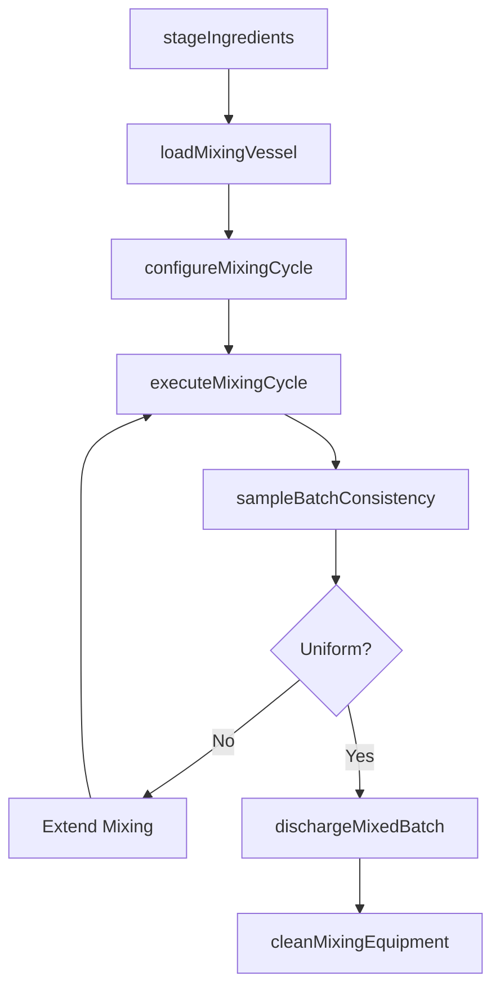
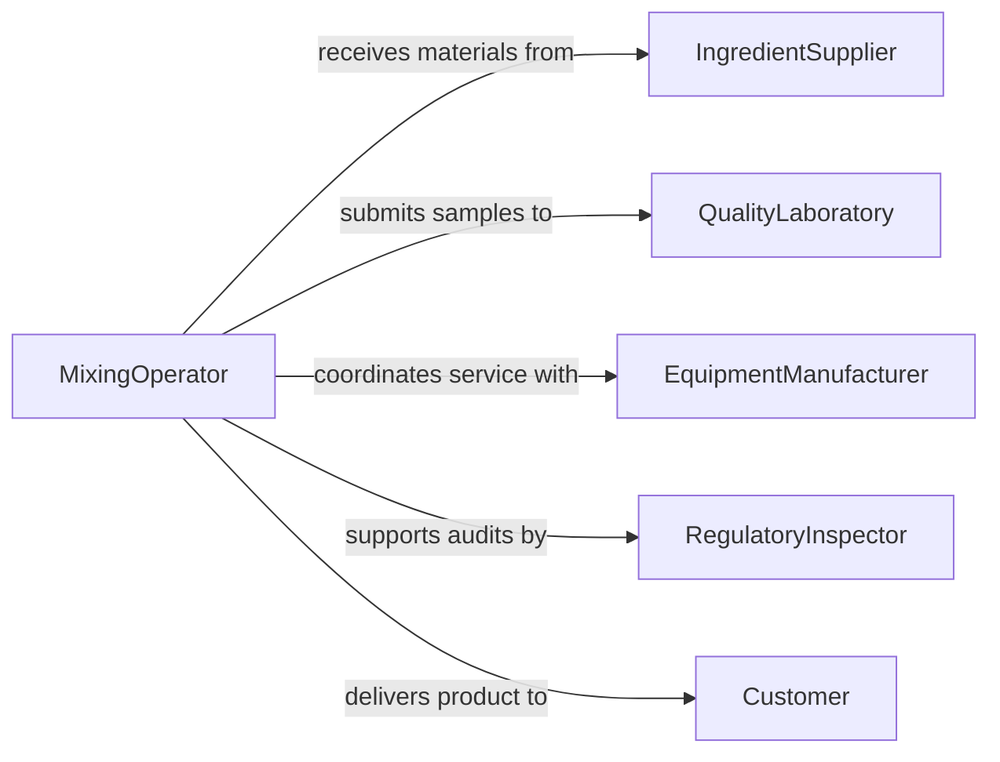

# Operate Mixing Equipment

> Business-as-Code definition for mixing equipment operation. Models the complete blending workflow from ingredient staging through mixing cycle execution, consistency verification, and batch discharge.

## Overview

Operating mixing equipment involves controlling industrial blenders, agitators, kneaders, ribbon mixers, and tumble blenders to combine raw materials into homogeneous mixtures. This includes measuring and loading ingredients, setting mixing speed and duration, monitoring blend consistency, and discharging finished batches. The definition covers mixing operations in food processing, chemical manufacturing, pharmaceutical production, and construction materials.

## Actors

| Actor | Description |
|-------|-------------|
| IngredientSupplier | Provides raw materials and additives for mixing |
| QualityLaboratory | Tests batch samples for composition and consistency |
| EquipmentManufacturer | Supplies and services mixing machinery |
| RegulatoryInspector | Audits mixing operations for safety and compliance |
| Customer | Receives mixed products or intermediate blends |

## Roles

| Role | Description |
|------|-------------|
| MixingOperator | Loads ingredients, runs mixers, and monitors blend quality |
| FormulationChemist | Develops recipes and specifies ingredient proportions |
| BatchSupervisor | Oversees mixing schedules and production targets |
| QualityAnalyst | Tests samples for uniformity and specification compliance |

## Entities

| Entity | Description |
|--------|-------------|
| MixingBatch | A defined set of ingredients combined in a single cycle |
| Formula | A recipe specifying ingredient types, quantities, and order |
| MixingCycle | A configured period of agitation with speed and time parameters |
| Ingredient | A raw material or additive measured for inclusion in the batch |
| ConsistencyReading | A measurement of blend uniformity or viscosity |
| BatchRecord | Documentation of all ingredients, parameters, and results |

## Actions

| Action | Description |
|--------|-------------|
| stageIngredients | Weigh and prepare raw materials for loading |
| loadMixingVessel | Add ingredients to the mixer in the specified sequence |
| configureMixingCycle | Set speed, duration, and temperature parameters |
| executeMixingCycle | Run the mixer to blend ingredients together |
| sampleBatchConsistency | Take and test a sample for blend uniformity |
| dischargeMixedBatch | Transfer the finished mixture to the next process stage |
| cleanMixingEquipment | Flush and sanitize the mixing vessel between batches |

## Events

| Event | Description |
|-------|-------------|
| ingredientsStaged | Raw materials have been weighed and prepared |
| mixingVesselLoaded | Ingredients have been added to the mixer |
| mixingCycleConfigured | Speed and duration parameters have been set |
| mixingCycleCompleted | The blending cycle has finished |
| batchConsistencySampled | A sample has been taken and tested for uniformity |
| mixedBatchDischarged | The finished mixture has been transferred out |
| mixingEquipmentCleaned | The vessel has been flushed and sanitized |

## Searches

| Search | Description |
|--------|-------------|
| findMixingBatches | Retrieve batches by formula, date, or status |
| getFormulas | Look up recipes by product type or ingredient |
| getConsistencyReadings | Query uniformity measurements by batch or parameter |
| getBatchRecords | Fetch complete production records for traceability |

## Workflow



## Actor Relationships



## Usage

### Calling Actions

```typescript
import { operateMixingEquipment } from '@headlessly/operate-mixing-equipment'

const mixing = operateMixingEquipment()

// Stage and load ingredients
const batch = await mixing.stageIngredients({
  formulaId: 'F-1200',
  ingredients: [
    { name: 'Portland Cement', quantity: 500, unit: 'kg' },
    { name: 'Fine Aggregate', quantity: 750, unit: 'kg' },
    { name: 'Water', quantity: 225, unit: 'L' },
    { name: 'Plasticizer', quantity: 2.5, unit: 'L' }
  ]
})

await mixing.loadMixingVessel({
  batchId: batch.id,
  mixerId: 'DRUM-MIXER-02',
  loadingSequence: ['dry-materials', 'water', 'additives']
})

// Mix and verify
await mixing.configureMixingCycle({
  batchId: batch.id,
  speed: 30,
  duration: 180
})

await mixing.executeMixingCycle({ batchId: batch.id })

const sample = await mixing.sampleBatchConsistency({
  batchId: batch.id,
  tests: ['slump', 'air-content']
})
```

### Event-Driven Automation

```typescript
// Auto-discharge when consistency passes
mixing.batchConsistencySampled(async ({ batchId, uniform, readings }) => {
  if (uniform) {
    await mixing.dischargeMixedBatch({ batchId })
  } else {
    await notify({
      to: 'batch-supervisor',
      message: `Batch ${batchId} failed consistency check: ${JSON.stringify(readings)}`
    })
  }
})

// Schedule cleaning after discharge
mixing.mixedBatchDischarged(async ({ batchId, mixerId }) => {
  await mixing.cleanMixingEquipment({ mixerId })
  await logProduction({ batchId, completedAt: new Date() })
})
```
