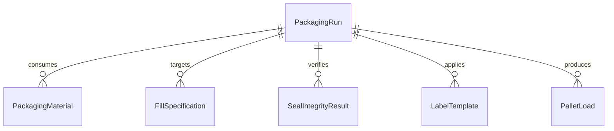
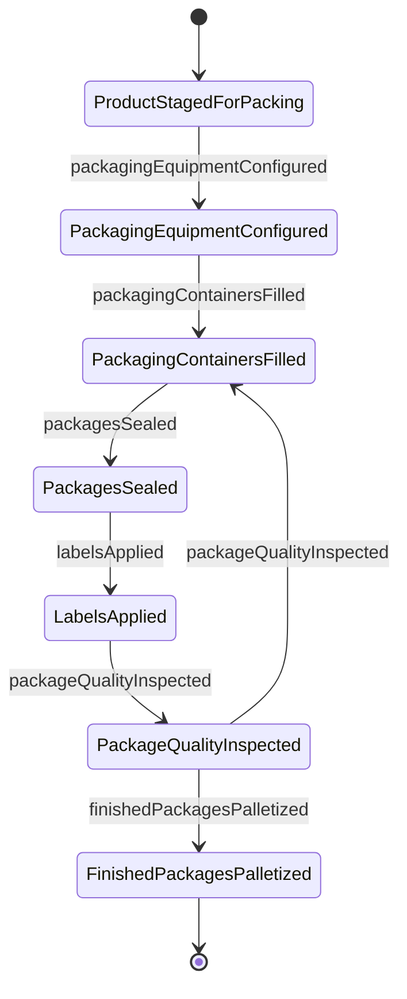
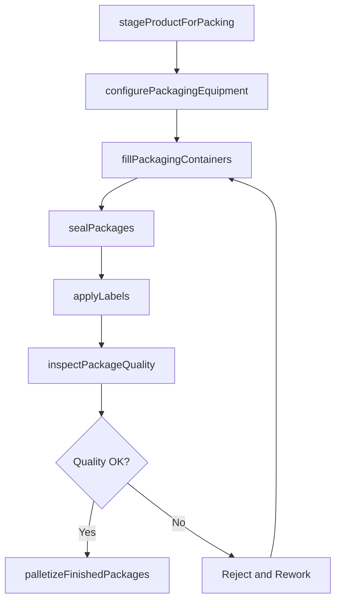
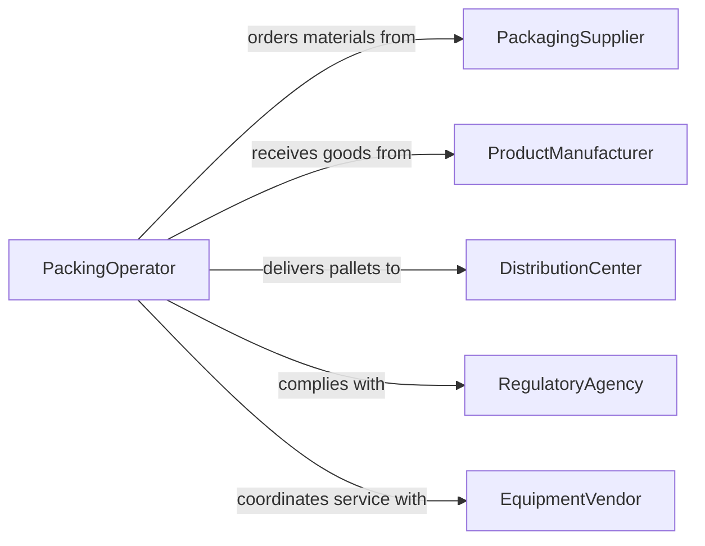

# Operate Packing Material Processing Equipment

> Business-as-Code definition for packing and material processing equipment operation. Models the complete packaging workflow from product staging through machine configuration, filling, sealing, labeling, and output verification.

## Overview

Operating packing or other material processing equipment involves controlling filling machines, sealing equipment, labeling systems, shrink wrappers, case packers, and palletizers to package finished products for storage and distribution. This includes configuring equipment for different product sizes, managing packaging material feeds, monitoring seal integrity, and verifying label accuracy. The definition covers primary, secondary, and tertiary packaging operations across manufacturing and distribution environments.

## Actors

| Actor | Description |
|-------|-------------|
| PackagingSupplier | Provides boxes, bags, wraps, labels, and sealing materials |
| ProductManufacturer | Delivers finished goods requiring packaging |
| DistributionCenter | Receives packaged goods for warehousing and shipping |
| RegulatoryAgency | Enforces labeling accuracy and packaging safety standards |
| EquipmentVendor | Supplies and services packaging machinery |

## Roles

| Role | Description |
|------|-------------|
| PackingOperator | Runs filling, sealing, and labeling equipment |
| LineLeader | Coordinates packaging line changeovers and throughput |
| PackagingEngineer | Designs packaging configurations and optimizes equipment settings |
| QualityChecker | Inspects sealed packages for integrity and label accuracy |
| WarehouseCoordinator | Stages finished packages for storage and shipment |

## Entities

| Entity | Description |
|--------|-------------|
| PackagingRun | A scheduled production session for packaging a specific product |
| PackagingMaterial | Boxes, pouches, wraps, or other container materials |
| FillSpecification | Volume, weight, or count targets for product filling |
| SealIntegrityResult | A test outcome verifying package closure quality |
| LabelTemplate | A configured label design with product and regulatory information |
| PalletLoad | A stacked group of packaged cases ready for shipment |

## Actions

| Action | Description |
|--------|-------------|
| stageProductForPacking | Position finished goods at the packaging line infeed |
| configurePackagingEquipment | Set up machines for the specific product and container |
| fillPackagingContainers | Dispense product into containers at the specified quantity |
| sealPackages | Close and seal filled containers for product integrity |
| applyLabels | Affix product labels with required information |
| inspectPackageQuality | Verify fill level, seal integrity, and label placement |
| palletizeFinishedPackages | Stack sealed packages onto pallets for distribution |

## Events

| Event | Description |
|-------|-------------|
| productStagedForPacking | Finished goods are positioned at the line infeed |
| packagingEquipmentConfigured | Machines have been set up for the current product run |
| packagingContainersFilled | Product has been dispensed into containers |
| packagesSealed | Filled containers have been closed and sealed |
| labelsApplied | Product labels have been affixed to packages |
| packageQualityInspected | Fill, seal, and label have been verified |
| finishedPackagesPalletized | Sealed packages have been stacked onto pallets |

## Searches

| Search | Description |
|--------|-------------|
| findPackagingRuns | Retrieve runs by product, date, or equipment line |
| getFillSpecifications | Look up fill targets by product type or container size |
| getSealIntegrityResults | Query seal test outcomes by run or failure type |
| getPalletLoads | Fetch pallet records by product, date, or destination |


## Entity Relationships



## State Diagram



## Workflow



## Actor Relationships



## Usage

### Calling Actions

```typescript
import { operatePackingMaterialProcessingEquipment } from '@headlessly/operate-packing-material-processing-equipment'

const packing = operatePackingMaterialProcessingEquipment()

// Configure the line for a product run
const run = await packing.configurePackagingEquipment({
  lineId: 'PACK-LINE-03',
  product: 'Organic Cereal 500g',
  containerType: 'box',
  fillTarget: { weight: 500, unit: 'g' }
})

// Fill and seal
await packing.fillPackagingContainers({
  runId: run.id,
  quantity: 2000
})

await packing.sealPackages({
  runId: run.id,
  sealType: 'heat-seal'
})

// Apply labels and inspect
await packing.applyLabels({
  runId: run.id,
  labelTemplate: 'organic-cereal-v3',
  includeBarcode: true
})

const inspection = await packing.inspectPackageQuality({
  runId: run.id,
  sampleSize: 20
})
```

### Event-Driven Automation

```typescript
// Auto-palletize after quality pass
packing.packageQualityInspected(async ({ runId, passed, defectCount }) => {
  if (passed) {
    await packing.palletizeFinishedPackages({
      runId,
      casesPerPallet: 48
    })
  } else {
    await notify({
      to: 'line-leader',
      message: `${defectCount} defects found in run ${runId} - rework required`
    })
  }
})

// Notify warehouse when pallets are ready
packing.finishedPackagesPalletized(async ({ runId, palletCount, product }) => {
  await notify({
    to: 'warehouse-coordinator',
    message: `${palletCount} pallets of ${product} from run ${runId} ready for pickup`
  })
})
```
