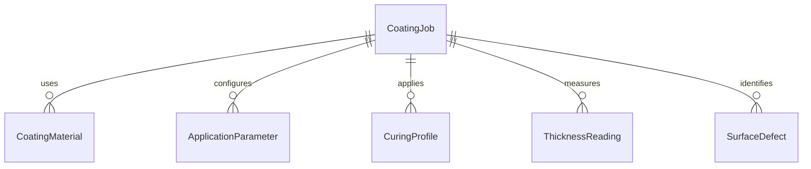
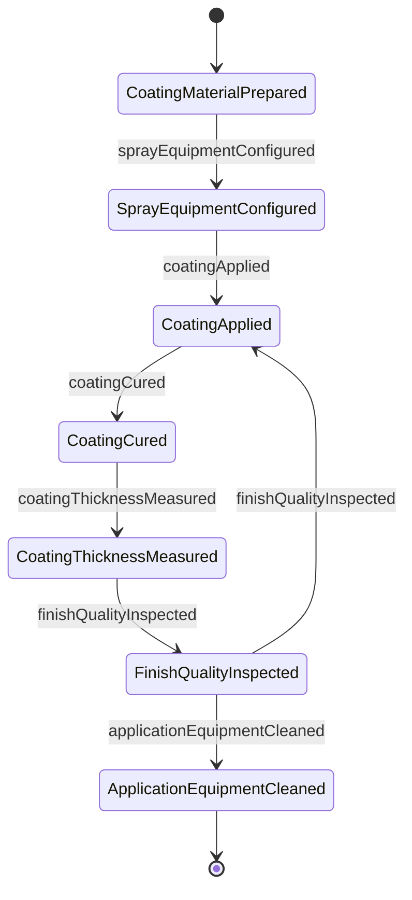
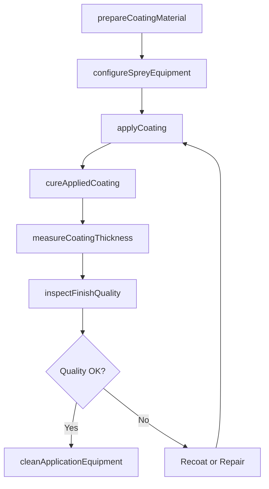
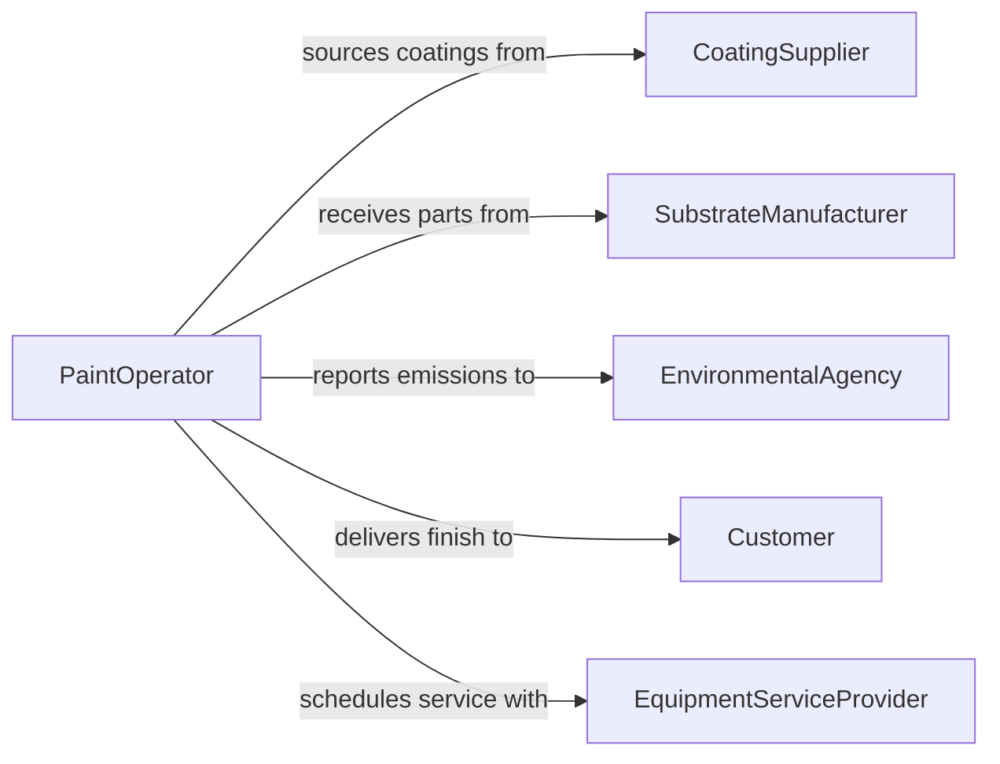

# Operate Painting Coating Equipment

> Business-as-Code definition for painting and coating equipment operation. Models the complete surface finishing workflow from preparation through application, curing, and inspection of painted or coated surfaces.

## Overview

Operating painting or coating equipment involves controlling spray guns, electrostatic applicators, dip tanks, powder coating systems, and automated paint lines to apply protective or decorative finishes to products and components. This includes mixing and preparing coatings, adjusting application parameters, managing curing processes, and inspecting finished surfaces for thickness and adhesion. The definition covers both manual and automated finishing operations across industrial environments.

## Actors

| Actor | Description |
|-------|-------------|
| CoatingSupplier | Provides paints, primers, powders, and specialty coatings |
| SubstrateManufacturer | Delivers parts and components requiring surface finishing |
| EnvironmentalAgency | Enforces VOC emission limits and waste disposal regulations |
| Customer | Specifies color, finish, and coating performance requirements |
| EquipmentServiceProvider | Maintains and calibrates painting and coating equipment |

## Roles

| Role | Description |
|------|-------------|
| PaintOperator | Operates spray equipment and manages coating application |
| CoatingEngineer | Develops application parameters and material specifications |
| ColorMatcher | Blends and verifies coating colors to match specifications |
| CuringTechnician | Manages oven and curing system operation |
| FinishInspector | Tests coating thickness, adhesion, and appearance |

## Entities

| Entity | Description |
|--------|-------------|
| CoatingJob | A production order specifying parts to be coated |
| CoatingMaterial | A paint, primer, or powder product with specific properties |
| ApplicationParameter | Spray pressure, distance, speed, and pattern settings |
| CuringProfile | Temperature and time settings for coating cure |
| ThicknessReading | A measurement of the applied coating depth |
| SurfaceDefect | A flaw identified during finish inspection |

## Actions

| Action | Description |
|--------|-------------|
| prepareCoatingMaterial | Mix, thin, or filter coating material for application |
| configureSpreyEquipment | Set spray pressure, fan width, and flow rate |
| applyCoating | Execute the painting or coating pass on workpieces |
| cureAppliedCoating | Run the oven or UV system to cure the finish |
| measureCoatingThickness | Test applied coating depth at specified points |
| inspectFinishQuality | Examine surfaces for runs, sags, pinholes, or color deviation |
| cleanApplicationEquipment | Flush spray guns, lines, and booths after coating runs |

## Events

| Event | Description |
|-------|-------------|
| coatingMaterialPrepared | Coating has been mixed and is ready for application |
| sprayEquipmentConfigured | Application parameters have been set |
| coatingApplied | A painting or coating pass has been completed |
| coatingCured | The applied finish has been cured to specification |
| coatingThicknessMeasured | Thickness readings have been taken and recorded |
| finishQualityInspected | Surfaces have been examined for defects |
| applicationEquipmentCleaned | Spray equipment and booth have been flushed |

## Searches

| Search | Description |
|--------|-------------|
| findCoatingJobs | Retrieve jobs by customer, part number, or coating type |
| getApplicationParameters | Look up settings by coating material or equipment type |
| getThicknessReadings | Query coating depth data by batch or measurement location |
| findSurfaceDefects | Search for defect records by type, severity, or batch |


## Entity Relationships



## State Diagram



## Workflow



## Actor Relationships



## Usage

### Calling Actions

```typescript
import { operatePaintingCoatingEquipment } from '@headlessly/operate-painting-coating-equipment'

const coating = operatePaintingCoatingEquipment()

// Prepare the coating material
const material = await coating.prepareCoatingMaterial({
  productId: 'EPOXY-2K-WHITE',
  mixRatio: '4:1',
  viscosity: 22.0
})

// Configure spray equipment
await coating.configureSpreyEquipment({
  boothId: 'BOOTH-02',
  sprayPressure: 45,
  fanWidth: 250,
  flowRate: 300
})

// Apply coating and cure
await coating.applyCoating({
  jobId: 'CJ-1089',
  coatingMaterialId: material.id,
  passes: 2
})

await coating.cureAppliedCoating({
  jobId: 'CJ-1089',
  temperature: 180,
  duration: 30
})
```

### Event-Driven Automation

```typescript
// Check thickness after curing
coating.coatingCured(async ({ jobId }) => {
  await coating.measureCoatingThickness({
    jobId,
    measurementPoints: ['top', 'center', 'bottom', 'edge']
  })
})

// Alert on defect detection
coating.finishQualityInspected(async ({ jobId, defects }) => {
  if (defects.length > 0) {
    await notify({
      to: 'coating-engineering',
      message: `${defects.length} defects found on job ${jobId}: ${defects.map(d => d.type).join(', ')}`
    })
  }
})
```
