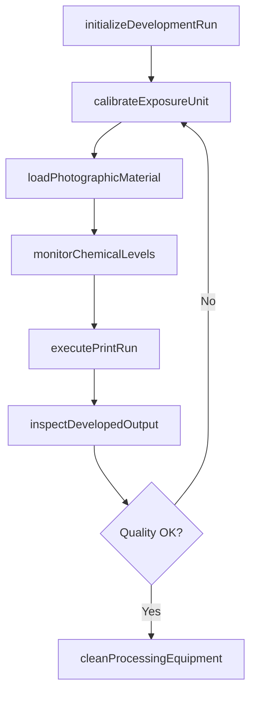
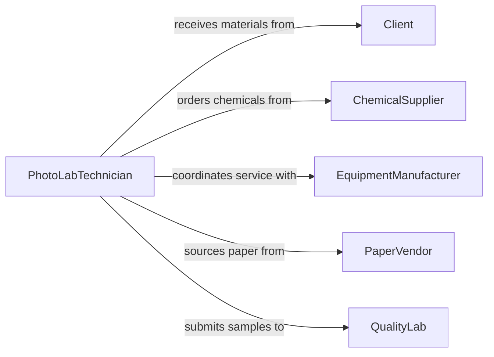

# Operate Photographic Developing Print Production

> Business-as-Code definition for photographic developing and print production equipment operation. Models the complete workflow from image processing through chemical development, printing, and finishing of photographic materials.

## Overview

Operating photographic developing or print production equipment involves managing specialized machines that process exposed film, photographic paper, and digital print media. This includes controlling chemical baths, exposure units, enlargers, and automated print processors to produce high-quality photographic outputs. The definition covers equipment calibration, chemical management, and quality control throughout the development and printing cycle.

## Actors

| Actor | Description |
|-------|-------------|
| Client | Submits photographic materials for development or printing |
| ChemicalSupplier | Provides developing chemicals, toners, and processing solutions |
| EquipmentManufacturer | Supplies and services photographic processing equipment |
| PaperVendor | Provides photographic paper and print media substrates |
| QualityLab | Performs independent quality testing of output samples |

## Roles

| Role | Description |
|------|-------------|
| PhotoLabTechnician | Operates developing and printing equipment daily |
| DarkroomSupervisor | Oversees lab operations and quality standards |
| ColorSpecialist | Manages color correction and calibration processes |
| ProductionManager | Schedules print jobs and manages throughput |

## Entities

| Entity | Description |
|--------|-------------|
| DevelopmentBatch | A group of photographic materials processed together |
| ChemicalSolution | A developing, fixing, or washing chemical mixture |
| PrintJob | A request to produce prints from negatives or digital files |
| ExposureSetting | Configured light intensity and duration for printing |
| ProcessingProfile | Predefined parameters for a specific film or paper type |
| OutputSample | A test print used for quality verification |

## Actions

| Action | Description |
|--------|-------------|
| initializeDevelopmentRun | Prepare equipment and chemical baths for a processing session |
| loadPhotographicMaterial | Feed film or paper into the processing equipment |
| calibrateExposureUnit | Adjust exposure settings for accurate reproduction |
| monitorChemicalLevels | Check and replenish chemical solution concentrations |
| executePrintRun | Run the printing equipment to produce output copies |
| inspectDevelopedOutput | Examine processed materials for defects or quality issues |
| cleanProcessingEquipment | Flush and maintain equipment after processing sessions |

## Events

| Event | Description |
|-------|-------------|
| developmentRunInitialized | Equipment and chemicals are prepared for processing |
| photographicMaterialLoaded | Film or paper has been fed into the processor |
| exposureUnitCalibrated | Exposure settings have been verified and adjusted |
| chemicalLevelsMonitored | Chemical concentrations have been checked and updated |
| printRunCompleted | A batch of prints has been produced successfully |
| outputInspected | Developed materials have been reviewed for quality |
| equipmentCleaned | Processing equipment has been flushed and maintained |

## Searches

| Search | Description |
|--------|-------------|
| findDevelopmentBatches | Retrieve batches by date, client, or processing status |
| getPrintJobs | List print jobs by priority, client, or completion state |
| getChemicalLevels | Query current chemical solution concentrations and age |
| findProcessingProfiles | Look up profiles by film type, paper type, or output format |

## Workflow



## Actor Relationships



## Usage

### Calling Actions

```typescript
import { operatePhotographicDevelopingPrintProduction } from '@headlessly/operate-photographic-developing-print-production'

const photoLab = operatePhotographicDevelopingPrintProduction()

// Initialize a development session
const run = await photoLab.initializeDevelopmentRun({
  chemistryType: 'C-41',
  temperature: 38.0,
  capacity: 50
})

// Calibrate exposure for the paper type
await photoLab.calibrateExposureUnit({
  runId: run.id,
  paperType: 'GlossyRC',
  exposureTime: 12.5,
  filterPack: { cyan: 10, magenta: 25, yellow: 15 }
})

// Execute the print run
const prints = await photoLab.executePrintRun({
  runId: run.id,
  printSize: '8x10',
  copies: 25
})
```

### Event-Driven Automation

```typescript
// Alert when chemical levels drop below threshold
photoLab.chemicalLevelsMonitored(async ({ solutionId, concentration }) => {
  if (concentration < 0.7) {
    await notify({
      to: 'lab-technicians',
      message: `Chemical solution ${solutionId} needs replenishment`
    })
  }
})

// Schedule cleaning after each completed run
photoLab.printRunCompleted(async ({ runId, batchSize }) => {
  await photoLab.cleanProcessingEquipment({ runId })
  await logProduction({ runId, units: batchSize })
})
```
