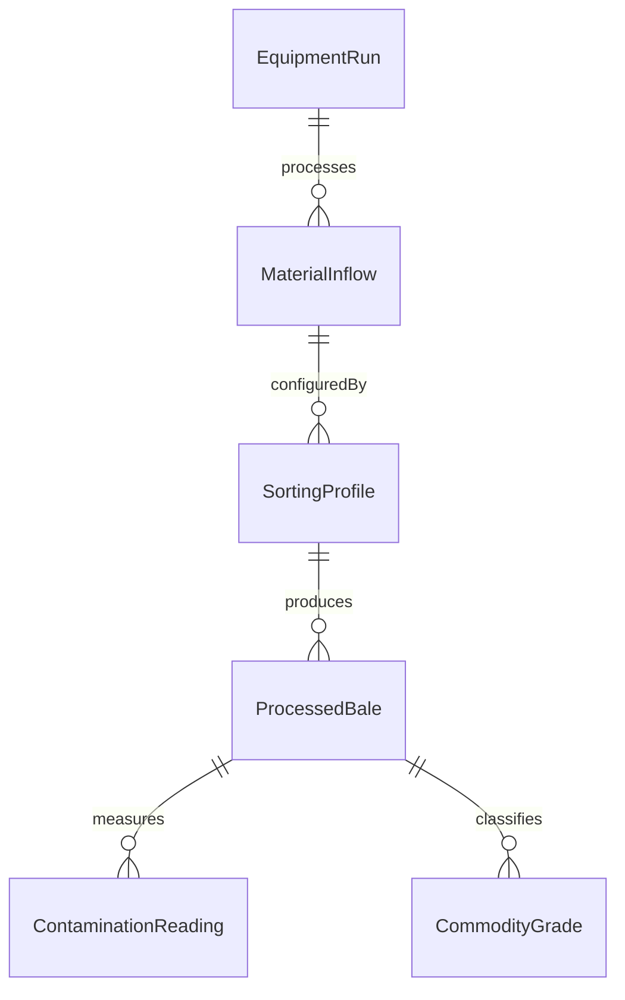
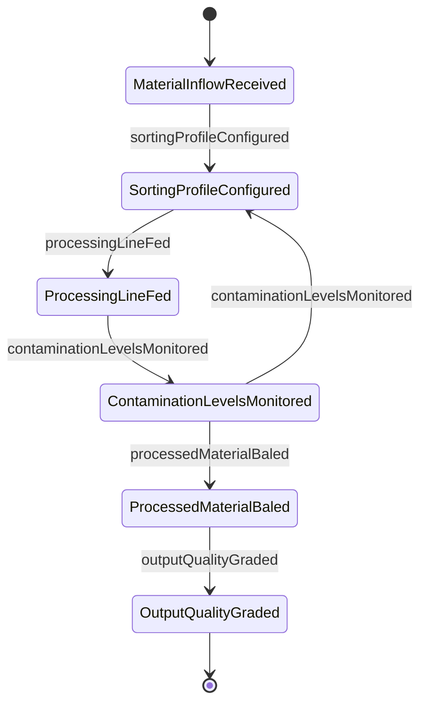
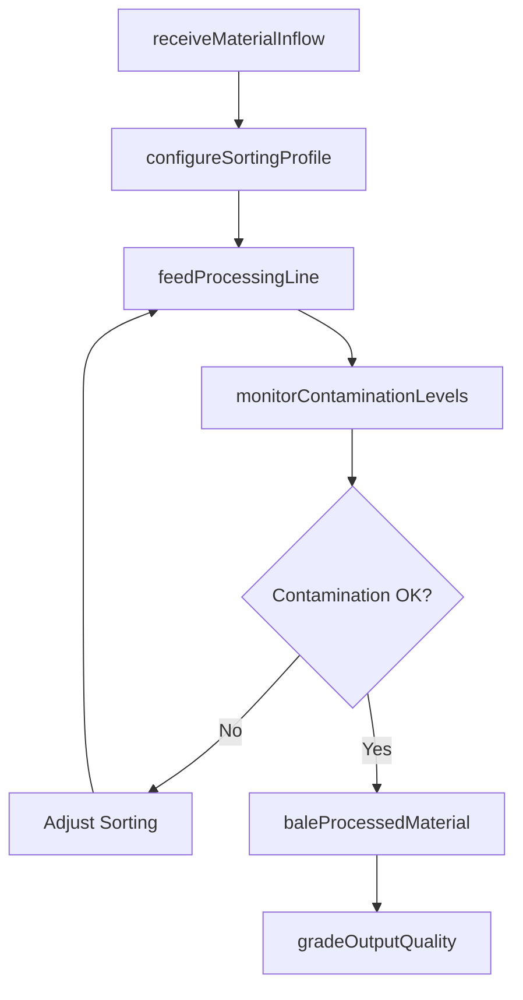
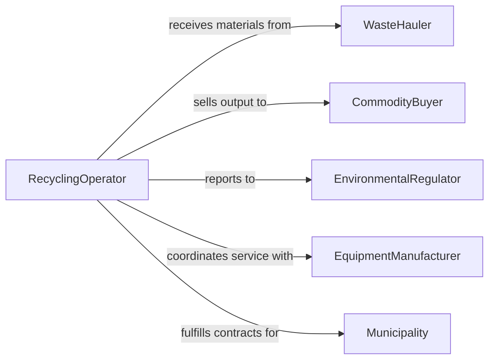

# Operate Recycling Equipment

> Business-as-Code definition for recycling equipment operation. Models the complete recycling workflow from material intake through sorting, processing, baling, and output quality verification.

## Overview

Operating recycling equipment involves controlling balers, shredders, granulators, magnetic separators, optical sorters, and washing lines to process recyclable materials into reusable commodities. This includes feeding material into processing lines, configuring sorting and separation parameters, monitoring contamination levels, and packaging output for resale. The definition covers municipal recycling facilities, industrial scrap processing, and specialized material recovery operations.

## Actors

| Actor | Description |
|-------|-------------|
| WasteHauler | Delivers collected recyclable materials to the facility |
| CommodityBuyer | Purchases processed recyclable output bales and materials |
| EnvironmentalRegulator | Enforces recycling standards and facility permits |
| EquipmentManufacturer | Provides and services recycling processing machinery |
| Municipality | Contracts recycling services and sets diversion targets |

## Roles

| Role | Description |
|------|-------------|
| RecyclingOperator | Runs sorting, shredding, and baling equipment |
| SortLineSupervisor | Oversees material flow and contamination management |
| MaintenanceTechnician | Services and repairs recycling machinery |
| QualityInspector | Tests output material purity and grade |
| FacilityManager | Manages throughput targets and commodity contracts |

## Entities

| Entity | Description |
|--------|-------------|
| MaterialInflow | A delivery of recyclable materials received for processing |
| SortingProfile | Configuration for separating material types and grades |
| ProcessedBale | A compressed package of sorted recyclable material |
| ContaminationReading | A measurement of non-target material in the output stream |
| EquipmentRun | A recorded session of recycling equipment operation |
| CommodityGrade | A quality classification for processed recyclable output |

## Actions

| Action | Description |
|--------|-------------|
| receiveMaterialInflow | Accept and log incoming recyclable materials |
| configureSortingProfile | Set parameters for material separation equipment |
| feedProcessingLine | Load materials onto the recycling equipment infeed |
| monitorContaminationLevels | Track non-target material in the output stream |
| baleProcessedMaterial | Compress sorted materials into shipping-ready bales |
| gradeOutputQuality | Classify processed material by purity and commodity grade |
| clearEquipmentJam | Resolve blockages in shredders, sorters, or conveyors |

## Events

| Event | Description |
|-------|-------------|
| materialInflowReceived | Recyclable materials have been accepted at the facility |
| sortingProfileConfigured | Separation equipment parameters have been set |
| processingLineFed | Materials have been loaded onto the infeed |
| contaminationLevelsMonitored | Output purity data has been captured and reviewed |
| processedMaterialBaled | Sorted materials have been compressed into bales |
| outputQualityGraded | Processed material has been classified by grade |
| equipmentJamCleared | A blockage has been resolved and operation resumed |

## Searches

| Search | Description |
|--------|-------------|
| findMaterialInflows | Retrieve deliveries by source, date, or material type |
| getProcessedBales | Query bales by commodity, grade, or production date |
| getContaminationReadings | Fetch purity measurements by run or material stream |
| getEquipmentRuns | Look up operational sessions by equipment or date range |


## Entity Relationships



## State Diagram



## Workflow



## Actor Relationships



## Usage

### Calling Actions

```typescript
import { operateRecyclingEquipment } from '@headlessly/operate-recycling-equipment'

const recycling = operateRecyclingEquipment()

// Receive incoming materials
const inflow = await recycling.receiveMaterialInflow({
  source: 'Route-12-Curbside',
  materialType: 'commingled-single-stream',
  weight: 18500,
  unit: 'kg'
})

// Configure sorting and feed the line
await recycling.configureSortingProfile({
  lineId: 'SORT-LINE-A',
  targets: ['PET', 'HDPE', 'aluminum', 'cardboard'],
  opticalSorterEnabled: true
})

await recycling.feedProcessingLine({
  inflowId: inflow.id,
  lineId: 'SORT-LINE-A',
  feedRate: 25
})

// Bale and grade output
const bale = await recycling.baleProcessedMaterial({
  materialType: 'PET',
  weight: 450,
  baleSize: 'standard'
})

await recycling.gradeOutputQuality({
  baleId: bale.id,
  contaminationThreshold: 2.0
})
```

### Event-Driven Automation

```typescript
// Alert on high contamination
recycling.contaminationLevelsMonitored(async ({ lineId, contamination, threshold }) => {
  if (contamination > threshold) {
    await notify({
      to: 'sort-line-supervisor',
      message: `Contamination at ${contamination}% on ${lineId} exceeds ${threshold}% threshold`
    })
  }
})

// Auto-notify buyer when bales are ready
recycling.outputQualityGraded(async ({ baleId, grade, materialType }) => {
  if (grade === 'A') {
    await notify({
      to: 'commodity-sales',
      message: `Grade A ${materialType} bale ${baleId} ready for shipment`
    })
  }
})
```
