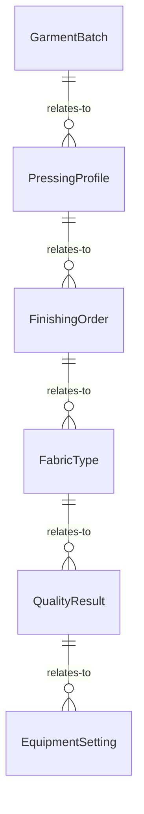
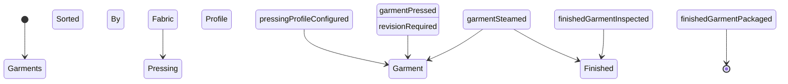
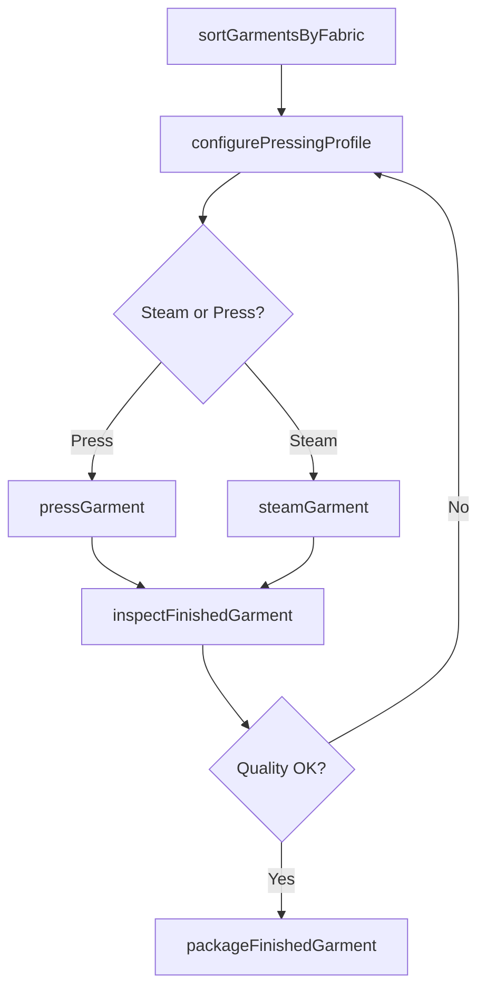
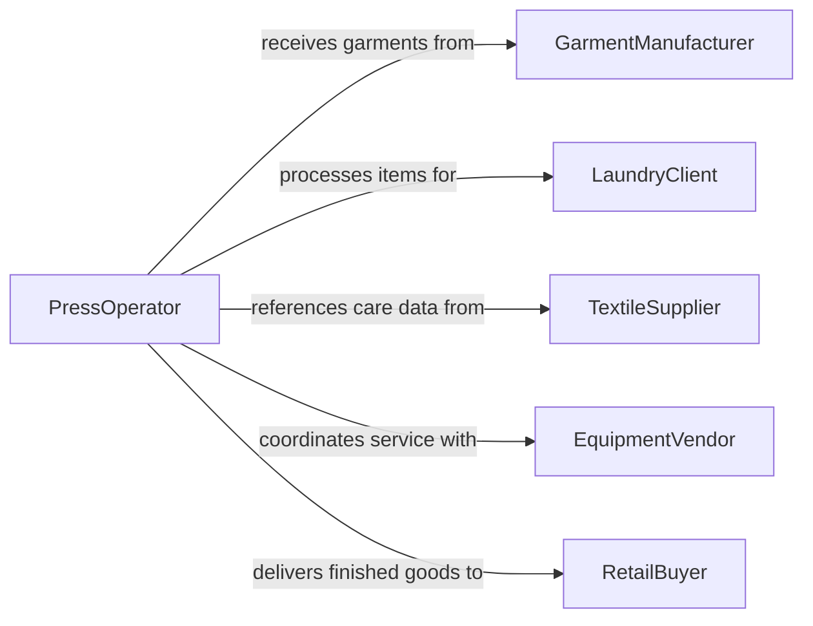

# Smooth Garments Irons Presses Steamers

> Business-as-Code definition for garment smoothing with irons, presses, and steamers. Models the complete finishing workflow from garment intake through pressing, steaming, quality inspection, and preparation for packaging or display.

## Overview

Smoothing garments with irons, presses, or steamers involves operating heated pressing equipment, steam tunnels, and hand irons to remove wrinkles and creases from clothing and textile products. This includes selecting appropriate temperature and steam settings for different fabrics, managing batch throughput, and ensuring garments meet appearance standards. The definition covers both commercial laundry finishing and garment manufacturing pressing operations.

## Actors

| Actor | Description |
|-------|-------------|
| GarmentManufacturer | Produces garments requiring finishing before distribution |
| LaundryClient | Sends clothing items for professional pressing services |
| TextileSupplier | Provides fabric information and care specifications |
| EquipmentVendor | Supplies and services pressing and steaming equipment |
| RetailBuyer | Receives finished garments ready for store display |

## Roles

| Role | Description |
|------|-------------|
| PressOperator | Operates pressing machines, irons, and steamers |
| FinishingSupervisor | Manages the pressing workflow and quality standards |
| FabricSpecialist | Determines correct temperature and steam settings per fabric |
| QualityChecker | Inspects garments for wrinkle-free appearance and heat damage |

## Entities

| Entity | Description |
|--------|-------------|
| GarmentBatch | A group of clothing items processed together |
| PressingProfile | Temperature, steam, and pressure settings for a fabric type |
| FinishingOrder | A request to press or steam specific garments |
| FabricType | A material classification with associated care instructions |
| QualityResult | An inspection outcome for a pressed garment |
| EquipmentSetting | Configured parameters for an iron, press, or steamer |

## Actions

| Action | Description |
|--------|-------------|
| sortGarmentsByFabric | Group garments by fabric type for appropriate heat settings |
| configurePressingProfile | Set temperature, steam level, and pressure for the fabric |
| pressGarment | Apply heat and pressure to smooth wrinkles from a garment |
| steamGarment | Use directed steam to relax fabric fibers and remove creases |
| inspectFinishedGarment | Check garment for wrinkle removal, scorching, or shine marks |
| packageFinishedGarment | Prepare pressed garments for delivery or display |

## Events

| Event | Description |
|-------|-------------|
| garmentsSortedByFabric | Garments have been grouped by fabric type |
| pressingProfileConfigured | Heat and steam settings have been set for the batch |
| garmentPressed | A garment has been pressed with heat and pressure |
| garmentSteamed | A garment has been treated with directed steam |
| finishedGarmentInspected | A pressed garment has been checked for quality |
| finishedGarmentPackaged | A completed garment has been prepared for delivery |

## Searches

| Search | Description |
|--------|-------------|
| findFinishingOrders | Retrieve orders by client, garment type, or priority |
| getPressingProfiles | Look up settings by fabric type or garment category |
| findGarmentBatches | Query batches by status, date, or fabric type |
| getQualityResults | Fetch inspection outcomes by batch or defect type |


## Entity Relationships



## State Diagram



## Workflow



## Actor Relationships



## Usage

### Calling Actions

```typescript
import { smoothGarmentsIronsPressesSteamers } from '@headlessly/smooth-garments-irons-presses-steamers'

const pressing = smoothGarmentsIronsPressesSteamers()

// Sort incoming batch by fabric
const sorted = await pressing.sortGarmentsByFabric({
  orderId: 'FO-2240',
  garments: ['cotton-shirt-01', 'silk-blouse-02', 'wool-jacket-03']
})

// Configure for cotton group and press
await pressing.configurePressingProfile({
  fabricType: 'cotton',
  temperature: 200,
  steamLevel: 'high',
  pressure: 'medium'
})

await pressing.pressGarment({
  garmentId: 'cotton-shirt-01',
  duration: 15
})

// Inspect result
const result = await pressing.inspectFinishedGarment({
  garmentId: 'cotton-shirt-01'
})
```

### Event-Driven Automation

```typescript
// Auto-package after passing inspection
pressing.finishedGarmentInspected(async ({ garmentId, passed }) => {
  if (passed) {
    await pressing.packageFinishedGarment({ garmentId })
  }
})

// Alert on quality failures for delicate fabrics
pressing.finishedGarmentInspected(async ({ garmentId, passed, fabricType, defects }) => {
  if (!passed && ['silk', 'cashmere', 'linen'].includes(fabricType)) {
    await notify({
      to: 'finishing-supervisor',
      message: `Quality issue on delicate fabric ${fabricType} (${garmentId}): ${defects.join(', ')}`
    })
  }
})
```
