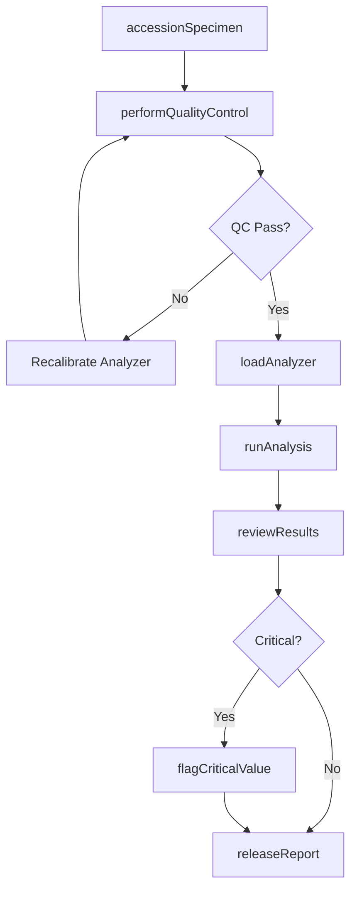
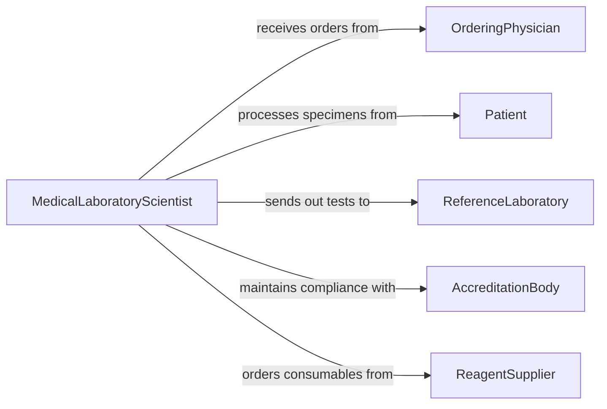

# Operate Laboratory Equipment Analyze Medical

> Business-as-Code definition for medical laboratory equipment operation. Models the end-to-end workflow of processing clinical specimens through analyzers to produce diagnostic results.

## Overview

Operating laboratory equipment to analyze medical samples involves using automated analyzers, microscopes, and diagnostic instruments to examine blood, tissue, urine, and other clinical specimens. This definition covers specimen accessioning, analyzer operation, result validation, and reporting to support clinical decision-making and patient care.

## Actors

| Actor | Description |
|-------|-------------|
| OrderingPhysician | Requests laboratory tests for patient diagnosis |
| Patient | Individual whose specimens are being analyzed |
| ReferenceLaboratory | Performs specialized tests beyond in-house capability |
| AccreditationBody | Certifies laboratory compliance with quality standards |
| ReagentSupplier | Provides chemicals and consumables for analyzers |

## Roles

| Role | Description |
|------|-------------|
| MedicalLaboratoryScientist | Operates analyzers and validates clinical results |
| Phlebotomist | Collects and labels patient specimens |
| LaboratoryDirector | Oversees quality assurance and regulatory compliance |
| PathologyAssistant | Prepares tissue specimens for microscopic analysis |

## Entities

| Entity | Description |
|--------|-------------|
| Specimen | Patient sample collected for laboratory analysis |
| TestOrder | Physician request specifying which analyses to perform |
| AnalyzerRun | A batch or individual processing cycle on an instrument |
| TestResult | Quantitative or qualitative outcome of an analysis |
| QualityControl | Control samples used to verify analyzer accuracy |
| CriticalValue | Result outside normal range requiring immediate notification |

## Actions

| Action | Description |
|--------|-------------|
| accessionSpecimen | Register and label incoming patient specimens |
| loadAnalyzer | Place specimens and reagents into the instrument |
| runAnalysis | Execute the analytical process on loaded specimens |
| reviewResults | Evaluate output against reference ranges and controls |
| flagCriticalValue | Identify and escalate results requiring urgent action |
| releaseReport | Finalize and transmit validated results to ordering system |
| performQualityControl | Run control samples to verify analyzer performance |

## Events

| Event | Description |
|-------|-------------|
| specimenAccessioned | Patient sample has been registered in the system |
| analyzerLoaded | Specimens and reagents are ready for processing |
| analysisCompleted | Instrument has finished the analytical run |
| resultsReviewed | Output has been evaluated by laboratory personnel |
| criticalValueFlagged | A result requiring urgent clinical attention has been identified |
| reportReleased | Validated results have been transmitted to the physician |
| qualityControlPassed | Control samples confirm analyzer is performing within limits |

## Searches

| Search | Description |
|--------|-------------|
| findPendingSpecimens | List specimens awaiting analysis by priority or type |
| getTestResults | Retrieve results for a patient or specimen |
| getQualityControlTrends | Review analyzer performance over time |
| findCriticalValues | List results flagged for urgent notification |

## Workflow



## Actor Relationships



## Usage

### Calling Actions

```typescript
import { operateLaboratoryEquipmentAnalyzeMedical } from '@headlessly/operate-laboratory-equipment-analyze-medical'

const medLab = operateLaboratoryEquipmentAnalyzeMedical()

// Accession a blood specimen
const specimen = await medLab.accessionSpecimen({
  patientId: 'PAT-10234',
  specimenType: 'blood',
  collectionTime: '2026-02-05T08:30:00Z',
  orderedTests: ['CBC', 'BMP', 'LFT']
})

// Run analysis
await medLab.loadAnalyzer({ analyzerId: 'CHEM-ANALYZER-01', specimenIds: [specimen.id] })
const run = await medLab.runAnalysis({ analyzerId: 'CHEM-ANALYZER-01' })

// Review and release
await medLab.reviewResults({ runId: run.id })
await medLab.releaseReport({ specimenId: specimen.id })
```

### Event-Driven Automation

```typescript
// Immediately notify physician of critical values
medLab.criticalValueFlagged(async ({ patientId, testName, value, referenceRange }) => {
  await notify({
    to: 'ordering-physician',
    priority: 'urgent',
    message: `Critical ${testName} value: ${value} (ref: ${referenceRange}) for patient ${patientId}`
  })
})

// Auto-rerun when QC fails
medLab.qualityControlPassed(async ({ analyzerId, passed }) => {
  if (!passed) {
    await medLab.performQualityControl({ analyzerId, retryCount: 1 })
  }
})
```
