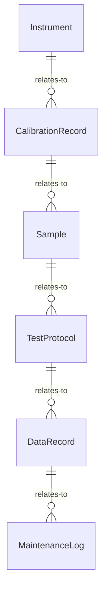
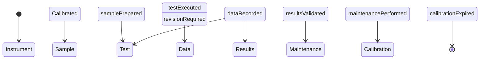
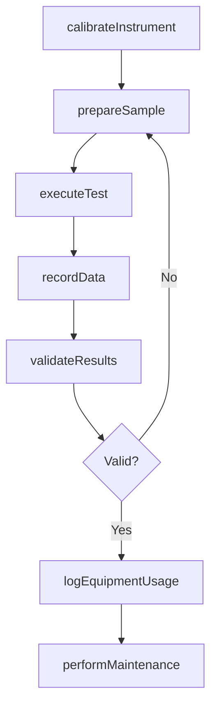
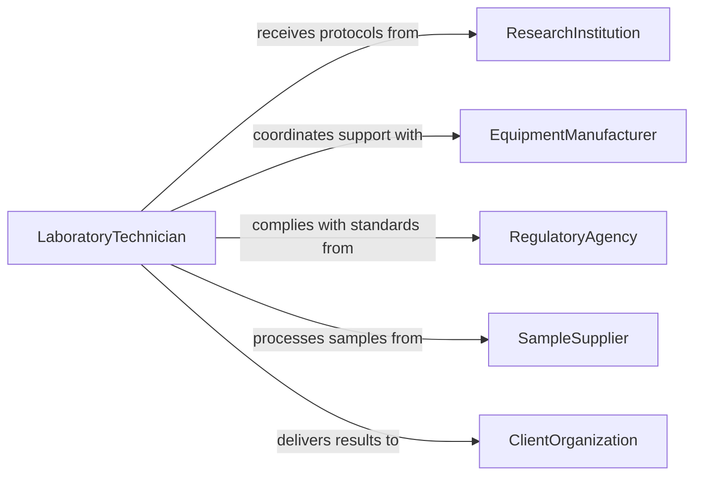

# Operate Laboratory Field Equipment

> Business-as-Code definition for laboratory and field equipment operation. Models equipment setup, calibration, sample processing, and data capture across research and testing environments.

## Overview

Operating laboratory or field equipment encompasses the use of analytical instruments, measurement devices, and specialized apparatus for scientific research, quality testing, and environmental monitoring. This definition covers instrument calibration, sample handling, data acquisition, and equipment maintenance to ensure reliable and reproducible results.

## Actors

| Actor | Description |
|-------|-------------|
| ResearchInstitution | Commissions studies requiring equipment operation |
| EquipmentManufacturer | Supplies instruments and provides technical support |
| RegulatoryAgency | Sets standards for equipment operation and data quality |
| SampleSupplier | Provides specimens or materials for analysis |
| ClientOrganization | Requests testing services and receives results |

## Roles

| Role | Description |
|------|-------------|
| LaboratoryTechnician | Operates instruments and processes samples |
| FieldResearcher | Deploys and operates portable equipment on-site |
| InstrumentSpecialist | Maintains and calibrates complex equipment |
| LabManager | Oversees equipment inventory and scheduling |

## Entities

| Entity | Description |
|--------|-------------|
| Instrument | Analytical or measurement device used in operations |
| CalibrationRecord | Documentation of instrument calibration and validation |
| Sample | Specimen or material being analyzed or measured |
| TestProtocol | Standard operating procedure for equipment use |
| DataRecord | Captured measurements and observations |
| MaintenanceLog | History of equipment servicing and repairs |

## Actions

| Action | Description |
|--------|-------------|
| calibrateInstrument | Verify and adjust equipment accuracy against standards |
| prepareSample | Process specimens for analysis per protocol |
| executeTest | Run the instrument to collect measurements or data |
| recordData | Capture and store measurement results |
| validateResults | Check data against expected ranges and controls |
| performMaintenance | Service equipment per manufacturer recommendations |
| logEquipmentUsage | Track instrument utilization and operator sessions |

## Events

| Event | Description |
|-------|-------------|
| instrumentCalibrated | Equipment has been verified against reference standards |
| samplePrepared | Specimen is ready for analysis |
| testExecuted | Instrument run has completed |
| dataRecorded | Measurement results have been captured |
| resultsValidated | Data has passed quality control checks |
| maintenancePerformed | Equipment servicing has been completed |
| calibrationExpired | Instrument calibration has exceeded its valid period |

## Searches

| Search | Description |
|--------|-------------|
| findInstruments | List available equipment by type, status, or location |
| getCalibrationHistory | Retrieve calibration records for a specific instrument |
| getTestResults | Look up data records by sample, date, or protocol |
| getMaintenanceSchedule | Find upcoming maintenance tasks for equipment |


## Entity Relationships



## State Diagram



## Workflow



## Actor Relationships



## Usage

### Calling Actions

```typescript
import { operateLaboratoryFieldEquipment } from '@headlessly/operate-laboratory-field-equipment'

const lab = operateLaboratoryFieldEquipment()

// Calibrate a spectrometer
const calibration = await lab.calibrateInstrument({
  instrumentId: 'SPEC-4200',
  standardReference: 'NIST-SRM-1643',
  tolerancePercent: 2.0
})

// Execute a test
const test = await lab.executeTest({
  instrumentId: 'SPEC-4200',
  sampleId: 'SAMP-2026-0088',
  protocolId: 'WATER-METALS-ICP'
})

// Validate and record
await lab.validateResults({ testId: test.id, controlSampleId: 'QC-BLANK-01' })
await lab.recordData({ testId: test.id, format: 'structured' })
```

### Event-Driven Automation

```typescript
// Alert when calibration expires
lab.calibrationExpired(async ({ instrumentId, lastCalibration }) => {
  await notify({
    to: 'instrument-specialist',
    message: `Instrument ${instrumentId} calibration expired since ${lastCalibration}`
  })
})

// Auto-schedule maintenance after heavy usage
lab.testExecuted(async ({ instrumentId, totalRunsSinceService }) => {
  if (totalRunsSinceService > 500) {
    await lab.performMaintenance({ instrumentId, type: 'preventive' })
  }
})
```
