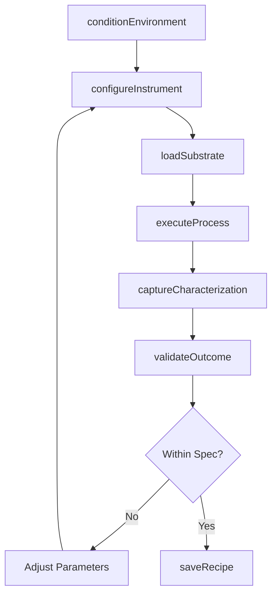
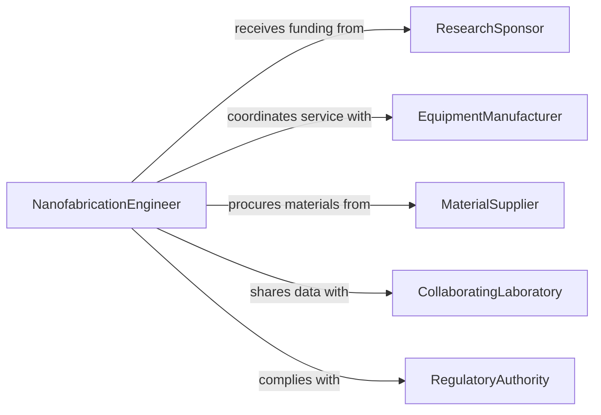

# Operate Precision Equipment Control Microscopic

> Business-as-Code definition for precision equipment operation at microscopic and nanoscopic scales. Models instrument control, process parameter management, and nanoscale fabrication or characterization workflows.

## Overview

Operating precision equipment to control microscopic or nanoscopic processes involves using electron microscopes, atomic force microscopes, lithography systems, and other nanoscale instruments for fabrication, characterization, and manipulation of materials at extremely small scales. This definition covers instrument parameter tuning, environmental conditioning, process execution, and quality verification at sub-micron resolution.

## Actors

| Actor | Description |
|-------|-------------|
| ResearchSponsor | Funds research requiring nanoscale operations |
| EquipmentManufacturer | Supplies precision instruments and maintenance services |
| MaterialSupplier | Provides substrates, wafers, and nanomaterials |
| CollaboratingLaboratory | Partners on multi-institutional nanoscale research |
| RegulatoryAuthority | Enforces safety and environmental standards for nanomaterials |

## Roles

| Role | Description |
|------|-------------|
| NanofabricationEngineer | Operates lithography and deposition systems |
| MicroscopySpecialist | Operates electron and scanning probe microscopes |
| ProcessEngineer | Designs and optimizes nanoscale process parameters |
| CleanroomTechnician | Maintains controlled environment conditions |

## Entities

| Entity | Description |
|--------|-------------|
| ProcessRecipe | Defined set of parameters for a nanoscale operation |
| Substrate | Base material on which nanoscale processes are performed |
| CharacterizationResult | Measurement data from microscopic analysis |
| EnvironmentLog | Record of cleanroom temperature, humidity, and particle count |
| FabricationRun | A single execution of a nanoscale manufacturing process |
| InstrumentConfiguration | Saved equipment settings for reproducible operation |

## Actions

| Action | Description |
|--------|-------------|
| configureInstrument | Set precision parameters for the target process |
| conditionEnvironment | Verify and adjust cleanroom or vacuum conditions |
| loadSubstrate | Place material into the instrument chamber |
| executeProcess | Run the fabrication or characterization sequence |
| captureCharacterization | Acquire measurements at nanoscale resolution |
| validateOutcome | Compare results against target specifications |
| saveRecipe | Store verified process parameters for reuse |

## Events

| Event | Description |
|-------|-------------|
| instrumentConfigured | Precision parameters have been set and verified |
| environmentConditioned | Operating environment meets required specifications |
| substrateLoaded | Material has been placed in the instrument |
| processExecuted | Nanoscale fabrication or manipulation is complete |
| characterizationCaptured | Microscopic measurements have been acquired |
| outcomeValidated | Results have been confirmed against specifications |
| recipesSaved | Process parameters have been stored for reproduction |

## Searches

| Search | Description |
|--------|-------------|
| findProcessRecipes | Look up recipes by material, instrument, or target feature |
| getCharacterizationResults | Retrieve measurements for a specific run or substrate |
| getEnvironmentHistory | Review cleanroom conditions over a time range |
| findFabricationRuns | List process executions by date, operator, or outcome |

## Workflow



## Actor Relationships



## Usage

### Calling Actions

```typescript
import { operatePrecisionEquipmentControlMicroscopic } from '@headlessly/operate-precision-equipment-control-microscopic'

const nano = operatePrecisionEquipmentControlMicroscopic()

// Configure electron beam lithography
const config = await nano.configureInstrument({
  instrumentId: 'EBL-JEOL-9500',
  accelerationVoltage: 100,
  beamCurrent: 0.5,
  writeField: 500,
  resolutionNm: 5
})

// Execute patterning process
await nano.loadSubstrate({ instrumentId: 'EBL-JEOL-9500', substrateName: 'Si-100nm-PMMA' })
const run = await nano.executeProcess({
  instrumentId: 'EBL-JEOL-9500',
  recipeId: 'NANOWIRE-PATTERN-V3',
  doseUcPerCm2: 300
})

// Characterize results with SEM
const results = await nano.captureCharacterization({
  instrumentId: 'SEM-HITACHI-8200',
  fabricationRunId: run.id,
  magnification: 50000
})
```

### Event-Driven Automation

```typescript
// Alert on environment drift
nano.environmentConditioned(async ({ cleanroomId, particleCount, threshold }) => {
  if (particleCount > threshold) {
    await notify({
      to: 'cleanroom-technician',
      message: `Particle count ${particleCount} exceeds limit in ${cleanroomId}`
    })
  }
})

// Save successful recipes automatically
nano.outcomeValidated(async ({ fabricationRunId, withinSpec, recipeId }) => {
  if (withinSpec) {
    await nano.saveRecipe({ recipeId, fabricationRunId, status: 'validated' })
  }
})
```
