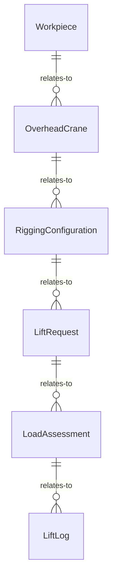
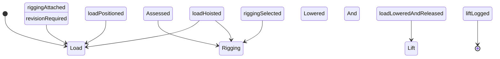
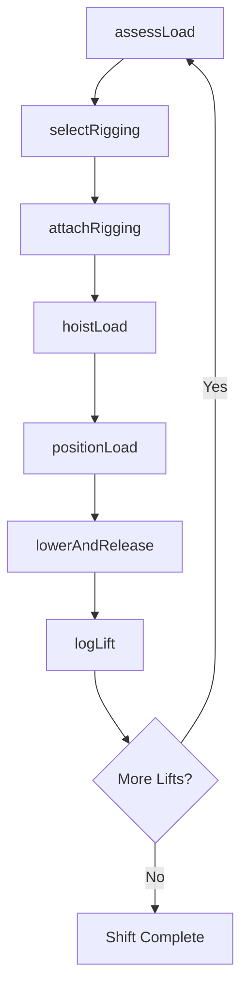
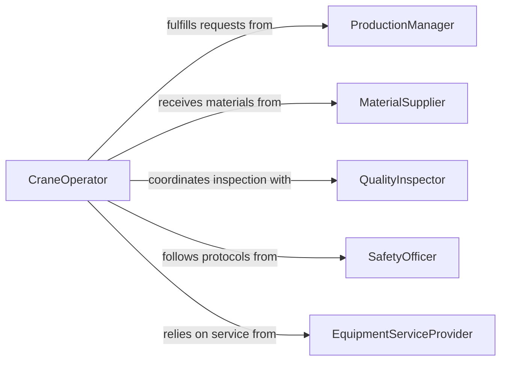

# Lift Materials Workpieces Using Cranes

> Business-as-Code definition for lifting materials or workpieces using cranes or other lifting equipment. Models the rigging, hoisting, and positioning of industrial materials and manufactured components in factories, shipyards, and fabrication shops.

## Overview

Lifting materials and workpieces using cranes involves assessing load characteristics, selecting appropriate rigging methods, operating overhead or jib cranes, and precisely positioning heavy components for assembly, machining, or storage. This definition provides actions for load assessment and lift execution, events for tracking material movement and safety, and searches for lift records and equipment status.

## Actors

| Actor | Description |
|-------|-------------|
| ProductionManager | Requests material lifts to support manufacturing schedules |
| MaterialSupplier | Delivers raw materials and heavy components to the facility |
| QualityInspector | Verifies that lifted workpieces are undamaged after handling |
| SafetyOfficer | Enforces overhead lifting safety protocols and reviews incidents |
| EquipmentServiceProvider | Performs load testing, inspections, and repairs on lifting equipment |

## Roles

| Role | Description |
|------|-------------|
| CraneOperator | Controls overhead or jib cranes to raise and position loads |
| Rigger | Selects and attaches slings, chains, and lifting fixtures to workpieces |
| Spotter | Guides the load and communicates positioning instructions to the operator |
| ShopSupervisor | Coordinates lift sequences with production and assembly schedules |

## Entities

| Entity | Description |
|--------|-------------|
| Workpiece | A manufactured component, raw material, or assembly being lifted |
| OverheadCrane | A bridge or gantry crane installed in a manufacturing facility |
| RiggingConfiguration | The specific arrangement of slings, hooks, and fixtures for a load |
| LiftRequest | A formal request to move a workpiece from one location to another |
| LoadAssessment | An evaluation of weight, center of gravity, and fragility of a workpiece |
| LiftLog | A record of a completed lift with details on load, equipment, and duration |

## Actions

| Action | Description |
|--------|-------------|
| assessLoad | Evaluate the weight, dimensions, center of gravity, and fragility of a workpiece |
| selectRigging | Choose the appropriate slings, hooks, and lifting fixtures for the load |
| attachRigging | Secure the rigging hardware to the workpiece at designated lift points |
| hoistLoad | Raise the workpiece off its current surface using the crane |
| positionLoad | Move the suspended workpiece to its target location |
| lowerAndRelease | Lower the workpiece into position and detach the rigging |
| logLift | Record details of the completed lift including weight, time, and any observations |

## Events

| Event | Description |
|-------|-------------|
| loadAssessed | The weight and characteristics of a workpiece have been evaluated |
| riggingSelected | Appropriate lifting hardware has been chosen for the load |
| riggingAttached | Slings and fixtures have been secured to the workpiece |
| loadHoisted | The workpiece has been raised off its resting surface |
| loadPositioned | The suspended workpiece has been moved to the target location |
| loadLoweredAndReleased | The workpiece has been set down and rigging removed |
| liftLogged | The completed lift has been documented |

## Searches

| Search | Description |
|--------|-------------|
| findLiftRequests | List pending lift requests by priority, workpiece type, or date |
| getLiftLogs | Retrieve lift records by crane, operator, or workpiece |
| getRiggingInventory | Check available slings, shackles, and lifting fixtures by capacity |
| findCraneStatus | Locate overhead cranes by bay, capacity, or operational status |


## Entity Relationships



## State Diagram



## Workflow



## Actor Relationships



## Usage

### Calling Actions

```typescript
import { liftMaterialsWorkpieces } from '@headlessly/lift-materials-workpieces-using-cranes'

const lifting = liftMaterialsWorkpieces()

// Assess the load before lifting
const assessment = await lifting.assessLoad({
  workpieceId: 'turbine-housing-unit-47',
  weight: { pounds: 8500 },
  dimensions: { length: 96, width: 48, height: 36, unit: 'inches' },
  centerOfGravity: 'offset-left-12-inches',
  fragility: 'medium'
})

// Select and attach rigging
await lifting.selectRigging({
  assessmentId: assessment.id,
  riggingType: 'four-leg-chain-sling',
  capacity: { pounds: 12000 }
})

await lifting.attachRigging({
  workpieceId: 'turbine-housing-unit-47',
  liftPoints: ['lug-NW', 'lug-NE', 'lug-SW', 'lug-SE']
})

// Hoist and position the workpiece
await lifting.hoistLoad({
  craneId: 'overhead-crane-bay-3',
  workpieceId: 'turbine-housing-unit-47',
  clearanceHeight: { feet: 15 }
})

await lifting.positionLoad({
  craneId: 'overhead-crane-bay-3',
  targetLocation: 'machining-center-MC-12'
})
```

### Event-Driven Automation

```typescript
// Verify workpiece integrity after placement
lifting.loadLoweredAndReleased(async ({ workpieceId, targetLocation }) => {
  await notify({
    to: 'quality-inspector',
    message: `Workpiece ${workpieceId} placed at ${targetLocation} - ready for inspection`
  })
})

// Track all lifts for safety compliance reporting
lifting.liftLogged(async ({ craneId, operatorId, workpieceId, weight }) => {
  await logCompliance({
    type: 'overhead-lift',
    craneId,
    operatorId,
    workpieceId,
    weight,
    timestamp: new Date().toISOString()
  })
})
```
