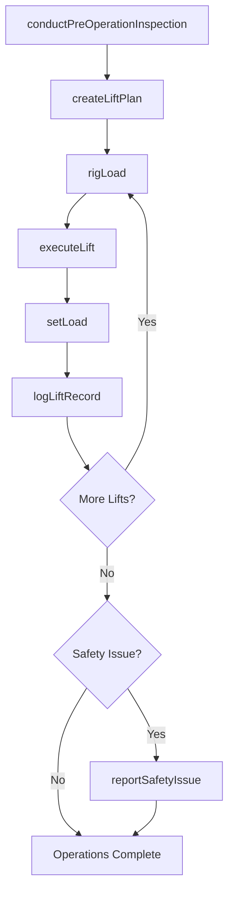
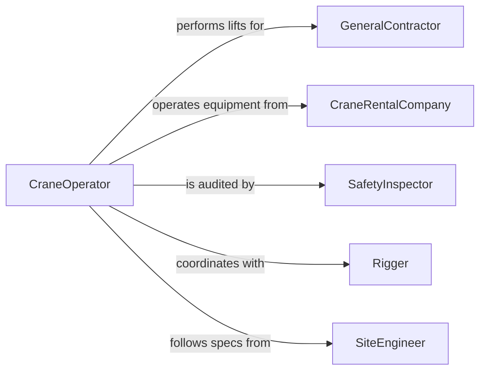

# Operate Cranes Hoists Moving Lifting

> Business-as-Code definition for operating cranes, hoists, or other moving and lifting equipment. Models the planning, rigging, lifting, and placement of loads using overhead cranes, mobile cranes, hoists, and derricks in construction, manufacturing, and logistics environments.

## Overview

Operating cranes, hoists, and other lifting equipment involves conducting pre-operation inspections, rigging loads, executing lifts according to load charts, and placing materials at designated locations on job sites and in facilities. This definition provides actions for lift planning and execution, events for tracking lift progress and safety compliance, and searches for equipment certifications and lift records.

## Actors

| Actor | Description |
|-------|-------------|
| GeneralContractor | Requests crane services for construction projects |
| CraneRentalCompany | Provides crane units and certified operators |
| SafetyInspector | Audits lifting operations for compliance with OSHA and industry standards |
| Rigger | Prepares and attaches loads to the crane hook using slings and hardware |
| SiteEngineer | Specifies load weights, placement locations, and ground conditions |

## Roles

| Role | Description |
|------|-------------|
| CraneOperator | Controls the crane during lifting and placement operations |
| LiftSupervisor | Plans lifts, reviews load charts, and oversees execution |
| SignalPerson | Communicates hand or radio signals to the crane operator |
| MaintenanceMechanic | Inspects, services, and repairs crane and hoist equipment |

## Entities

| Entity | Description |
|--------|-------------|
| Crane | A mobile, tower, or overhead crane used for heavy lifting |
| Hoist | A mechanical device for raising or lowering loads vertically |
| LiftPlan | A documented plan specifying load weight, rigging configuration, and crane position |
| LoadChart | A reference table defining safe lifting capacities at various radii and boom lengths |
| RiggingHardware | Slings, shackles, spreader bars, and hooks used to attach loads |
| InspectionRecord | A documented check of crane condition, safety devices, and certifications |

## Actions

| Action | Description |
|--------|-------------|
| conductPreOperationInspection | Check crane systems, safety devices, and rigging before operation |
| createLiftPlan | Document load weight, rigging method, crane position, and swing path |
| rigLoad | Attach slings and hardware to the load and connect to the crane hook |
| executeLift | Raise, swing, and place the load at the designated location |
| setLoad | Position and release the load at its final placement point |
| logLiftRecord | Record lift details including load, duration, and any incidents |
| reportSafetyIssue | Document a hazard, near-miss, or safety violation during lifting |

## Events

| Event | Description |
|-------|-------------|
| preOperationInspectionCompleted | Crane and rigging have been checked and cleared for operation |
| liftPlanCreated | A documented lift plan has been prepared and approved |
| loadRigged | The load has been attached to the crane hook and is ready to lift |
| liftExecuted | The load has been raised and moved to the target position |
| loadSet | The load has been placed and released at its final location |
| liftRecordLogged | Lift details have been documented |
| safetyIssueReported | A safety concern has been identified and documented |

## Searches

| Search | Description |
|--------|-------------|
| findCranes | List available cranes by type, capacity, or location |
| getLiftRecords | Retrieve lift history by crane, operator, or project |
| getInspectionRecords | Locate inspection reports by crane, date, or inspector |
| findLiftPlans | Search lift plans by project, load type, or date |

## Workflow



## Actor Relationships



## Usage

### Calling Actions

```typescript
import { operateCranesHoists } from '@headlessly/operate-cranes-hoists-moving-lifting'

const crane = operateCranesHoists()

// Conduct pre-operation inspection
const inspection = await crane.conductPreOperationInspection({
  craneId: 'mobile-crane-ltm-1300',
  operatorId: 'op-johnson',
  checkItems: ['boom-condition', 'wire-rope', 'safety-devices', 'outriggers']
})

// Create a lift plan
const liftPlan = await crane.createLiftPlan({
  craneId: 'mobile-crane-ltm-1300',
  loadWeight: { tons: 45 },
  rigging: 'four-point-sling',
  radius: { feet: 80 },
  boomLength: { feet: 140 },
  groundConditions: 'compacted-gravel'
})

// Execute the lift
await crane.executeLift({
  liftPlanId: liftPlan.id,
  signalPersonId: 'sp-williams',
  targetLocation: 'steel-column-grid-B4'
})
```

### Event-Driven Automation

```typescript
// Alert supervisor if inspection finds issues
crane.preOperationInspectionCompleted(async ({ craneId, passed, findings }) => {
  if (!passed) {
    await notify({
      to: 'lift-supervisor',
      message: `Crane ${craneId} failed pre-op inspection: ${findings.join(', ')}`
    })
  }
})

// Track all lifts for compliance reporting
crane.liftExecuted(async ({ craneId, liftPlanId, loadWeight, operatorId }) => {
  await crane.logLiftRecord({
    craneId,
    liftPlanId,
    loadWeight,
    operatorId,
    timestamp: new Date().toISOString()
  })
})
```
