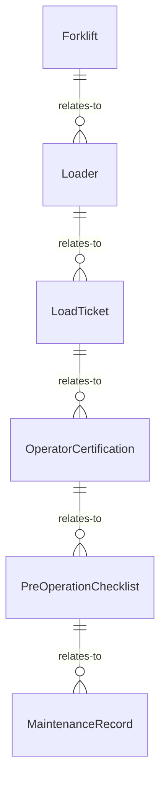
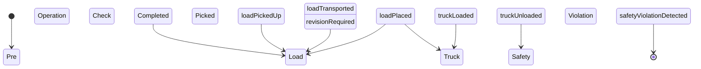
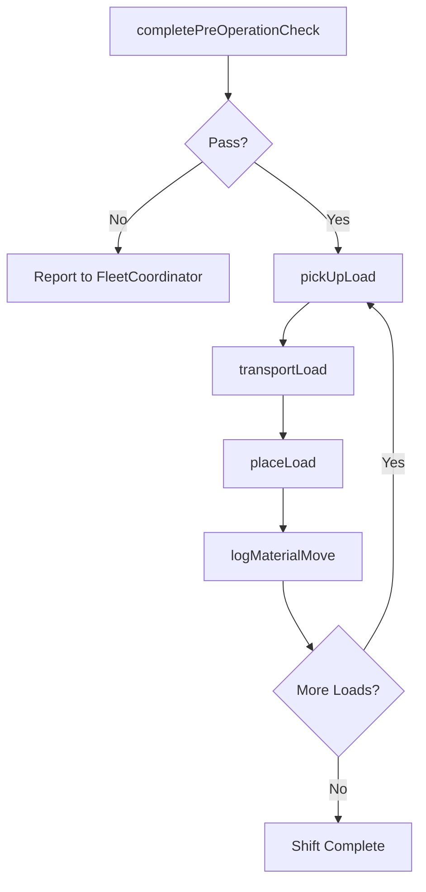
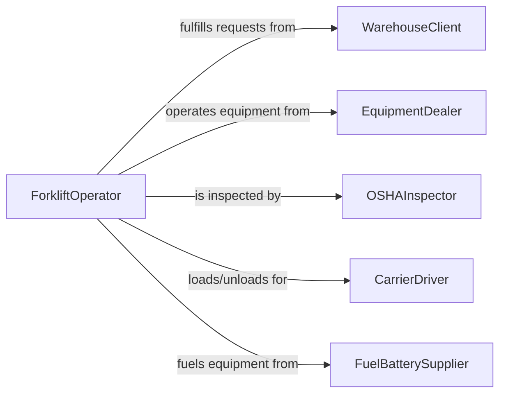

# Operate Forklifts Loaders

> Business-as-Code definition for operating forklifts or other loaders. Models the daily operation of forklifts, pallet jacks, and wheel loaders for material handling in warehouses, distribution centers, manufacturing plants, and construction sites.

## Overview

Operating forklifts and loaders involves moving palletized goods, loading and unloading trucks, stacking inventory in racking systems, and transporting bulk materials across facilities. This definition provides actions for load handling and equipment management, events for tracking material movement and safety compliance, and searches for inventory location and equipment utilization records.

## Actors

| Actor | Description |
|-------|-------------|
| WarehouseClient | Requests material movement and staging for inbound or outbound shipments |
| EquipmentDealer | Sells and leases forklifts, loaders, and attachments |
| OSHAInspector | Audits forklift operations for compliance with safety regulations |
| CarrierDriver | Delivers or picks up goods requiring forklift loading or unloading |
| FuelBatterySupplier | Provides propane, diesel, or battery charging for powered equipment |

## Roles

| Role | Description |
|------|-------------|
| ForkliftOperator | Drives forklifts and loaders to move, stack, and stage materials |
| WarehouseSupervisor | Assigns tasks to operators and manages material flow priorities |
| SafetyTrainer | Certifies operators and conducts ongoing safety training |
| FleetCoordinator | Tracks equipment availability, maintenance schedules, and utilization |

## Entities

| Entity | Description |
|--------|-------------|
| Forklift | A powered truck with forks for lifting and transporting palletized loads |
| Loader | A wheeled or tracked machine with a bucket for moving bulk materials |
| LoadTicket | A record of a specific material move including origin, destination, and weight |
| OperatorCertification | A documented qualification authorizing an individual to operate a forklift |
| PreOperationChecklist | A daily inspection form verifying equipment readiness before use |
| MaintenanceRecord | A log of service performed on a forklift or loader |

## Actions

| Action | Description |
|--------|-------------|
| completePreOperationCheck | Inspect fluid levels, tires, forks, mast, and safety features before use |
| pickUpLoad | Approach, engage forks under, and lift a pallet or load |
| transportLoad | Drive a loaded forklift from origin to destination within the facility |
| placeLoad | Position and set down a load at a racking location or staging area |
| loadTruck | Place pallets or materials onto a trailer for outbound shipment |
| unloadTruck | Remove pallets or materials from an inbound trailer |
| logMaterialMove | Record the details of a completed material movement |

## Events

| Event | Description |
|-------|-------------|
| preOperationCheckCompleted | Daily inspection has been performed and documented |
| loadPickedUp | A pallet or load has been engaged and lifted |
| loadTransported | A load has been moved from origin to destination |
| loadPlaced | A load has been set down at its designated location |
| truckLoaded | A trailer has been loaded with outbound materials |
| truckUnloaded | An inbound trailer has been emptied |
| safetyViolationDetected | An unsafe operation or condition has been identified |

## Searches

| Search | Description |
|--------|-------------|
| findForklifts | List forklifts by type, capacity, location, or availability |
| getLoadTickets | Retrieve material move records by date, operator, or location |
| getOperatorCertifications | Check certification status and expiration for operators |
| findMaintenanceRecords | Locate service history for a specific forklift or loader |


## Entity Relationships



## State Diagram



## Workflow



## Actor Relationships



## Usage

### Calling Actions

```typescript
import { operateForkliftsLoaders } from '@headlessly/operate-forklifts-loaders'

const forklift = operateForkliftsLoaders()

// Complete daily pre-operation check
const check = await forklift.completePreOperationCheck({
  forkliftId: 'forklift-toyota-8fgu25',
  operatorId: 'op-garcia',
  items: ['forks', 'mast', 'hydraulics', 'tires', 'horn', 'lights', 'seatbelt']
})

// Pick up and transport a pallet
await forklift.pickUpLoad({
  forkliftId: 'forklift-toyota-8fgu25',
  loadId: 'pallet-inv-44821',
  origin: 'dock-3-staging'
})

await forklift.transportLoad({
  forkliftId: 'forklift-toyota-8fgu25',
  loadId: 'pallet-inv-44821',
  destination: 'rack-B12-level-3'
})

// Place and log the move
await forklift.placeLoad({
  forkliftId: 'forklift-toyota-8fgu25',
  loadId: 'pallet-inv-44821',
  location: 'rack-B12-level-3'
})
```

### Event-Driven Automation

```typescript
// Alert on safety violations
forklift.safetyViolationDetected(async ({ forkliftId, operatorId, violation }) => {
  await notify({
    to: 'warehouse-supervisor',
    message: `Safety violation by ${operatorId} on ${forkliftId}: ${violation}`
  })
})

// Track certification expiration
forklift.preOperationCheckCompleted(async ({ operatorId }) => {
  const certs = await forklift.getOperatorCertifications({ operatorId })
  const expiring = certs.filter(c => c.daysUntilExpiry < 30)
  if (expiring.length > 0) {
    await notify({
      to: 'safety-trainer',
      message: `Operator ${operatorId} certification expires in ${expiring[0].daysUntilExpiry} days`
    })
  }
})
```
