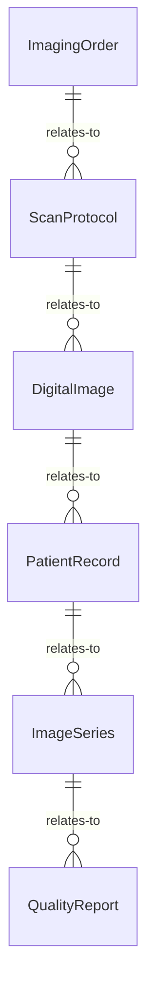
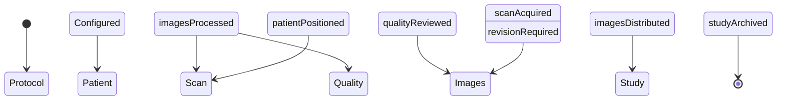
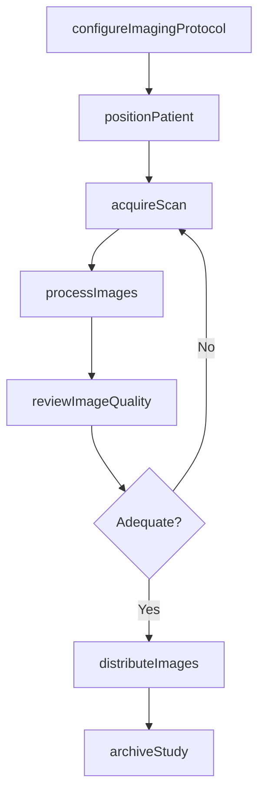
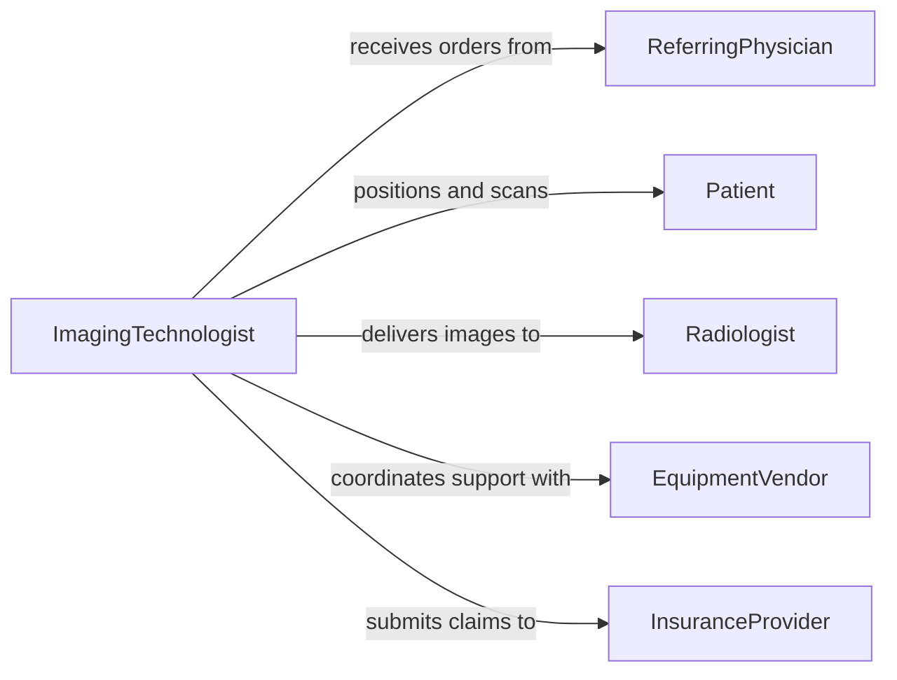

# Create Advanced Digital Images Patients

> Business-as-Code definition for advanced digital patient imaging. Models the complete imaging workflow from patient preparation through image acquisition, processing, and delivery to clinicians.

## Overview

Creating advanced digital images of patients involves operating computer-based imaging systems such as CT, MRI, PET, and 3D reconstruction platforms to produce diagnostic-quality visualizations. This definition covers image acquisition parameter configuration, scan execution, post-processing enhancement, and image distribution to referring physicians and medical records systems.

## Actors

| Actor | Description |
|-------|-------------|
| Patient | Individual undergoing the imaging procedure |
| ReferringPhysician | Orders the imaging study and reviews results |
| Radiologist | Interprets the acquired images and issues reports |
| EquipmentVendor | Provides imaging hardware and software support |
| InsuranceProvider | Authorizes and reimburses imaging procedures |

## Roles

| Role | Description |
|------|-------------|
| ImagingTechnologist | Operates the imaging equipment and acquires scans |
| RadiologyTechnician | Assists with patient positioning and equipment setup |
| PACSAdministrator | Manages image storage and distribution systems |
| QualityAssuranceSpecialist | Ensures imaging protocols meet diagnostic standards |

## Entities

| Entity | Description |
|--------|-------------|
| ImagingOrder | Physician request specifying the study to perform |
| ScanProtocol | Predefined equipment parameters for a specific study type |
| DigitalImage | Acquired image data in DICOM or equivalent format |
| PatientRecord | Demographics and clinical history relevant to imaging |
| ImageSeries | Collection of related images from a single acquisition |
| QualityReport | Assessment of image diagnostic adequacy |

## Actions

| Action | Description |
|--------|-------------|
| configureImagingProtocol | Set equipment parameters for the ordered study |
| positionPatient | Prepare and align the patient for image acquisition |
| acquireScan | Execute the imaging sequence and capture raw data |
| processImages | Apply reconstruction algorithms and enhancement filters |
| reviewImageQuality | Assess images for diagnostic adequacy |
| distributeImages | Send finalized images to PACS and referring physician |
| archiveStudy | Store completed study in long-term archive |

## Events

| Event | Description |
|-------|-------------|
| protocolConfigured | Imaging parameters have been set for the study |
| patientPositioned | Patient is aligned and ready for scanning |
| scanAcquired | Raw image data has been captured |
| imagesProcessed | Post-processing and reconstruction are complete |
| qualityReviewed | Image quality assessment has been performed |
| imagesDistributed | Finalized images have been sent to recipients |
| studyArchived | Completed study has been stored in archive |

## Searches

| Search | Description |
|--------|-------------|
| findImagingOrders | List pending or completed imaging orders by patient or date |
| getStudyImages | Retrieve image series for a specific study |
| getScanProtocols | Look up available protocols by modality and body region |
| getQualityMetrics | Retrieve image quality scores and rejection rates |


## Entity Relationships



## State Diagram



## Workflow



## Actor Relationships



## Usage

### Calling Actions

```typescript
import { createAdvancedDigitalImagesPatients } from '@headlessly/create-advanced-digital-images-patients'

const imaging = createAdvancedDigitalImagesPatients()

// Configure protocol for a brain MRI
const protocol = await imaging.configureImagingProtocol({
  modality: 'MRI',
  bodyRegion: 'Brain',
  protocolName: 'Brain with Contrast',
  sliceThickness: 1.5,
  sequences: ['T1', 'T2', 'FLAIR', 'DWI']
})

// Acquire the scan
const scan = await imaging.acquireScan({
  orderId: 'IMG-2026-00412',
  patientId: 'PAT-88431',
  protocolId: protocol.id
})

// Process and distribute
await imaging.processImages({ studyId: scan.studyId, reconstructionType: '3D-MPR' })
await imaging.distributeImages({ studyId: scan.studyId, recipients: ['DR-JONES', 'PACS'] })
```

### Event-Driven Automation

```typescript
// Notify radiologist when images are ready
imaging.imagesProcessed(async ({ studyId, patientId }) => {
  await notify({
    to: 'radiology-reading-queue',
    message: `Study ${studyId} ready for interpretation`
  })
})

// Flag quality issues for re-scan
imaging.qualityReviewed(async ({ studyId, score }) => {
  if (score < 0.7) {
    await imaging.acquireScan({ studyId, reason: 'quality-rescan' })
  }
})
```
