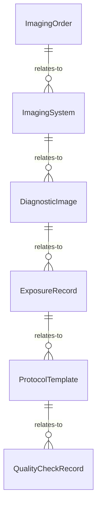
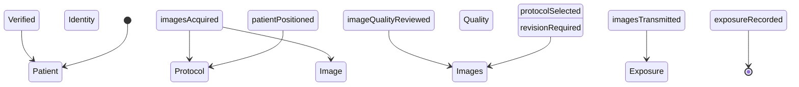
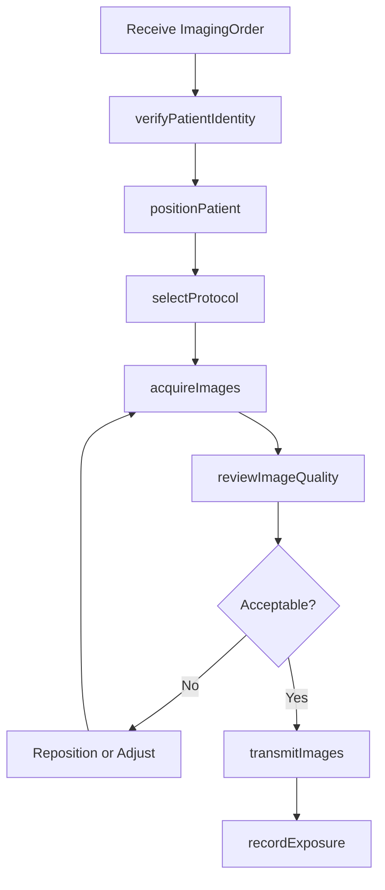
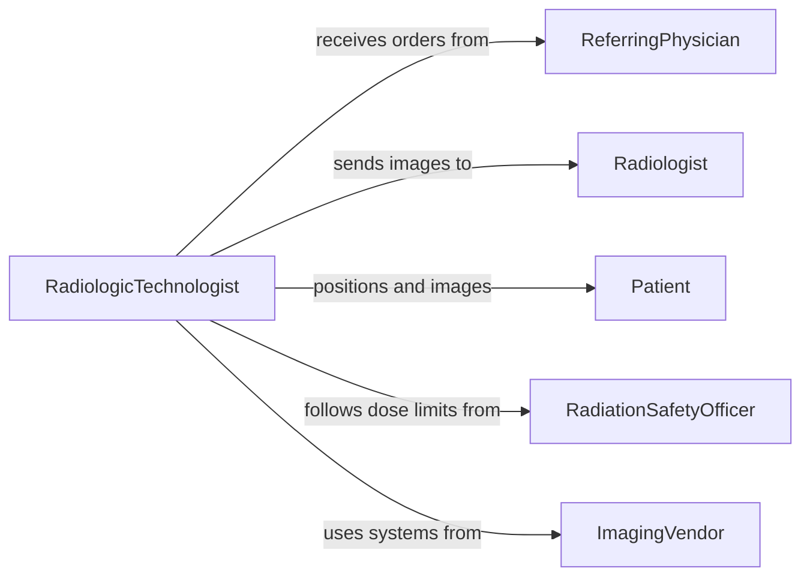

# Operate Diagnostic Imaging Equipment

> Business-as-Code definition for operating diagnostic imaging equipment. Models the use of X-ray machines, CT scanners, MRI systems, ultrasound units, and fluoroscopy equipment to acquire medical images for clinical diagnosis.

## Overview

Operating diagnostic imaging equipment involves positioning patients, selecting imaging protocols, configuring exposure parameters, and acquiring images using X-ray, computed tomography, magnetic resonance imaging, ultrasound, and fluoroscopy systems. Operators must follow radiation safety guidelines, verify patient identity and clinical orders, and produce images of diagnostic quality for radiologist interpretation. This definition exposes actions for each stage of the imaging workflow, events for quality and safety tracking, and searches for exam and equipment records.

## Actors

| Actor | Description |
|-------|-------------|
| ImagingVendor | Supplies imaging systems, upgrades, and service contracts |
| Radiologist | Interprets acquired images and provides diagnostic reports |
| Patient | The individual being imaged for diagnostic purposes |
| ReferringPhysician | Orders the imaging examination and specifies the clinical question |
| RadiationSafetyOfficer | Monitors dose compliance and enforces radiation protection standards |

## Roles

| Role | Description |
|------|-------------|
| RadiologicTechnologist | Positions patients, selects protocols, and acquires diagnostic images |
| CTTechnologist | Specializes in operating computed tomography scanners |
| MRITechnologist | Specializes in operating magnetic resonance imaging systems |
| ImagingSupervisor | Manages technologist schedules, equipment assignments, and quality standards |

## Entities

| Entity | Description |
|--------|-------------|
| ImagingOrder | A physician order specifying the exam type, body region, and clinical indication |
| ImagingSystem | A registered X-ray, CT, MRI, or ultrasound unit with configuration data |
| DiagnosticImage | An acquired image stored in DICOM format with patient and exam metadata |
| ExposureRecord | A log of radiation dose or imaging parameters for each acquisition |
| ProtocolTemplate | A predefined set of imaging parameters for a specific exam type |
| QualityCheckRecord | A record of image quality review against diagnostic criteria |

## Actions

| Action | Description |
|--------|-------------|
| verifyPatientIdentity | Confirm patient name, date of birth, and exam order before imaging |
| positionPatient | Place the patient on the table and align the anatomy to the imaging field |
| selectProtocol | Choose the appropriate imaging protocol and exposure parameters |
| acquireImages | Execute the imaging scan and capture diagnostic images |
| reviewImageQuality | Evaluate acquired images for diagnostic acceptability |
| transmitImages | Send images to the PACS archive and radiologist worklist |
| recordExposure | Document radiation dose or imaging parameters for the exam |

## Events

| Event | Description |
|-------|-------------|
| patientIdentityVerified | Patient identity and exam order have been confirmed |
| patientPositioned | The patient has been placed and aligned for imaging |
| protocolSelected | The imaging protocol and parameters have been configured |
| imagesAcquired | Diagnostic images have been captured by the imaging system |
| imageQualityReviewed | Acquired images have been evaluated for diagnostic quality |
| imagesTransmitted | Images have been sent to the PACS and radiologist worklist |
| exposureRecorded | Radiation dose or imaging parameters have been documented |

## Searches

| Search | Description |
|--------|-------------|
| findImagingOrders | List imaging orders by patient, exam type, or status |
| getExamHistory | Retrieve past exams for a patient by modality or date range |
| getExposureRecords | Look up radiation dose records by patient, exam, or system |
| findImagingSystems | List imaging equipment by modality, location, or availability |


## Entity Relationships



## State Diagram



## Workflow



## Actor Relationships



## Usage

### Calling Actions

```typescript
import { operateDiagnosticImagingEquipment } from '@headlessly/operate-diagnostic-imaging-equipment'

const imaging = operateDiagnosticImagingEquipment()

// Verify patient identity before exam
await imaging.verifyPatientIdentity({
  patientId: 'PT-44210',
  orderId: 'IMG-2026-08831',
  verificationMethod: 'two-identifier'
})

// Select the CT protocol for the chest exam
await imaging.selectProtocol({
  systemId: 'CT-GE-REV-EVO-03',
  protocolName: 'chest-pe-protocol',
  contrastAgent: 'iodinated',
  kvp: 120,
  mAs: 250
})

// Acquire images
await imaging.acquireImages({
  systemId: 'CT-GE-REV-EVO-03',
  orderId: 'IMG-2026-08831',
  seriesCount: 2
})
```

### Event-Driven Automation

```typescript
// Notify radiologist when images are ready
imaging.imagesTransmitted(async ({ orderId, patientId, modality, imageCount }) => {
  await notify({
    to: 'radiologist-worklist',
    message: `${modality} exam for patient ${patientId} (order ${orderId}): ${imageCount} images ready for review`
  })
})

// Alert on high radiation dose
imaging.exposureRecorded(async ({ orderId, patientId, doseMgy, thresholdMgy }) => {
  if (doseMgy > thresholdMgy) {
    await notify({
      to: 'radiation-safety-officer',
      message: `High dose on order ${orderId}: ${doseMgy} mGy exceeds threshold of ${thresholdMgy} mGy`
    })
  }
})
```
