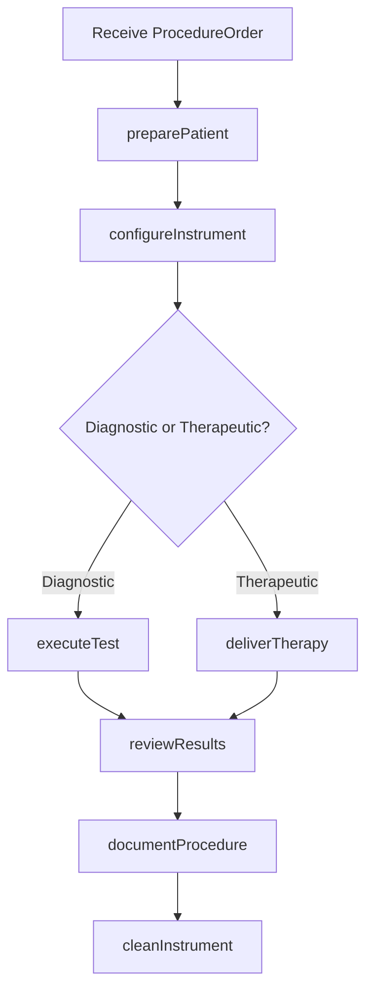
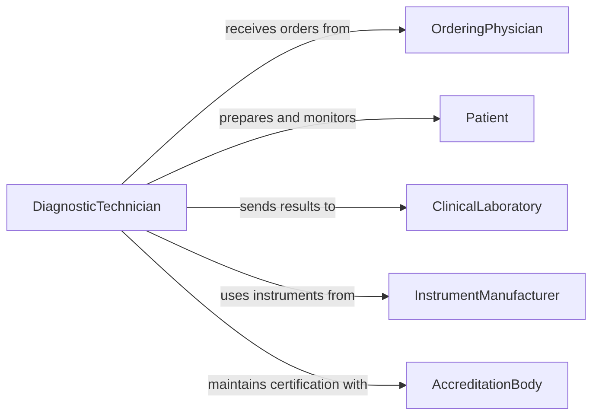

# Operate Diagnostic Therapeutic Medical Instruments

> Business-as-Code definition for operating diagnostic or therapeutic medical instruments or equipment. Models the use of electrocardiographs, electroencephalographs, therapeutic lasers, electrosurgical units, and other specialized clinical instruments for patient evaluation and treatment.

## Overview

Operating diagnostic or therapeutic medical instruments involves using specialized devices such as electrocardiographs, electroencephalographs, nerve conduction analyzers, therapeutic lasers, electrosurgical units, and radiation therapy machines to evaluate patient conditions and deliver targeted treatments. Operators configure instrument parameters per physician specifications, attach electrodes or applicators, monitor output during procedures, and document results. This definition exposes actions for instrument setup and operation, events for procedure tracking and patient safety, and searches for instrument and procedure records.

## Actors

| Actor | Description |
|-------|-------------|
| InstrumentManufacturer | Designs and supplies diagnostic and therapeutic medical instruments |
| Patient | The individual undergoing diagnostic testing or therapeutic treatment |
| OrderingPhysician | Prescribes the diagnostic test or therapeutic procedure |
| ClinicalLaboratory | Receives and processes diagnostic test results for analysis |
| AccreditationBody | Certifies instrument operators and audits procedural compliance |

## Roles

| Role | Description |
|------|-------------|
| DiagnosticTechnician | Operates electrodiagnostic instruments and records test results |
| TherapyTechnician | Operates therapeutic devices and monitors patient response during treatment |
| Electrophysiologist | Interprets diagnostic instrument data and guides complex procedures |
| DepartmentManager | Manages instrument inventory, scheduling, and quality assurance |

## Entities

| Entity | Description |
|--------|-------------|
| ProcedureOrder | A physician order specifying the diagnostic test or therapy to perform |
| ClinicalInstrument | A registered diagnostic or therapeutic device with calibration status |
| TestResult | Recorded data from a diagnostic instrument such as an ECG tracing |
| TreatmentSession | A documented session of therapeutic instrument application |
| CalibrationRecord | A log of instrument calibration checks and adjustments |
| PatientPreparation | A checklist of steps required to prepare the patient for the procedure |

## Actions

| Action | Description |
|--------|-------------|
| preparePatient | Position the patient and attach electrodes, sensors, or applicators |
| configureInstrument | Set device parameters per the physician order and procedure protocol |
| executeTest | Run the diagnostic test and capture instrument output data |
| deliverTherapy | Activate the therapeutic instrument and monitor treatment delivery |
| reviewResults | Evaluate the captured data or treatment outcome for completeness |
| documentProcedure | Record procedure details, results, and any adverse observations |
| cleanInstrument | Disinfect and prepare the instrument for the next patient |

## Events

| Event | Description |
|-------|-------------|
| patientPrepared | The patient has been positioned and instrumented for the procedure |
| instrumentConfigured | Device parameters have been set per the procedure protocol |
| testExecuted | A diagnostic test has been completed and data captured |
| therapyDelivered | A therapeutic treatment session has been completed |
| resultsReviewed | Captured data or treatment outcomes have been evaluated |
| procedureDocumented | Procedure details and results have been recorded |
| adverseReactionDetected | An unexpected patient response has been observed during the procedure |

## Searches

| Search | Description |
|--------|-------------|
| findProcedureOrders | List procedure orders by patient, type, or status |
| getTestResults | Retrieve diagnostic test results by patient, instrument, or date |
| getTreatmentSessions | Look up therapy sessions by patient, device, or date range |
| findCalibrationRecords | List calibration records by instrument or due date |

## Workflow



## Actor Relationships



## Usage

### Calling Actions

```typescript
import { operateDiagnosticTherapeuticMedicalInstruments } from '@headlessly/operate-diagnostic-therapeutic-medical-instruments'

const instruments = operateDiagnosticTherapeuticMedicalInstruments()

// Prepare patient for an EKG
await instruments.preparePatient({
  patientId: 'PT-55102',
  orderId: 'PROC-2026-04421',
  preparationSteps: ['verify-identity', 'expose-chest', 'clean-skin', 'attach-12-lead-electrodes']
})

// Configure and execute the EKG
await instruments.configureInstrument({
  instrumentId: 'ECG-GE-MAC5500-07',
  protocol: '12-lead-resting-ecg',
  paperSpeed: 25,
  gain: 10
})

await instruments.executeTest({
  instrumentId: 'ECG-GE-MAC5500-07',
  orderId: 'PROC-2026-04421',
  durationSeconds: 10
})
```

### Event-Driven Automation

```typescript
// Alert on adverse reaction during therapy
instruments.adverseReactionDetected(async ({ patientId, instrumentId, reactionType }) => {
  await notify({
    to: 'ordering-physician',
    message: `Adverse reaction for patient ${patientId} on ${instrumentId}: ${reactionType} - halt procedure`
  })
})

// Route results to ordering physician
instruments.testExecuted(async ({ orderId, patientId, instrumentType, resultSummary }) => {
  await notify({
    to: 'ordering-physician',
    message: `${instrumentType} results for patient ${patientId} (order ${orderId}): ${resultSummary}`
  })
})
```
