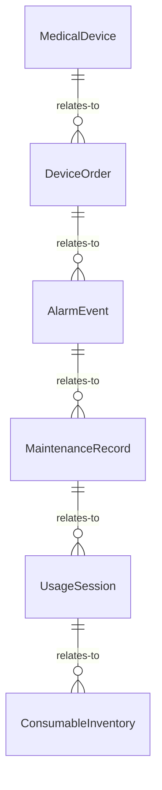
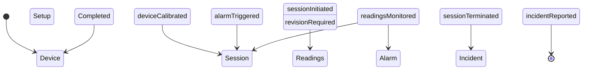
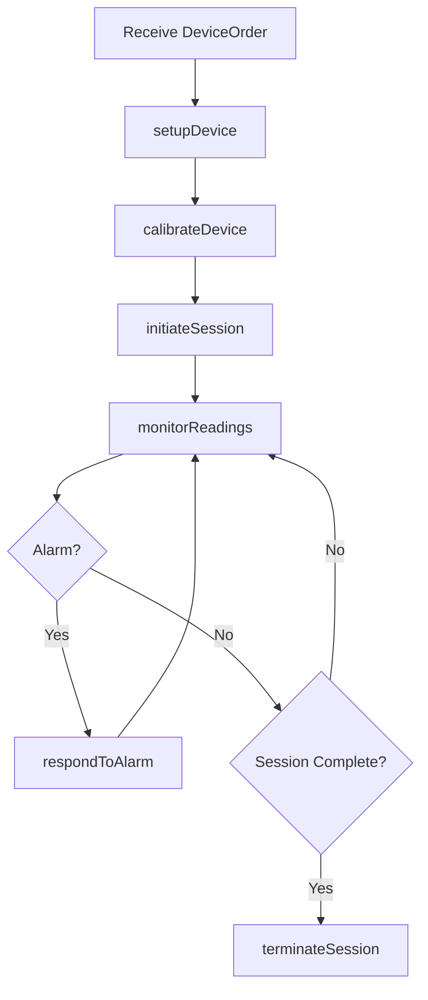
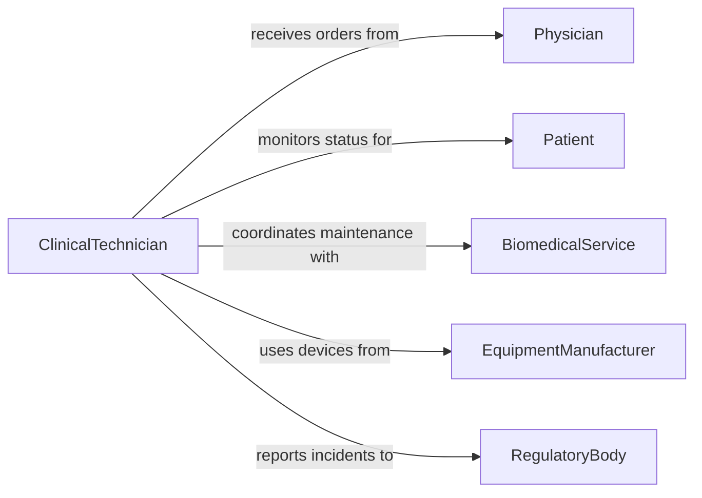

# Operate Medical Equipment

> Business-as-Code definition for operating medical equipment. Models the use of patient monitors, ventilators, infusion pumps, surgical instruments, and other clinical devices to deliver patient care in hospitals, clinics, and field settings.

## Overview

Operating medical equipment involves using patient monitors, ventilators, infusion pumps, defibrillators, surgical devices, and other clinical instruments to support patient diagnosis, treatment, and monitoring. Operators must calibrate equipment, verify settings against physician orders, monitor readings during use, and respond to alarms. This definition exposes actions for equipment setup and operation, events for patient safety and compliance tracking, and searches for equipment and usage records.

## Actors

| Actor | Description |
|-------|-------------|
| EquipmentManufacturer | Designs and supplies medical devices, accessories, and consumables |
| BiomedicalService | Provides calibration, preventive maintenance, and repair for medical devices |
| Patient | The individual receiving care through the medical equipment |
| Physician | Orders procedures and specifies equipment settings for patient care |
| RegulatoryBody | Enforces device safety standards and reporting requirements |

## Roles

| Role | Description |
|------|-------------|
| ClinicalTechnician | Sets up, operates, and monitors medical equipment during procedures |
| RegisteredNurse | Operates bedside equipment and responds to patient alarms |
| BiomedicalEngineer | Manages device inventory, maintenance schedules, and safety compliance |
| ChargeNurse | Assigns equipment to patients and coordinates availability across the unit |

## Entities

| Entity | Description |
|--------|-------------|
| MedicalDevice | A registered piece of clinical equipment with serial number and service history |
| DeviceOrder | A physician order specifying equipment type, settings, and patient assignment |
| AlarmEvent | A triggered alert from a medical device indicating a parameter out of range |
| MaintenanceRecord | A log of calibration, preventive maintenance, and repair activities |
| UsageSession | A record of a device being used for a specific patient over a time period |
| ConsumableInventory | Stock levels for device-specific consumables such as tubing, electrodes, and filters |

## Actions

| Action | Description |
|--------|-------------|
| setupDevice | Prepare and configure a medical device for a specific patient and procedure |
| calibrateDevice | Verify and adjust device measurement accuracy per manufacturer specifications |
| initiateSession | Begin an active equipment usage session for a patient |
| monitorReadings | Continuously observe device output and patient parameters during use |
| respondToAlarm | Acknowledge and act on a device alarm per clinical protocol |
| terminateSession | End an equipment usage session and document results |
| reportIncident | File a device malfunction or adverse event report per regulatory requirements |

## Events

| Event | Description |
|-------|-------------|
| deviceSetupCompleted | A medical device has been configured and is ready for patient use |
| deviceCalibrated | Device measurement accuracy has been verified and adjusted |
| sessionInitiated | An active equipment usage session has begun for a patient |
| readingsMonitored | Device output and patient parameters have been recorded |
| alarmTriggered | A device alarm has been activated due to an out-of-range parameter |
| sessionTerminated | An equipment usage session has ended and results documented |
| incidentReported | A device malfunction or adverse event has been filed |

## Searches

| Search | Description |
|--------|-------------|
| findMedicalDevices | List medical devices by type, unit, or availability status |
| getUsageSessions | Retrieve usage sessions by patient, device, or date range |
| getAlarmHistory | Look up alarm events by device, severity, or time period |
| findMaintenanceRecords | List maintenance and calibration records by device or due date |


## Entity Relationships



## State Diagram



## Workflow



## Actor Relationships



## Usage

### Calling Actions

```typescript
import { operateMedicalEquipment } from '@headlessly/operate-medical-equipment'

const medical = operateMedicalEquipment()

// Setup a ventilator for a patient
await medical.setupDevice({
  deviceId: 'VENT-HAMIL-T1-042',
  patientId: 'PT-88201',
  orderId: 'ORD-2026-11455',
  settings: { mode: 'SIMV', tidalVolumeMl: 500, ratePerMin: 14, fio2Percent: 40 }
})

// Calibrate the device before use
await medical.calibrateDevice({
  deviceId: 'VENT-HAMIL-T1-042',
  calibrationType: 'flow-sensor',
  standardReference: 'MFG-CAL-SPEC-V3'
})

// Initiate the usage session
await medical.initiateSession({
  deviceId: 'VENT-HAMIL-T1-042',
  patientId: 'PT-88201',
  startTime: '2026-02-05T08:00:00Z'
})
```

### Event-Driven Automation

```typescript
// Escalate critical alarms
medical.alarmTriggered(async ({ deviceId, patientId, parameter, severity }) => {
  if (severity === 'critical') {
    await notify({
      to: 'charge-nurse',
      message: `CRITICAL alarm on ${deviceId} for patient ${patientId}: ${parameter} out of range`
    })
  }
})

// Auto-schedule maintenance after session count threshold
medical.sessionTerminated(async ({ deviceId, totalSessions }) => {
  if (totalSessions % 100 === 0) {
    await notify({
      to: 'biomed-engineer',
      message: `Device ${deviceId} has completed ${totalSessions} sessions - schedule preventive maintenance`
    })
  }
})
```
