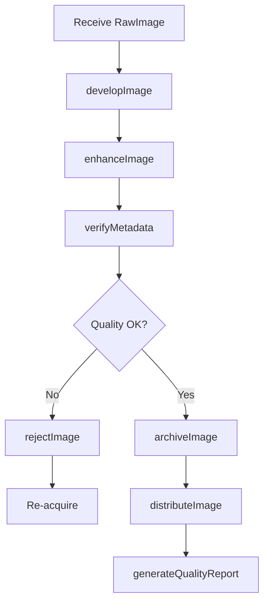
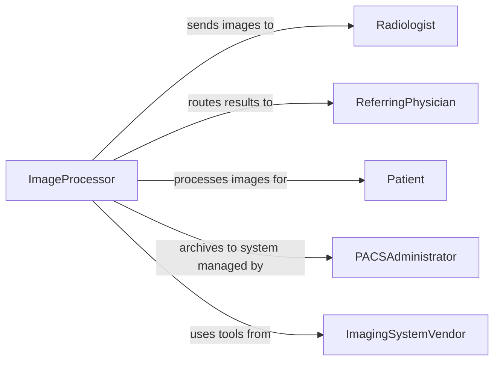

# Process X-rays Medical Images

> Business-as-Code definition for processing x-rays or other medical images. Models the workflow of developing, digitizing, enhancing, archiving, and distributing radiographic and diagnostic images for clinical interpretation.

## Overview

Processing x-rays or other medical images involves developing film-based radiographs, digitizing analog images, adjusting digital image quality through windowing and enhancement, verifying patient and exam metadata, archiving images to PACS, and distributing them to radiologists and referring physicians. This activity spans computed radiography plate processing, digital detector readout, image post-processing, and quality assurance checks. This definition exposes actions for each processing step, events for tracking image readiness and quality, and searches for image and exam records.

## Actors

| Actor | Description |
|-------|-------------|
| ImagingSystemVendor | Supplies image processing hardware, software, and PACS infrastructure |
| Radiologist | Reviews processed images and provides diagnostic interpretations |
| ReferringPhysician | Receives processed images and reports for patient care decisions |
| Patient | The individual whose medical images are being processed |
| PACSAdministrator | Manages the picture archiving and communication system infrastructure |

## Roles

| Role | Description |
|------|-------------|
| ImageProcessor | Develops, digitizes, and enhances medical images for diagnostic review |
| QualityAssuranceTechnologist | Verifies image quality, metadata accuracy, and processing standards |
| DarkroomTechnician | Handles film-based image development in chemical processing environments |
| ImagingInformatics Specialist | Manages image routing, PACS workflows, and DICOM compliance |

## Entities

| Entity | Description |
|--------|-------------|
| RawImage | An unprocessed image captured from a detector, cassette, or film |
| ProcessedImage | An image that has been enhanced, windowed, and prepared for review |
| ImageMetadata | Patient demographics, exam type, and acquisition parameters linked to an image |
| PACSRecord | An archived image entry in the picture archiving and communication system |
| ProcessingProtocol | A predefined set of image enhancement and windowing parameters |
| RejectAnalysis | A record documenting images rejected for quality and the reason for rejection |

## Actions

| Action | Description |
|--------|-------------|
| developImage | Process a film cassette or computed radiography plate to produce a visible image |
| enhanceImage | Apply windowing, contrast adjustment, and noise reduction to a digital image |
| verifyMetadata | Confirm that patient identity and exam information match the image |
| archiveImage | Store the processed image in the PACS with proper indexing and metadata |
| distributeImage | Route images to the radiologist worklist and referring physician portal |
| rejectImage | Flag an image as non-diagnostic and document the reason for rejection |
| generateQualityReport | Produce a summary of image quality metrics over a specified period |

## Events

| Event | Description |
|-------|-------------|
| imageDeveloped | A film or CR plate has been processed into a visible image |
| imageEnhanced | Digital enhancement and windowing have been applied to an image |
| metadataVerified | Patient and exam metadata have been confirmed as accurate |
| imageArchived | A processed image has been stored in the PACS |
| imageDistributed | An image has been routed to the radiologist worklist or physician portal |
| imageRejected | An image has been flagged as non-diagnostic with documented reasons |
| qualityReportGenerated | An image quality summary report has been produced |

## Searches

| Search | Description |
|--------|-------------|
| findRawImages | List unprocessed images by exam, modality, or acquisition date |
| getProcessedImages | Retrieve processed images by patient, exam, or archive date |
| getRejectAnalysis | Look up rejected images by reason, technologist, or time period |
| findPACSRecords | List archived images by patient, modality, or study status |

## Workflow



## Actor Relationships



## Usage

### Calling Actions

```typescript
import { processXRaysMedicalImages } from '@headlessly/process-x-rays-medical-images'

const imageProc = processXRaysMedicalImages()

// Develop a computed radiography plate
await imageProc.developImage({
  rawImageId: 'RAW-2026-11420',
  cassetteType: 'CR-plate-35x43',
  processingStation: 'CR-READER-02'
})

// Enhance the digital image
await imageProc.enhanceImage({
  imageId: 'IMG-2026-11420-001',
  protocol: 'chest-pa-standard',
  windowWidth: 1500,
  windowLevel: -500
})

// Verify metadata and archive
await imageProc.verifyMetadata({
  imageId: 'IMG-2026-11420-001',
  patientId: 'PT-77301',
  examType: 'chest-xray-pa',
  acquisitionDate: '2026-02-05'
})

await imageProc.archiveImage({
  imageId: 'IMG-2026-11420-001',
  pacsDestination: 'PACS-PRIMARY',
  storageClass: 'online'
})
```

### Event-Driven Automation

```typescript
// Notify radiologist when images are ready for reading
imageProc.imageDistributed(async ({ imageId, patientId, examType }) => {
  await notify({
    to: 'radiologist-worklist',
    message: `${examType} for patient ${patientId} (image ${imageId}) ready for interpretation`
  })
})

// Track reject rates for quality improvement
imageProc.imageRejected(async ({ imageId, reason, technologistId }) => {
  await notify({
    to: 'qa-technologist',
    message: `Image ${imageId} rejected: ${reason} - technologist ${technologistId}`
  })
})
```
