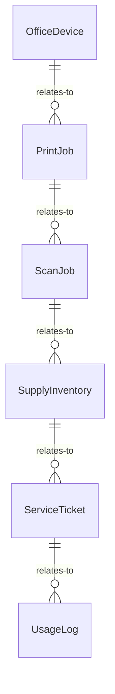
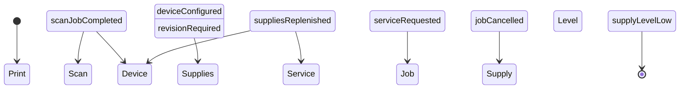
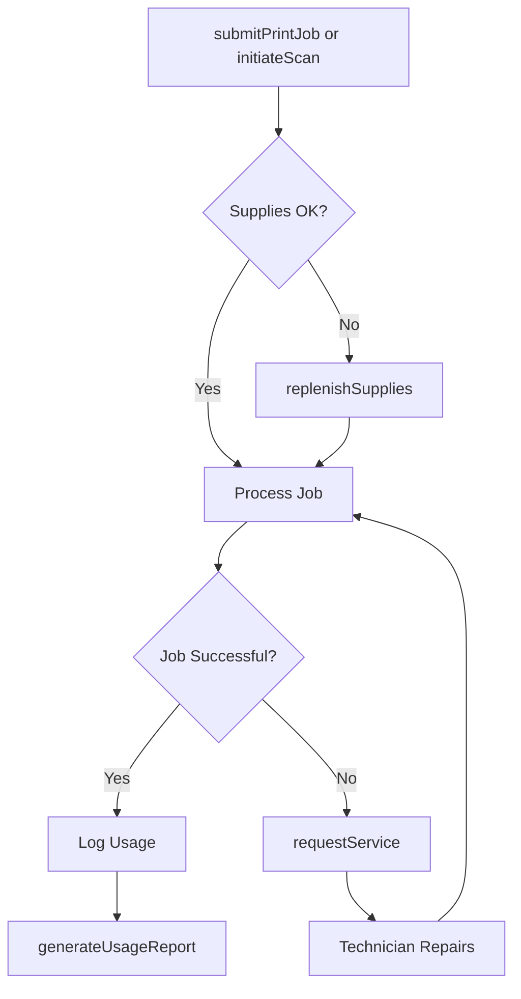
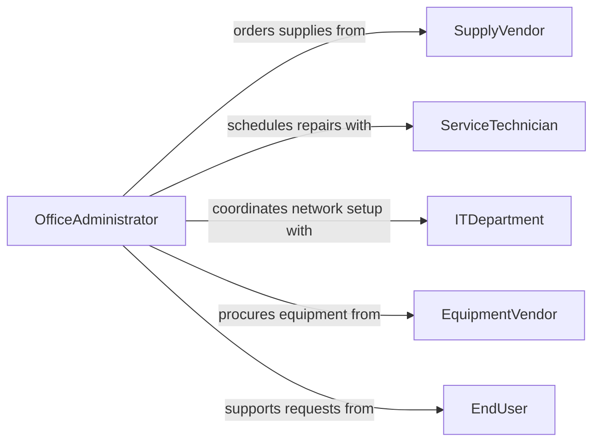

# Operate Office Equipment

> Business-as-Code definition for operating office equipment. Models the use, configuration, and maintenance of printers, copiers, scanners, fax machines, and other standard office devices to support administrative workflows.

## Overview

Operating office equipment involves using and managing devices such as multifunction printers, copiers, scanners, shredders, postage meters, and binding machines to produce, reproduce, and distribute documents and materials. This definition exposes actions for initiating and configuring equipment jobs, events for tracking job completion and equipment status, and searches for retrieving job histories and device inventories.

## Actors

| Actor | Description |
|-------|-------------|
| EquipmentVendor | Supplies printers, copiers, scanners, and other office devices |
| ServiceTechnician | Provides maintenance, repair, and calibration for equipment |
| SupplyVendor | Delivers toner, paper, ink cartridges, and consumable supplies |
| ITDepartment | Manages network connectivity and driver configuration for devices |
| EndUser | Staff members who submit print, copy, and scan requests |

## Roles

| Role | Description |
|------|-------------|
| OfficeAdministrator | Oversees day-to-day equipment usage and supply inventory |
| ReceptionistClerk | Operates front-office equipment for incoming and outgoing correspondence |
| DocumentSpecialist | Handles high-volume printing, binding, and finishing tasks |
| FacilitiesCoordinator | Manages equipment placement, leases, and service contracts |

## Entities

| Entity | Description |
|--------|-------------|
| OfficeDevice | A registered printer, copier, scanner, or multifunction unit |
| PrintJob | A queued request to print or copy documents on a specific device |
| ScanJob | A request to digitize physical documents into electronic format |
| SupplyInventory | Current stock levels for toner, paper, and consumable items |
| ServiceTicket | A maintenance or repair request for a malfunctioning device |
| UsageLog | A record of jobs processed by device, user, and date |

## Actions

| Action | Description |
|--------|-------------|
| submitPrintJob | Send a document to a printer or copier with specified settings |
| initiateScan | Digitize a physical document using a scanner or multifunction device |
| configureDevice | Adjust device settings such as paper size, quality, or network options |
| replenishSupplies | Restock toner, paper, or other consumables in a device |
| requestService | Submit a maintenance or repair ticket for a malfunctioning device |
| cancelJob | Remove a queued print or scan job before completion |
| generateUsageReport | Produce a summary of device utilization over a specified period |

## Events

| Event | Description |
|-------|-------------|
| printJobCompleted | A print or copy job has finished successfully |
| scanJobCompleted | A document has been scanned and saved to the target location |
| deviceConfigured | Device settings have been updated |
| suppliesReplenished | Consumables have been restocked in a device |
| serviceRequested | A maintenance or repair ticket has been submitted |
| jobCancelled | A queued job has been removed from the queue |
| supplyLevelLow | Toner, paper, or other consumables have fallen below threshold |

## Searches

| Search | Description |
|--------|-------------|
| findDevices | List office devices by type, location, or availability status |
| getJobHistory | Retrieve print and scan jobs by user, device, or date range |
| getSupplyLevels | Check current supply inventory for a device or location |
| findServiceTickets | List open or resolved service tickets by device or priority |


## Entity Relationships



## State Diagram



## Workflow



## Actor Relationships



## Usage

### Calling Actions

```typescript
import { operateOfficeEquipment } from '@headlessly/operate-office-equipment'

const office = operateOfficeEquipment()

// Submit a print job
const job = await office.submitPrintJob({
  deviceId: 'MFP-FLOOR3-01',
  documentPath: '/reports/quarterly-summary.pdf',
  copies: 10,
  color: true,
  duplex: true
})

// Initiate a document scan
await office.initiateScan({
  deviceId: 'SCN-RECEPTION-01',
  outputFormat: 'pdf',
  destination: '/scans/incoming-mail/',
  resolution: 300
})

// Replenish toner when low
await office.replenishSupplies({
  deviceId: 'MFP-FLOOR3-01',
  supplyType: 'toner-black',
  quantity: 2
})
```

### Event-Driven Automation

```typescript
// Auto-order supplies when levels are low
office.supplyLevelLow(async ({ deviceId, supplyType, remainingPercent }) => {
  if (remainingPercent < 10) {
    await notify({
      to: 'office-admin',
      message: `${supplyType} on ${deviceId} at ${remainingPercent}% - reorder needed`
    })
  }
})

// Notify user when scan completes
office.scanJobCompleted(async ({ userId, documentPath, pageCount }) => {
  await notify({
    to: userId,
    message: `Scan complete: ${pageCount} pages saved to ${documentPath}`
  })
})
```
