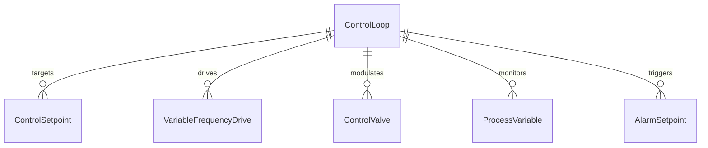
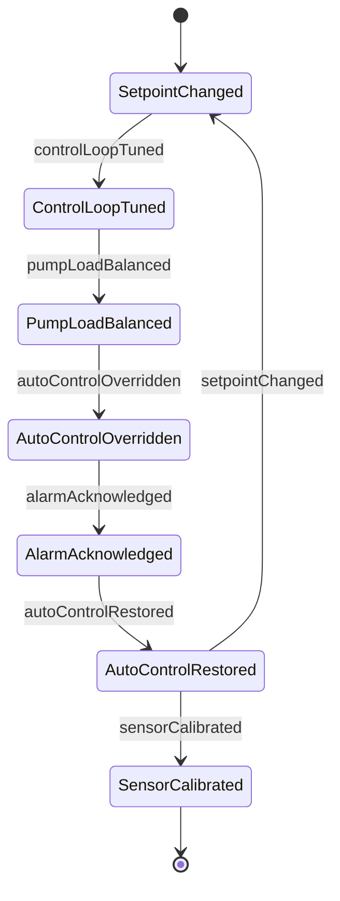
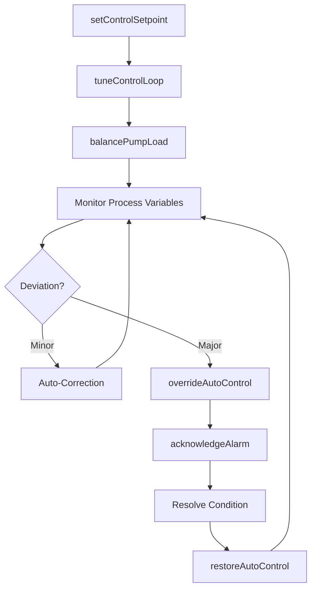
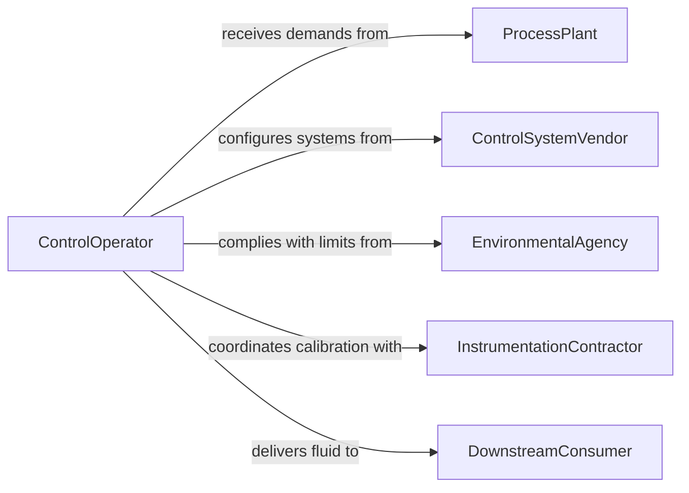

# Control Pumps Pumping Equipment

> Business-as-Code definition for pump control and regulation. Models the automated and manual control loop for adjusting pump output, managing system balance, and responding to process demands.

## Overview

Controlling pumps or pumping equipment focuses on the regulation of pump output through variable frequency drives, control valves, and programmable logic controllers to match dynamic process demands. This definition covers setpoint management, automatic control loop tuning, load balancing across multiple pumps, and exception handling for off-normal conditions in water, wastewater, oil, and chemical transfer operations.

## Actors

| Actor | Description |
|-------|-------------|
| ProcessPlant | Facility whose production requires controlled fluid delivery |
| ControlSystemVendor | Supplies PLCs, VFDs, and control software |
| EnvironmentalAgency | Regulates discharge limits and fluid handling standards |
| InstrumentationContractor | Installs and calibrates sensors and control devices |
| DownstreamConsumer | Receives the pumped fluid at required flow and pressure |

## Roles

| Role | Description |
|------|-------------|
| ControlOperator | Manages pump setpoints and responds to process changes |
| InstrumentTechnician | Calibrates sensors and maintains control hardware |
| ProcessControlEngineer | Designs and tunes automatic control strategies |
| PlantSupervisor | Authorizes changes to critical control parameters |

## Entities

| Entity | Description |
|--------|-------------|
| ControlSetpoint | Target value for flow rate, pressure, or level |
| VariableFrequencyDrive | Device that regulates pump motor speed |
| ControlValve | Valve that modulates flow based on controller output |
| ProcessVariable | Real-time measurement of the controlled parameter |
| ControlLoop | Feedback mechanism linking sensor to actuator |
| AlarmSetpoint | Threshold that triggers operator notification |

## Actions

| Action | Description |
|--------|-------------|
| setControlSetpoint | Define target flow, pressure, or level for the system |
| tuneControlLoop | Adjust PID parameters for stable response |
| balancePumpLoad | Distribute demand across multiple pump units |
| overrideAutoControl | Switch from automatic to manual control mode |
| acknowledgeAlarm | Confirm and address an active alarm condition |
| restoreAutoControl | Return the system to automatic mode after override |
| calibrateSensor | Verify and adjust process measurement instruments |

## Events

| Event | Description |
|-------|-------------|
| setpointChanged | Control target has been modified |
| controlLoopTuned | PID parameters have been updated |
| pumpLoadBalanced | Demand has been redistributed across pump units |
| autoControlOverridden | System has been switched to manual mode |
| alarmAcknowledged | Operator has responded to an alarm condition |
| autoControlRestored | System has been returned to automatic mode |
| sensorCalibrated | Process measurement instrument has been validated |

## Searches

| Search | Description |
|--------|-------------|
| findControlSetpoints | List current setpoints by pump station or process area |
| getProcessVariableHistory | Retrieve time-series data for a measured parameter |
| getAlarmLog | Look up alarm events by type, severity, or date range |
| getControlLoopPerformance | Review control response metrics and stability indices |


## Entity Relationships



## State Diagram



## Workflow



## Actor Relationships



## Usage

### Calling Actions

```typescript
import { controlPumpsPumpingEquipment } from '@headlessly/control-pumps-pumping-equipment'

const pumpControl = controlPumpsPumpingEquipment()

// Set target flow rate
await pumpControl.setControlSetpoint({
  stationId: 'WTP-INTAKE-01',
  parameter: 'flowRate',
  targetValue: 3500,
  unit: 'GPM'
})

// Tune PID loop
await pumpControl.tuneControlLoop({
  loopId: 'FLOW-LOOP-01',
  proportional: 1.2,
  integral: 0.3,
  derivative: 0.05
})

// Balance load across pumps
await pumpControl.balancePumpLoad({
  stationId: 'WTP-INTAKE-01',
  units: ['PUMP-01', 'PUMP-02', 'PUMP-03'],
  strategy: 'equal-wear'
})
```

### Event-Driven Automation

```typescript
// Auto-balance when setpoint changes
pumpControl.setpointChanged(async ({ stationId, parameter, newTarget }) => {
  await pumpControl.balancePumpLoad({
    stationId,
    strategy: 'demand-responsive'
  })
})

// Escalate unacknowledged alarms
pumpControl.autoControlOverridden(async ({ stationId, reason, timestamp }) => {
  setTimeout(async () => {
    const log = await pumpControl.getAlarmLog({ stationId, since: timestamp })
    const unacked = log.filter(a => !a.acknowledged)
    if (unacked.length > 0) {
      await notify({ to: 'plant-supervisor', message: `Unacknowledged alarms at ${stationId}` })
    }
  }, 300000)
})
```
