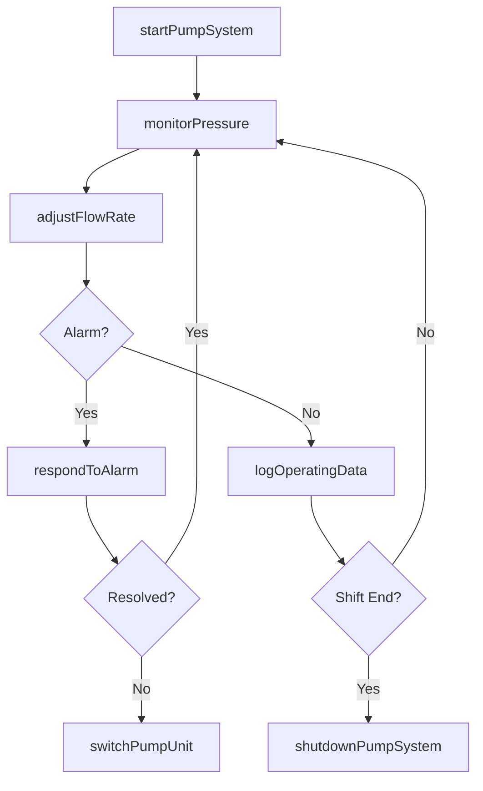
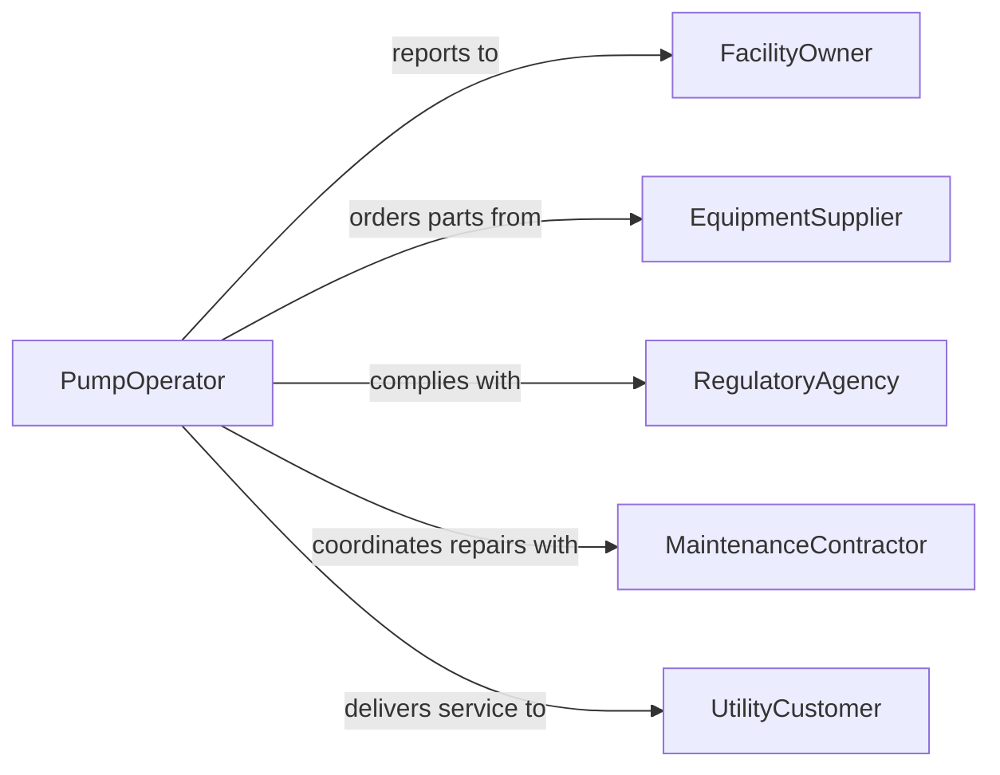

# Operate Pumping Systems Equipment

> Business-as-Code definition for pumping systems operation. Models the lifecycle of pump system startup, monitoring, flow control, and shutdown across industrial and utility applications.

## Overview

Operating pumping systems or equipment involves managing centrifugal, reciprocating, and submersible pumps used to transfer fluids in water treatment, oil and gas, chemical processing, and municipal utility settings. This definition covers system startup sequences, flow rate regulation, pressure monitoring, and safe shutdown procedures to maintain continuous and efficient fluid transport.

## Actors

| Actor | Description |
|-------|-------------|
| FacilityOwner | Organization responsible for the pumping infrastructure |
| EquipmentSupplier | Provides pumps, motors, and replacement parts |
| RegulatoryAgency | Sets standards for fluid handling and environmental compliance |
| MaintenanceContractor | Performs specialized repair and overhaul services |
| UtilityCustomer | End consumer receiving pumped fluids such as water or fuel |

## Roles

| Role | Description |
|------|-------------|
| PumpOperator | Starts, monitors, and controls pumping equipment |
| SystemEngineer | Designs and optimizes pumping system configurations |
| MaintenanceTechnician | Performs preventive and corrective pump maintenance |
| ShiftSupervisor | Oversees pump station operations during a shift |

## Entities

| Entity | Description |
|--------|-------------|
| PumpUnit | Individual pump with motor and associated valves |
| FlowRate | Measured volume of fluid passing through the system per unit time |
| PressureReading | Real-time or logged pressure measurements at key points |
| OperatingSchedule | Planned run times and sequencing for pump stations |
| AlarmCondition | Threshold-triggered alert for abnormal operating parameters |
| MaintenanceRecord | History of servicing, repairs, and part replacements |

## Actions

| Action | Description |
|--------|-------------|
| startPumpSystem | Execute startup sequence for one or more pump units |
| adjustFlowRate | Modify pump speed or valve positions to regulate flow |
| monitorPressure | Track system pressure against operating parameters |
| switchPumpUnit | Transfer load from one pump to a standby unit |
| shutdownPumpSystem | Execute controlled shutdown sequence |
| logOperatingData | Record flow, pressure, and runtime metrics |
| respondToAlarm | Investigate and resolve abnormal operating conditions |

## Events

| Event | Description |
|-------|-------------|
| pumpSystemStarted | Startup sequence has completed successfully |
| flowRateAdjusted | Pump output has been modified to new target |
| pressureThresholdExceeded | System pressure has moved outside safe range |
| pumpUnitSwitched | Load has been transferred to alternate pump |
| pumpSystemShutdown | Controlled shutdown has been completed |
| operatingDataLogged | Metrics have been recorded for the operating period |
| alarmTriggered | An abnormal condition has been detected |

## Searches

| Search | Description |
|--------|-------------|
| findPumpUnits | List pumps by station, status, or capacity |
| getOperatingMetrics | Retrieve flow, pressure, and runtime data by period |
| getAlarmHistory | Look up triggered alarms by severity or date range |
| getMaintenanceSchedule | Find upcoming service tasks for pump equipment |

## Workflow



## Actor Relationships



## Usage

### Calling Actions

```typescript
import { operatePumpingSystemsEquipment } from '@headlessly/operate-pumping-systems-equipment'

const pumps = operatePumpingSystemsEquipment()

// Start a pump station
const startup = await pumps.startPumpSystem({
  stationId: 'PUMP-STATION-12',
  units: ['PUMP-12A', 'PUMP-12B'],
  targetFlowGPM: 2500
})

// Monitor and adjust
const pressure = await pumps.monitorPressure({ stationId: 'PUMP-STATION-12' })
await pumps.adjustFlowRate({
  unitId: 'PUMP-12A',
  targetFlowGPM: 2800
})

// Log operating data
await pumps.logOperatingData({ stationId: 'PUMP-STATION-12', period: 'shift-1' })
```

### Event-Driven Automation

```typescript
// Auto-switch on pressure alarm
pumps.pressureThresholdExceeded(async ({ stationId, unitId, pressure }) => {
  await pumps.switchPumpUnit({
    stationId,
    fromUnit: unitId,
    toUnit: `${unitId}-STANDBY`
  })
})

// Alert supervisor on alarm
pumps.alarmTriggered(async ({ stationId, alarmType, severity }) => {
  if (severity === 'critical') {
    await notify({
      to: 'shift-supervisor',
      message: `Critical alarm at ${stationId}: ${alarmType}`
    })
  }
})
```
