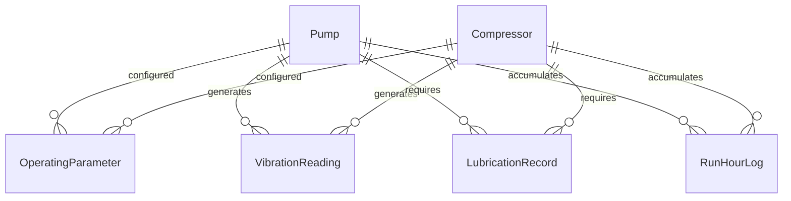
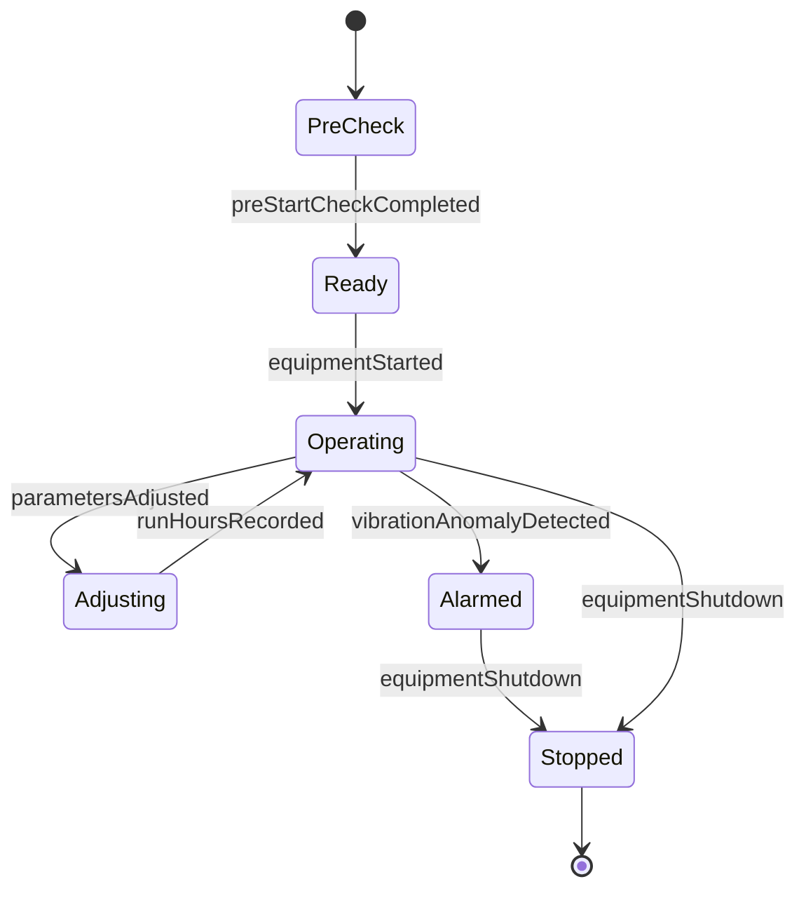
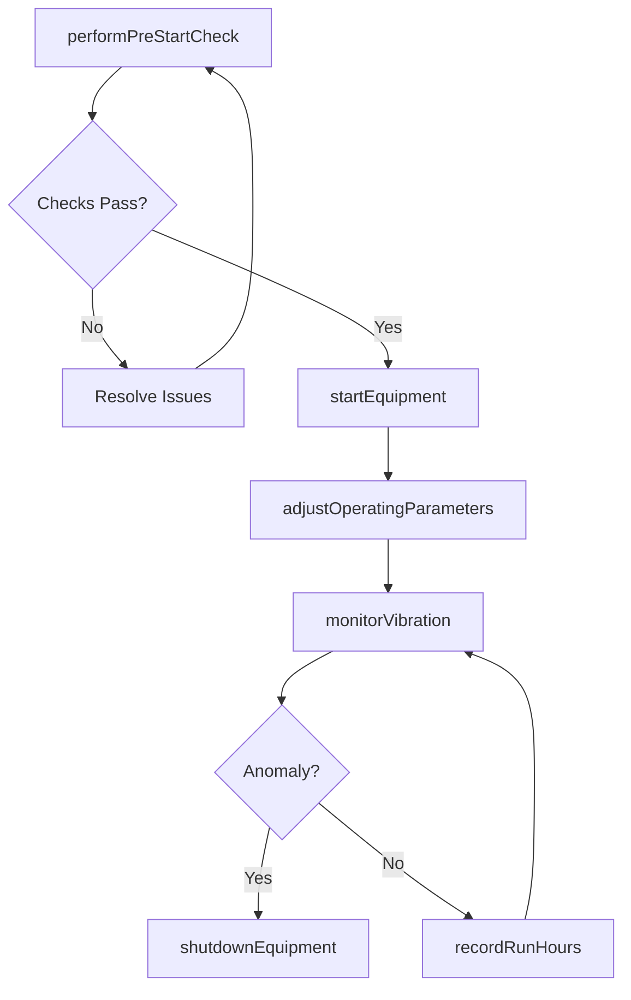
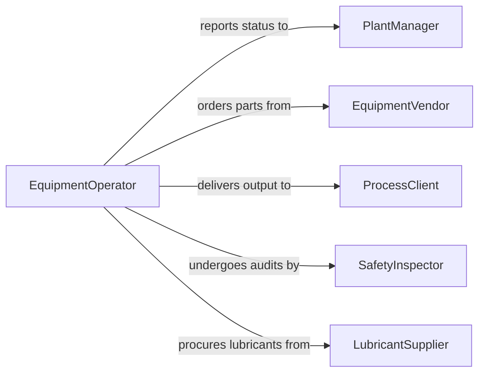

# Operate Pumps Compressors

> Business-as-Code definition for pump and compressor operation. Models the startup, regulation, monitoring, and maintenance workflows for fluid and gas compression equipment.

## Overview

Operating pumps or compressors involves controlling equipment that moves liquids or compresses gases for industrial, HVAC, refrigeration, and process applications. This definition covers pre-start checks, operating parameter adjustment, continuous monitoring of temperature, pressure, and vibration, and coordinated maintenance to maximize equipment uptime and efficiency.

## Actors

| Actor | Description |
|-------|-------------|
| PlantManager | Oversees facility operations including pump and compressor assets |
| EquipmentVendor | Supplies pumps, compressors, and spare parts |
| ProcessClient | Downstream consumer of pumped fluids or compressed gases |
| SafetyInspector | Audits equipment compliance with safety regulations |
| LubricantSupplier | Provides oils and lubricants for rotating equipment |

## Roles

| Role | Description |
|------|-------------|
| EquipmentOperator | Starts, stops, and monitors pumps and compressors |
| MechanicalTechnician | Performs repairs and preventive maintenance |
| ControlRoomOperator | Monitors SCADA dashboards and adjusts setpoints remotely |
| ReliabilityEngineer | Analyzes performance data to optimize equipment life |

## Entities

| Entity | Description |
|--------|-------------|
| Pump | Equipment that transfers fluid by mechanical action |
| Compressor | Equipment that increases gas pressure by reducing volume |
| OperatingParameter | Setpoint values for pressure, flow, temperature, and speed |
| VibrationReading | Measurement of mechanical oscillation on rotating equipment |
| LubricationRecord | Log of oil levels, changes, and sample analyses |
| RunHourLog | Accumulated operating time for each unit |

## Actions

| Action | Description |
|--------|-------------|
| performPreStartCheck | Verify oil levels, valve positions, and safety interlocks |
| startEquipment | Initiate pump or compressor operation sequence |
| adjustOperatingParameters | Modify speed, pressure, or flow setpoints |
| monitorVibration | Track vibration signatures for early fault detection |
| recordRunHours | Log operating time and cycle counts |
| shutdownEquipment | Execute controlled stop and secure the unit |
| scheduleLubrication | Plan and perform lubrication per manufacturer intervals |

## Events

| Event | Description |
|-------|-------------|
| preStartCheckCompleted | All pre-operation verifications have passed |
| equipmentStarted | Pump or compressor has reached operating speed |
| parametersAdjusted | Operating setpoints have been changed |
| vibrationAnomalyDetected | Abnormal vibration pattern has been identified |
| runHoursRecorded | Operating time has been logged for the period |
| equipmentShutdown | Controlled stop sequence has been completed |
| lubricationCompleted | Oil change or lubrication task has been performed |

## Searches

| Search | Description |
|--------|-------------|
| findEquipment | List pumps and compressors by type, location, or status |
| getVibrationTrends | Retrieve vibration data over time for a specific unit |
| getRunHourSummary | Look up accumulated operating hours by equipment |
| getLubricationSchedule | Find upcoming lubrication tasks and due dates |

## Entity Relationships



## State Diagram



## Workflow



## Actor Relationships



## Usage

### Calling Actions

```typescript
import { operatePumpsCompressors } from '@headlessly/operate-pumps-compressors'

const equipment = operatePumpsCompressors()

// Pre-start check and startup
const check = await equipment.performPreStartCheck({
  unitId: 'COMP-AIR-03',
  checklist: ['oilLevel', 'valvePositions', 'interlocks', 'drainTraps']
})

await equipment.startEquipment({
  unitId: 'COMP-AIR-03',
  targetPressurePSI: 125,
  loadMode: 'auto'
})

// Monitor vibration
const vibration = await equipment.monitorVibration({
  unitId: 'COMP-AIR-03',
  sensorLocations: ['drive-end-bearing', 'non-drive-end-bearing']
})

// Log run hours
await equipment.recordRunHours({ unitId: 'COMP-AIR-03' })
```

### Event-Driven Automation

```typescript
// Auto-shutdown on vibration anomaly
equipment.vibrationAnomalyDetected(async ({ unitId, severity, bearing }) => {
  if (severity === 'high') {
    await equipment.shutdownEquipment({ unitId, reason: `vibration-${bearing}` })
    await notify({ to: 'mechanical-technician', message: `High vibration on ${unitId} at ${bearing}` })
  }
})

// Schedule lubrication based on run hours
equipment.runHoursRecorded(async ({ unitId, totalHours, lubricationIntervalHours }) => {
  if (totalHours % lubricationIntervalHours < 8) {
    await equipment.scheduleLubrication({ unitId, type: 'oil-change' })
  }
})
```
