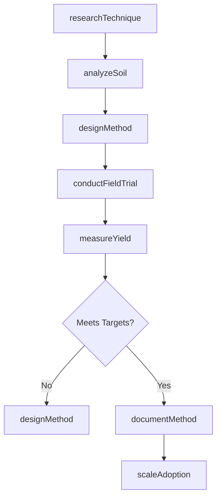
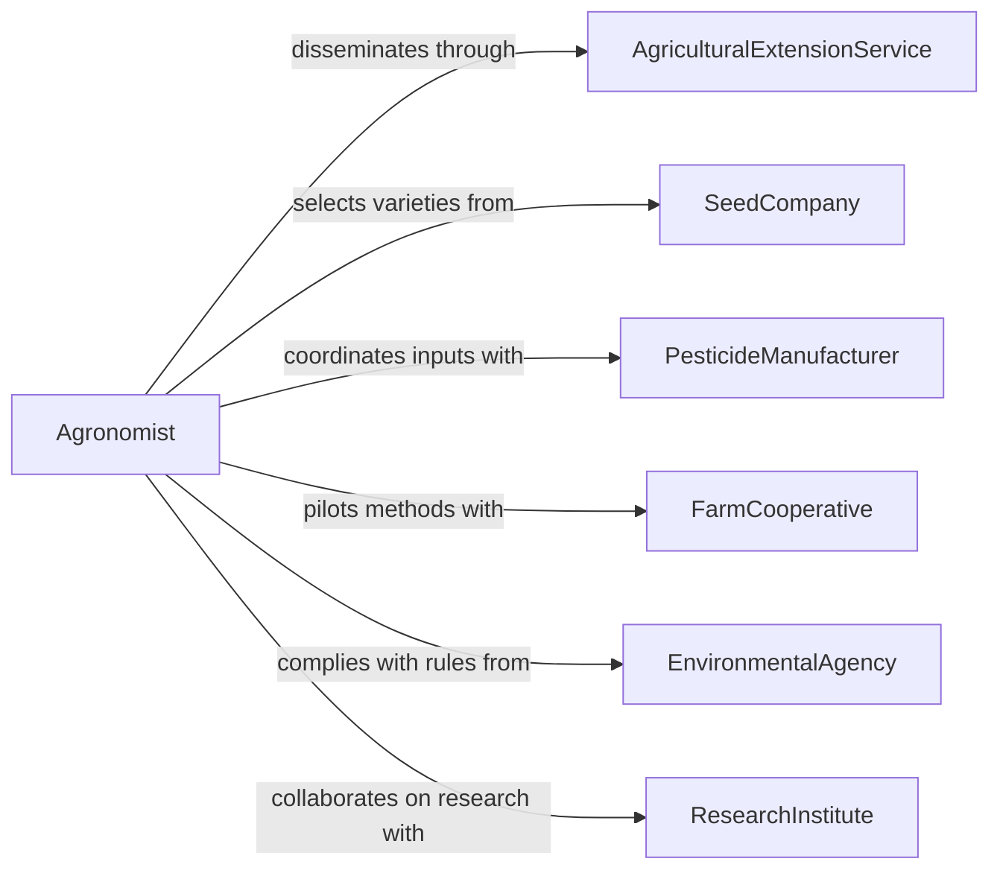

# Develop Agricultural Methods

> Business-as-Code definition for developing agricultural methods. Models the research, design, field testing, and adoption lifecycle for new farming techniques, crop management practices, and sustainable agriculture innovations.

## Overview

Developing agricultural methods involves researching, designing, and validating new or improved techniques for crop cultivation, livestock management, soil conservation, and pest control. This activity draws on agronomic science, field trial data, and farmer feedback to create methods that increase yield, reduce environmental impact, and adapt to changing climate conditions. The resulting methods are documented, piloted on test plots, and scaled through extension services and training programs.

## Actors

| Actor | Description |
|-------|-------------|
| AgriculturalExtensionService | Government or university programs that disseminate methods to farmers |
| SeedCompany | Providers of seed varieties optimized for specific growing methods |
| PesticideManufacturer | Companies producing crop protection products used in new methods |
| FarmCooperative | Farmer groups that participate in trials and adopt new techniques |
| EnvironmentalAgency | Regulators overseeing land use, water quality, and chemical application |
| ResearchInstitute | Academic or government labs conducting agricultural research |

## Roles

| Role | Description |
|------|-------------|
| Agronomist | Designs crop management methods and analyzes field performance |
| SoilScientist | Evaluates soil health and develops conservation practices |
| FieldTrialManager | Plans and executes experimental plots to test new methods |
| ExtensionAgent | Translates research findings into practical guidance for farmers |

## Entities

| Entity | Description |
|--------|-------------|
| AgriculturalMethod | A documented technique for a specific farming activity |
| FieldTrial | A controlled experiment testing a method under real growing conditions |
| CropProtocol | Step-by-step instructions for planting, managing, and harvesting a crop |
| SoilAnalysis | Laboratory results characterizing soil composition and health |
| YieldRecord | Measured crop output from a specific method and growing season |
| AdoptionPlan | A strategy for scaling a validated method to commercial farming |

## Actions

| Action | Description |
|--------|-------------|
| researchTechnique | Investigate scientific literature and existing practices for improvement opportunities |
| designMethod | Create the specification for a new agricultural technique |
| conductFieldTrial | Execute a controlled test of a method on experimental plots |
| analyzeSoil | Evaluate soil conditions to inform method design and site selection |
| measureYield | Record and compare crop output from trial and control plots |
| documentMethod | Produce comprehensive documentation for farmer adoption |
| scaleAdoption | Roll out a validated method through extension and training programs |

## Events

| Event | Description |
|-------|-------------|
| techniqueResearched | Background research for a new method has been completed |
| methodDesigned | A new agricultural technique has been specified |
| fieldTrialConducted | An experimental plot test has been completed |
| soilAnalyzed | Soil evaluation results are available |
| yieldMeasured | Crop output data has been recorded and compared |
| methodDocumented | Farmer-ready documentation has been produced |
| adoptionScaled | A method has been rolled out to commercial farming operations |

## Searches

| Search | Description |
|--------|-------------|
| findMethods | List agricultural methods by crop type, region, or development stage |
| getTrialResults | Retrieve field trial data by method, season, or location |
| getSoilAnalyses | Look up soil evaluations by plot, region, or date |
| findYieldRecords | Search crop output records by method and growing season |

## Workflow



## Actor Relationships



## Usage

### Calling Actions

```typescript
import { developAgriculturalMethods } from '@headlessly/develop-agricultural-methods'

const agriculture = developAgriculturalMethods()

// Analyze soil at a target farm site
const soil = await agriculture.analyzeSoil({
  location: { lat: 41.8781, lng: -87.6298 },
  tests: ['pH', 'organicMatter', 'nitrogen', 'phosphorus', 'potassium'],
  depth: { value: 30, unit: 'cm' }
})

// Design a cover crop method for soil health improvement
const method = await agriculture.designMethod({
  name: 'Winter Cover Crop Rotation with Crimson Clover',
  cropType: 'Cover Crop',
  objective: 'Increase soil nitrogen fixation and reduce erosion',
  soilAnalysisId: soil.id,
  steps: [
    'Plant crimson clover after fall harvest',
    'Allow growth through winter dormancy',
    'Terminate 3 weeks before spring planting',
    'No-till drill cash crop into residue'
  ]
})

// Conduct field trial
const trial = await agriculture.conductFieldTrial({
  methodId: method.id,
  plots: [
    { id: 'treatment-1', acres: 10, treatment: 'cover-crop' },
    { id: 'control-1', acres: 10, treatment: 'fallow' }
  ],
  season: '2026-2027',
  metrics: ['soilNitrogen', 'erosionRate', 'cashCropYield']
})
```

### Event-Driven Automation

```typescript
// Notify extension service when a method is validated
agriculture.yieldMeasured(async ({ methodId, results }) => {
  const yieldIncrease = results.treatment.yield - results.control.yield
  if (yieldIncrease > 0) {
    await notify({
      to: 'extension-agents',
      message: `Method ${methodId} showed +${yieldIncrease} bu/acre yield increase. Ready for farmer outreach.`
    })
  }
})

// Schedule training when adoption is scaled
agriculture.adoptionScaled(async ({ methodId, regions }) => {
  for (const region of regions) {
    await scheduleTrain({
      topic: `New agricultural method training`,
      methodId,
      region,
      audience: 'farm-cooperative-members',
      deadline: addDays(new Date(), 30)
    })
  }
})
```
