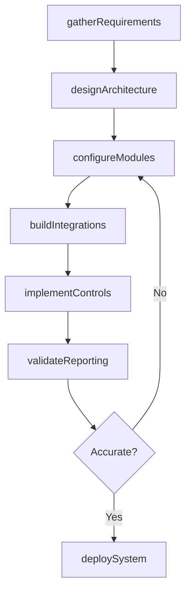
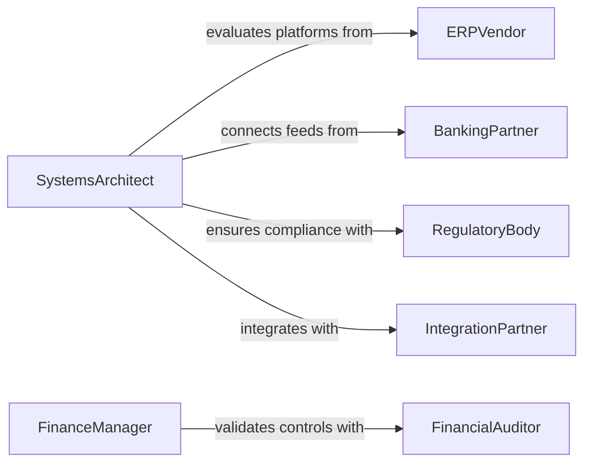

# Develop Business Financial Information Systems

> Business-as-Code definition for developing business or financial information systems. Models the design, implementation, and deployment of systems that capture, process, and report financial and operational data.

## Overview

Developing business or financial information systems involves designing and building software platforms that automate financial transactions, generate reports, manage accounting records, and support operational decision making. This activity covers requirements gathering from finance and business stakeholders, system architecture design, data integration with existing enterprise systems, and the implementation of controls to ensure data accuracy and regulatory compliance. The resulting systems serve as the backbone for financial planning, reporting, and analysis across the organization.

## Actors

| Actor | Description |
|-------|-------------|
| ERPVendor | Provider of enterprise resource planning software and modules |
| FinancialAuditor | External party that reviews system controls and data integrity |
| BankingPartner | Financial institution providing transaction feeds and payment processing |
| RegulatoryBody | Authority requiring specific financial reporting standards and controls |
| IntegrationPartner | Third-party system that exchanges data with the financial platform |

## Roles

| Role | Description |
|------|-------------|
| SystemsArchitect | Designs the technical architecture and integration patterns for financial systems |
| BusinessAnalyst | Translates financial and operational requirements into system specifications |
| FinanceManager | Defines business rules, reporting needs, and approval workflows |
| ImplementationLead | Manages the build, testing, and deployment of the information system |

## Entities

| Entity | Description |
|--------|-------------|
| SystemSpecification | A detailed document describing system requirements and design |
| DataIntegration | A connection between the financial system and an external data source |
| FinancialModule | A functional component handling a specific financial process such as AP, AR, or GL |
| ControlFramework | A set of internal controls ensuring data accuracy and regulatory compliance |
| ReportTemplate | A preconfigured layout for generating financial or operational reports |
| DeploymentPlan | A schedule and procedure for releasing the system into production |

## Actions

| Action | Description |
|--------|-------------|
| gatherRequirements | Collect financial and operational needs from stakeholders |
| designArchitecture | Define the system components, data flows, and integration points |
| configureModules | Set up financial modules with business rules and chart of accounts |
| buildIntegrations | Implement data connections with banking, ERP, and third-party systems |
| implementControls | Establish internal controls for transaction authorization and data validation |
| deploySystem | Release the configured system into the production environment |
| validateReporting | Verify that financial reports produce accurate and compliant output |

## Events

| Event | Description |
|-------|-------------|
| requirementsGathered | Financial and operational requirements have been collected |
| architectureDesigned | System architecture and integration patterns have been defined |
| modulesConfigured | Financial modules have been set up with business rules |
| integrationsBuilt | Data connections with external systems have been implemented |
| controlsImplemented | Internal controls and validation rules have been established |
| systemDeployed | The information system has been released to production |
| reportingValidated | Financial reports have been verified for accuracy and compliance |

## Searches

| Search | Description |
|--------|-------------|
| findSystemSpecifications | List system specs by module, status, or business domain |
| getIntegrations | Retrieve data integrations by source system, target, or status |
| getControlFrameworks | Find control frameworks by regulation, module, or audit period |
| getReportTemplates | Search report templates by financial domain, frequency, or format |

## Workflow



## Actor Relationships



## Usage

### Calling Actions

```typescript
import { developBusinessFinancialInformationSystems } from '@headlessly/develop-business-financial-information-systems'

const financialSystems = developBusinessFinancialInformationSystems()

// Gather requirements for a new GL system
const requirements = await financialSystems.gatherRequirements({
  projectId: 'proj-gl-modernization',
  stakeholders: ['cfo-office', 'accounts-payable', 'accounts-receivable', 'tax'],
  scope: ['general-ledger', 'consolidation', 'intercompany-eliminations']
})

// Design system architecture
const architecture = await financialSystems.designArchitecture({
  projectId: 'proj-gl-modernization',
  modules: ['general-ledger', 'accounts-payable', 'accounts-receivable'],
  integrations: ['banking-feed', 'erp-procurement', 'tax-reporting'],
  deploymentTarget: 'cloud-multi-region'
})

// Implement controls for SOX compliance
await financialSystems.implementControls({
  moduleId: 'general-ledger',
  controls: [
    { type: 'segregation-of-duties', rule: 'journal-entry-approval-required' },
    { type: 'transaction-limit', rule: 'entries-above-50000-require-cfo-approval' },
    { type: 'reconciliation', rule: 'daily-bank-reconciliation' }
  ]
})
```

### Event-Driven Automation

```typescript
// Trigger audit review when system is deployed
financialSystems.systemDeployed(async ({ projectId, modules, deploymentDate }) => {
  await createTask({
    assignee: 'financial-auditor',
    title: `Post-deployment review: ${projectId}`,
    modules,
    deadline: addDays(deploymentDate, 30)
  })
})

// Alert finance team when reporting validation fails
financialSystems.reportingValidated(async ({ moduleId, accurate, discrepancies }) => {
  if (!accurate) {
    await notify({
      to: 'finance-manager',
      message: `Reporting validation failed for ${moduleId}: ${discrepancies.length} discrepancies found`
    })
  }
})
```
