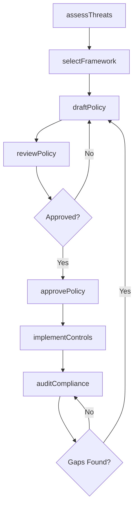
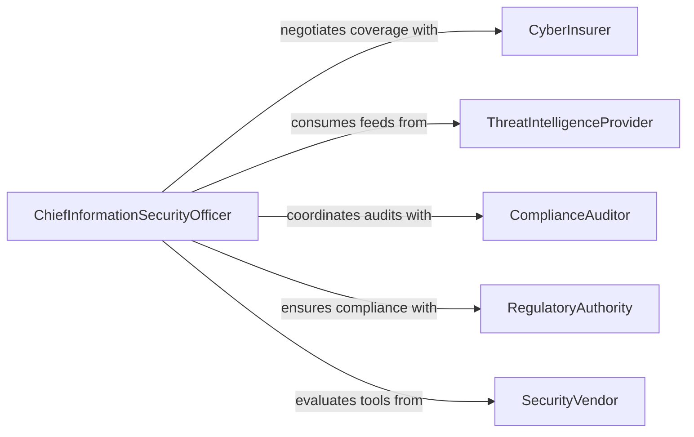

# Develop Computer Information Security Policies

> Business-as-Code definition for developing computer and information security policies. Models the full policy lifecycle from threat assessment and framework selection through drafting, approval, implementation, and incident-driven revision.

## Overview

Developing computer or information security policies involves defining the rules, procedures, and technical controls that protect an organization's digital assets, networks, and data from unauthorized access, breaches, and cyber threats. This activity draws on regulatory requirements, industry frameworks such as NIST and ISO 27001, and organizational risk assessments to produce enforceable policies covering access control, encryption, incident response, and acceptable use. Policies are reviewed periodically and updated in response to emerging threats or compliance changes.

## Actors

| Actor | Description |
|-------|-------------|
| CyberInsurer | Insurance providers that require specific security controls as policy conditions |
| ThreatIntelligenceProvider | External services that deliver threat feeds and vulnerability data |
| ComplianceAuditor | Third-party auditors who verify adherence to security standards |
| RegulatoryAuthority | Government bodies mandating data protection and security requirements |
| SecurityVendor | Providers of firewalls, endpoint protection, and security tooling |

## Roles

| Role | Description |
|------|-------------|
| ChiefInformationSecurityOfficer | Leads security policy development and organizational risk posture |
| SecurityPolicyAnalyst | Researches threats and drafts policy documents |
| ITSecurityEngineer | Implements technical controls mandated by security policies |
| ComplianceManager | Maps policies to regulatory frameworks and tracks adherence |

## Entities

| Entity | Description |
|--------|-------------|
| SecurityPolicy | A formal document defining rules for protecting information assets |
| ThreatAssessment | An evaluation of risks and vulnerabilities facing the organization |
| ControlFramework | A structured set of security controls such as NIST CSF or CIS Controls |
| IncidentResponsePlan | Procedures for detecting, containing, and recovering from security incidents |
| AccessControlPolicy | Rules governing who can access which systems and data |
| PolicyException | A documented deviation from a security policy with compensating controls |

## Actions

| Action | Description |
|--------|-------------|
| assessThreats | Evaluate the organization's threat landscape and vulnerabilities |
| selectFramework | Choose a security control framework to align policies with |
| draftPolicy | Author a new security policy based on risk assessment and framework |
| reviewPolicy | Circulate a draft policy for stakeholder and legal review |
| approvePolicy | Formally ratify a security policy for organizational adoption |
| implementControls | Deploy technical and procedural controls mandated by the policy |
| auditCompliance | Verify that systems and personnel adhere to approved policies |

## Events

| Event | Description |
|-------|-------------|
| threatsAssessed | A threat and vulnerability evaluation has been completed |
| frameworkSelected | A security control framework has been chosen |
| policyDrafted | A new security policy document has been authored |
| policyReviewed | Stakeholder feedback on a policy has been incorporated |
| policyApproved | A security policy has been formally ratified |
| controlsImplemented | Technical and procedural controls have been deployed |
| complianceAudited | A policy compliance check has been completed |

## Searches

| Search | Description |
|--------|-------------|
| findPolicies | List security policies by domain, status, or effective date |
| getThreatAssessments | Retrieve threat evaluations by date range or risk category |
| getComplianceResults | Look up audit results by policy or organizational unit |
| findPolicyExceptions | Search active exceptions by policy, department, or expiration date |

## Workflow



## Actor Relationships



## Usage

### Calling Actions

```typescript
import { developComputerInformationSecurityPolicies } from '@headlessly/develop-computer-information-security-policies'

const security = developComputerInformationSecurityPolicies()

// Assess current threat landscape
const assessment = await security.assessThreats({
  scope: ['Corporate Network', 'Cloud Infrastructure', 'Remote Endpoints'],
  sources: ['MITRE ATT&CK', 'CVE Database', 'Internal Incident History'],
  period: { start: '2025-01-01', end: '2025-12-31' }
})

// Draft an access control policy
const policy = await security.draftPolicy({
  title: 'Zero Trust Access Control Policy',
  framework: 'NIST-800-207',
  threatAssessmentId: assessment.id,
  sections: [
    { topic: 'Identity Verification', requirement: 'MFA required for all systems' },
    { topic: 'Least Privilege', requirement: 'Role-based access with quarterly review' },
    { topic: 'Network Segmentation', requirement: 'Microsegmentation for sensitive workloads' }
  ]
})

// Audit compliance after implementation
const audit = await security.auditCompliance({
  policyId: policy.id,
  targets: ['Engineering', 'Finance', 'HR', 'Operations'],
  method: 'automated-scan-plus-interview'
})
```

### Event-Driven Automation

```typescript
// Notify security team when new threats are assessed
security.threatsAssessed(async ({ assessmentId, criticalVulnerabilities }) => {
  if (criticalVulnerabilities > 0) {
    await notify({
      to: 'security-operations',
      message: `Threat assessment ${assessmentId} identified ${criticalVulnerabilities} critical vulnerabilities. Immediate policy review required.`
    })
  }
})

// Trigger remediation when audit finds non-compliance
security.complianceAudited(async ({ policyId, department, complianceRate }) => {
  if (complianceRate < 0.90) {
    await createRemediationPlan({
      policyId,
      department,
      deadline: addDays(new Date(), 30),
      priority: 'high'
    })
  }
})
```
