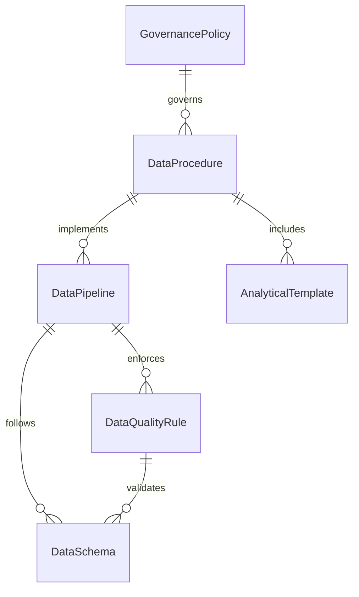
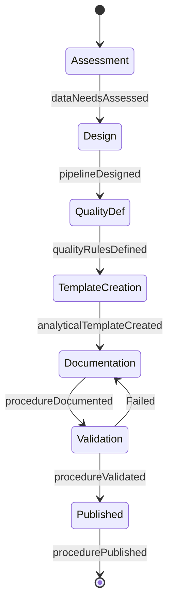
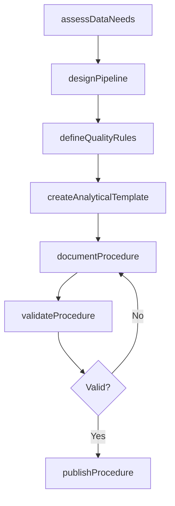
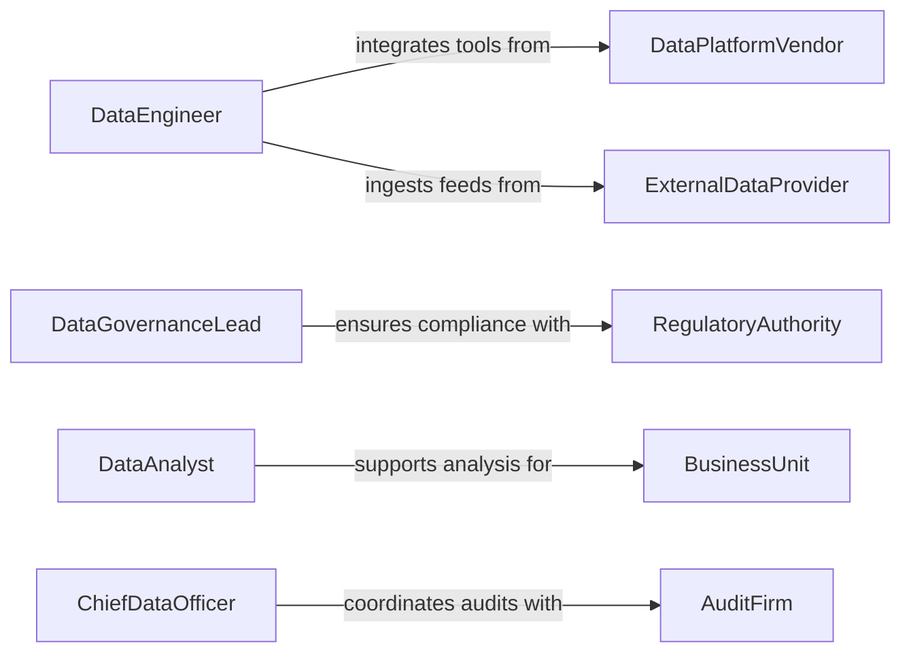

# Develop Data Analysis Data Management

> Business-as-Code definition for developing data analysis or data management procedures. Models the creation, validation, and governance of standardized procedures for collecting, storing, transforming, and analyzing organizational data.

## Overview

Developing data analysis or data management procedures involves designing standardized methods for data collection, quality assurance, storage, transformation, and analytical workflows. This activity ensures that data-driven decision making is grounded in consistent, repeatable processes that maintain data integrity and comply with governance requirements. It encompasses defining data pipelines, establishing naming conventions and schemas, creating analytical templates, and documenting procedures for data stewardship.

## Actors

| Actor | Description |
|-------|-------------|
| DataPlatformVendor | Provider of databases, warehouses, or analytics tools used in data operations |
| RegulatoryAuthority | Government or industry body setting data privacy and handling standards |
| BusinessUnit | Internal department that produces or consumes data for operations |
| ExternalDataProvider | Third-party source supplying data feeds or reference datasets |
| AuditFirm | External entity that reviews data handling practices for compliance |

## Roles

| Role | Description |
|------|-------------|
| DataEngineer | Designs and implements data pipelines and storage architectures |
| DataAnalyst | Develops analytical procedures and reporting methodologies |
| DataGovernanceLead | Establishes policies for data quality, access, and lifecycle management |
| ChiefDataOfficer | Sets organizational data strategy and approves procedural standards |

## Entities

| Entity | Description |
|--------|-------------|
| DataProcedure | A documented, standardized method for a specific data operation |
| DataPipeline | An automated workflow that extracts, transforms, and loads data |
| DataQualityRule | A validation check ensuring data meets defined accuracy and completeness standards |
| DataSchema | A structural definition specifying data fields, types, and relationships |
| AnalyticalTemplate | A reusable framework for conducting a specific type of data analysis |
| GovernancePolicy | A rule governing data access, retention, classification, or handling |

## Actions

| Action | Description |
|--------|-------------|
| assessDataNeeds | Evaluate organizational requirements for data collection and analysis |
| designPipeline | Architect the flow of data from source systems through transformation to storage |
| defineQualityRules | Establish validation checks for data accuracy, completeness, and timeliness |
| createAnalyticalTemplate | Build a reusable procedure for a specific analytical methodology |
| documentProcedure | Write formal documentation for a data management or analysis process |
| validateProcedure | Test a procedure against sample data to confirm correctness and reliability |
| publishProcedure | Release an approved procedure for organizational adoption |

## Events

| Event | Description |
|-------|-------------|
| dataNeedsAssessed | Organizational data requirements have been evaluated |
| pipelineDesigned | A data pipeline architecture has been defined |
| qualityRulesDefined | Data validation checks have been established |
| analyticalTemplateCreated | A reusable analytical procedure has been built |
| procedureDocumented | A data procedure has been formally written and documented |
| procedureValidated | A procedure has been tested and confirmed as reliable |
| procedurePublished | An approved procedure has been released for use |

## Searches

| Search | Description |
|--------|-------------|
| findProcedures | List data procedures by type, domain, or approval status |
| getQualityRules | Retrieve data quality rules by dataset, severity, or category |
| getPipelines | Search data pipelines by source system, target, or schedule |
| getAnalyticalTemplates | Find analytical templates by methodology, domain, or author |

## Entity Relationships



## State Diagram



## Workflow



## Actor Relationships



## Usage

### Calling Actions

```typescript
import { developDataAnalysisDataManagement } from '@headlessly/develop-data-analysis-data-management'

const dataProcedures = developDataAnalysisDataManagement()

// Assess data needs for a new business initiative
const needs = await dataProcedures.assessDataNeeds({
  initiative: 'customer-churn-prediction',
  dataSources: ['crm-events', 'billing-records', 'support-tickets'],
  requiredOutputs: ['monthly-churn-report', 'risk-score-model']
})

// Design a data pipeline
const pipeline = await dataProcedures.designPipeline({
  name: 'churn-feature-pipeline',
  sources: ['crm-events', 'billing-records'],
  transformations: ['deduplicate', 'join-on-customer-id', 'compute-recency-features'],
  target: 'analytics-warehouse',
  schedule: 'daily-6am'
})

// Define quality rules for the pipeline
await dataProcedures.defineQualityRules({
  pipelineId: pipeline.id,
  rules: [
    { field: 'customer_id', check: 'not-null', severity: 'critical' },
    { field: 'event_timestamp', check: 'within-24-hours', severity: 'warning' },
    { field: 'billing_amount', check: 'non-negative', severity: 'critical' }
  ]
})
```

### Event-Driven Automation

```typescript
// Notify stakeholders when a procedure is published
dataProcedures.procedurePublished(async ({ procedureId, name, domain }) => {
  await notify({
    to: `${domain}-team`,
    message: `New data procedure published: ${name}. Review and adopt for upcoming analyses.`
  })
})

// Auto-run validation when a pipeline design changes
dataProcedures.pipelineDesigned(async ({ pipelineId, name }) => {
  await dataProcedures.validateProcedure({
    pipelineId,
    testDataset: 'sample-data-latest',
    checks: ['schema-conformance', 'row-count-threshold', 'quality-rules']
  })
})
```
