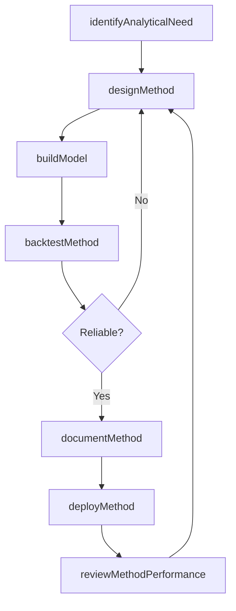
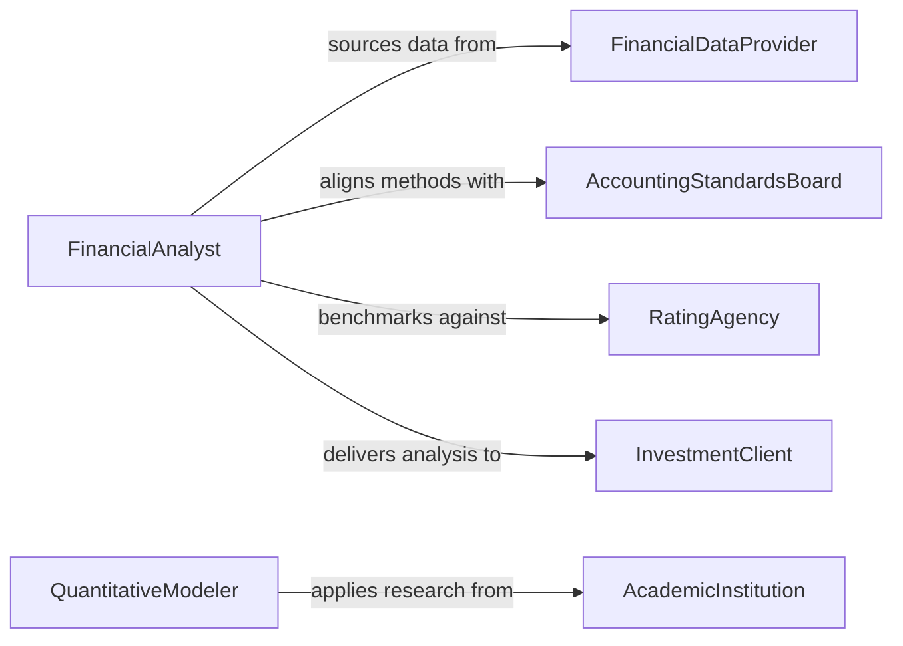

# Develop Financial Analysis Methods

> Business-as-Code definition for developing financial analysis methods. Models the design, validation, and deployment of analytical frameworks and quantitative techniques used to evaluate financial performance, risk, and investment opportunities.

## Overview

Developing financial analysis methods involves creating standardized quantitative frameworks, models, and techniques for evaluating financial statements, assessing investment opportunities, measuring risk, and forecasting financial performance. This activity covers the selection of appropriate analytical approaches, the construction of financial models, the validation of methods against historical data, and the documentation of procedures for consistent application across the organization. It supports disciplines including corporate finance, investment analysis, credit assessment, and actuarial science.

## Actors

| Actor | Description |
|-------|-------------|
| FinancialDataProvider | Vendor supplying market data, economic indicators, and financial benchmarks |
| AccountingStandardsBoard | Body such as FASB or IASB that establishes financial reporting standards |
| RatingAgency | Organization that evaluates creditworthiness and publishes financial ratings |
| InvestmentClient | Individual or institution seeking financial analysis for decision making |
| AcademicInstitution | University or research center contributing to financial theory and methodology |

## Roles

| Role | Description |
|------|-------------|
| FinancialAnalyst | Designs and applies quantitative methods to evaluate financial data |
| QuantitativeModeler | Builds mathematical models for pricing, risk, and forecasting |
| RiskManager | Develops methods for measuring and managing financial risk exposure |
| FinanceDirector | Approves analytical methodologies and oversees their organizational adoption |

## Entities

| Entity | Description |
|--------|-------------|
| AnalyticalMethod | A documented technique for evaluating a specific financial metric or scenario |
| FinancialModel | A quantitative representation of financial relationships and projections |
| ValuationFramework | A structured approach for determining the value of assets or enterprises |
| RiskMetric | A quantitative measure of financial risk such as VaR, beta, or Sharpe ratio |
| BacktestResult | An evaluation of a method's performance against historical financial data |
| MethodDocumentation | Formal specifications of an analytical method's assumptions, inputs, and outputs |

## Actions

| Action | Description |
|--------|-------------|
| identifyAnalyticalNeed | Determine which financial questions require new or improved methods |
| designMethod | Create the quantitative framework, formulas, and assumptions for the analysis |
| buildModel | Implement the financial model in a computational tool or platform |
| backtestMethod | Validate the method by testing it against historical financial data |
| documentMethod | Write formal specifications covering assumptions, inputs, outputs, and limitations |
| deployMethod | Release the validated method for use by analysts across the organization |
| reviewMethodPerformance | Periodically evaluate the accuracy and relevance of deployed methods |

## Events

| Event | Description |
|-------|-------------|
| analyticalNeedIdentified | A requirement for a new or improved financial analysis method has been recognized |
| methodDesigned | The quantitative framework and assumptions have been defined |
| modelBuilt | The financial model has been implemented in a computational environment |
| methodBacktested | The method has been validated against historical data |
| methodDocumented | Formal specifications for the method have been written |
| methodDeployed | The validated method has been released for organizational use |
| methodPerformanceReviewed | The accuracy and relevance of a deployed method have been evaluated |

## Searches

| Search | Description |
|--------|-------------|
| findMethods | List financial analysis methods by type, asset class, or approval status |
| getBacktestResults | Retrieve backtest outcomes by method, time period, or performance metric |
| getFinancialModels | Search financial models by methodology, author, or deployment status |
| getRiskMetrics | Find risk metric definitions by category, regulatory framework, or asset type |

## Workflow



## Actor Relationships



## Usage

### Calling Actions

```typescript
import { developFinancialAnalysisMethods } from '@headlessly/develop-financial-analysis-methods'

const analysisMethods = developFinancialAnalysisMethods()

// Identify need for an improved DCF valuation method
const need = await analysisMethods.identifyAnalyticalNeed({
  domain: 'equity-valuation',
  problem: 'Current DCF model does not account for scenario-weighted terminal values',
  requestedBy: 'portfolio-management-team'
})

// Design the method
const method = await analysisMethods.designMethod({
  name: 'Scenario-Weighted DCF Valuation',
  type: 'valuation-framework',
  assumptions: ['Risk-free rate from 10Y Treasury', 'Three-scenario terminal value weighting'],
  inputs: ['projected-cash-flows', 'discount-rate', 'scenario-probabilities'],
  outputs: ['enterprise-value', 'per-share-value', 'sensitivity-table']
})

// Backtest against historical data
const backtest = await analysisMethods.backtestMethod({
  methodId: method.id,
  dataset: 'sp500-historical-2015-2025',
  metrics: ['mean-absolute-error', 'directional-accuracy', 'r-squared']
})
```

### Event-Driven Automation

```typescript
// Notify analysts when a new method is deployed
analysisMethods.methodDeployed(async ({ methodId, name, type }) => {
  await notify({
    to: 'financial-analysis-team',
    message: `New ${type} available: ${name}. Review documentation and begin adoption.`
  })
})

// Auto-schedule performance review for deployed methods
analysisMethods.methodDeployed(async ({ methodId, name }) => {
  await scheduleTask({
    action: 'reviewMethodPerformance',
    methodId,
    scheduledDate: addMonths(new Date(), 6),
    assignee: 'quantitative-modeler'
  })
})
```
