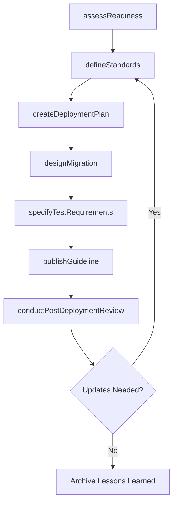
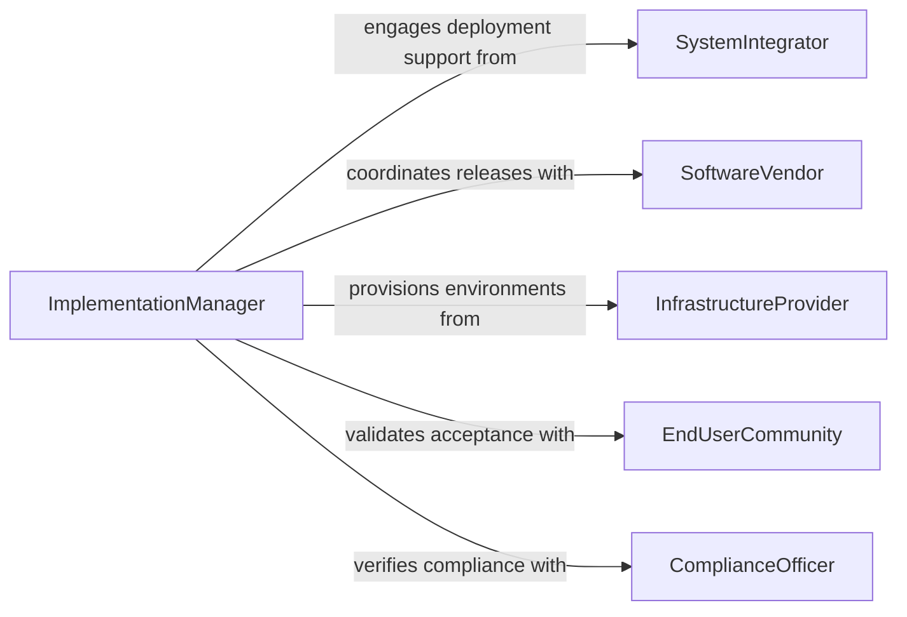

# Develop Guidelines System Implementation

> Business-as-Code definition for developing system implementation guidelines. Models the creation of deployment standards, migration plans, testing requirements, and rollback procedures that govern how technology systems are introduced into production environments.

## Overview

Developing guidelines for system implementation involves defining the standards, checklists, and procedures that govern how new technology systems are deployed into an organization's infrastructure. These guidelines cover environment preparation, data migration, integration testing, user acceptance, go-live sequencing, and post-deployment validation. The goal is to reduce implementation risk, ensure consistency across projects, and provide repeatable frameworks that project teams can follow for any system rollout.

## Actors

| Actor | Description |
|-------|-------------|
| SystemIntegrator | External firms that assist with complex system deployments and migrations |
| SoftwareVendor | Providers of the application or platform being implemented |
| InfrastructureProvider | Cloud or data center providers hosting the target environment |
| EndUserCommunity | Business users who will operate the implemented system |
| ComplianceOfficer | Internal or external parties verifying regulatory alignment of the implementation |

## Roles

| Role | Description |
|------|-------------|
| ImplementationManager | Leads the development of implementation guidelines and oversees deployments |
| SolutionsArchitect | Designs the technical implementation approach and environment topology |
| QALead | Defines testing requirements and acceptance criteria for implementations |
| ChangeManagementLead | Ensures user readiness and organizational adoption during rollouts |

## Entities

| Entity | Description |
|--------|-------------|
| ImplementationGuideline | A documented standard or checklist for deploying a system |
| DeploymentPlan | A sequenced schedule of implementation activities and milestones |
| MigrationStrategy | A defined approach for transferring data and workflows to the new system |
| TestPlan | A specification of test scenarios, data, and acceptance criteria |
| RollbackProcedure | Steps to revert a deployment if critical issues are discovered |
| GoLiveChecklist | A pre-launch verification list ensuring readiness across all areas |

## Actions

| Action | Description |
|--------|-------------|
| assessReadiness | Evaluate infrastructure, data, and organizational readiness for implementation |
| defineStandards | Establish the technical and procedural standards for deployments |
| createDeploymentPlan | Build the sequenced schedule and milestone plan for implementation |
| designMigration | Plan the data and workflow migration approach |
| specifyTestRequirements | Define test scenarios, data sets, and acceptance criteria |
| publishGuideline | Release the finalized implementation guideline for project use |
| conductPostDeploymentReview | Assess the implementation outcome and capture lessons learned |

## Events

| Event | Description |
|-------|-------------|
| readinessAssessed | Infrastructure and organizational readiness has been evaluated |
| standardsDefined | Implementation standards have been established |
| deploymentPlanCreated | The implementation schedule and milestones have been built |
| migrationDesigned | The data and workflow migration approach has been planned |
| testRequirementsSpecified | Test scenarios and acceptance criteria have been defined |
| guidelinePublished | An implementation guideline has been released |
| postDeploymentReviewed | A post-implementation review has been completed |

## Searches

| Search | Description |
|--------|-------------|
| findGuidelines | List implementation guidelines by system type, version, or status |
| getDeploymentPlans | Retrieve deployment schedules by project or target date |
| getTestPlans | Look up test specifications by system or implementation phase |
| findLessonsLearned | Search post-deployment review findings by project or issue category |

## Workflow



## Actor Relationships



## Usage

### Calling Actions

```typescript
import { developGuidelinesSystemImplementation } from '@headlessly/develop-guidelines-system-implementation'

const implementation = developGuidelinesSystemImplementation()

// Assess readiness for ERP deployment
const readiness = await implementation.assessReadiness({
  system: 'SAP S/4HANA',
  environment: 'production',
  checks: [
    { area: 'Infrastructure', items: ['Network bandwidth', 'Storage capacity', 'Compute resources'] },
    { area: 'Data', items: ['Master data cleansed', 'Historical migration mapped', 'Interfaces tested'] },
    { area: 'Organization', items: ['Training completed', 'Support desk staffed', 'Cutover plan approved'] }
  ]
})

// Create deployment plan
const plan = await implementation.createDeploymentPlan({
  system: 'SAP S/4HANA',
  phases: [
    { name: 'Environment Setup', duration: '2 weeks', dependencies: [] },
    { name: 'Data Migration', duration: '3 weeks', dependencies: ['Environment Setup'] },
    { name: 'Integration Testing', duration: '2 weeks', dependencies: ['Data Migration'] },
    { name: 'User Acceptance', duration: '2 weeks', dependencies: ['Integration Testing'] },
    { name: 'Go-Live', duration: '1 week', dependencies: ['User Acceptance'] }
  ],
  rollbackWindow: '72 hours'
})

// Specify test requirements
await implementation.specifyTestRequirements({
  deploymentPlanId: plan.id,
  scenarios: [
    { name: 'Order-to-Cash', type: 'end-to-end', priority: 'critical' },
    { name: 'Procure-to-Pay', type: 'end-to-end', priority: 'critical' },
    { name: 'Financial Close', type: 'regression', priority: 'high' }
  ],
  acceptanceCriteria: { passRate: 100, criticalDefects: 0 }
})
```

### Event-Driven Automation

```typescript
// Distribute guidelines when published
implementation.guidelinePublished(async ({ guidelineId, systemType, version }) => {
  await distribute({
    document: guidelineId,
    to: ['project-managers', 'solutions-architects', 'qa-leads'],
    message: `Implementation guideline v${version} for ${systemType} is now available.`
  })
})

// Capture and share lessons from post-deployment reviews
implementation.postDeploymentReviewed(async ({ projectId, findings }) => {
  if (findings.issues.length > 0) {
    await updateGuideline({
      section: 'Known Risks',
      additions: findings.issues.map(i => ({
        risk: i.description,
        mitigation: i.resolution
      }))
    })
  }
})
```
