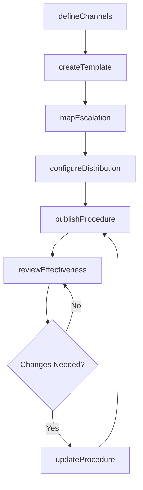
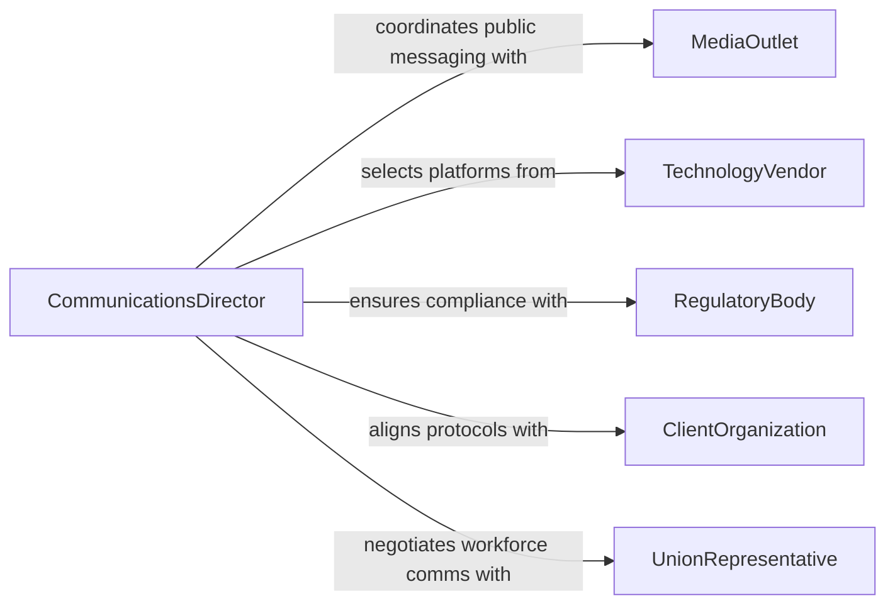

# Develop Information Communication Procedures

> Business-as-Code definition for developing information communication procedures. Models the creation and governance of organizational communication protocols, from channel selection and message standards through escalation paths and feedback loops.

## Overview

Developing information communication procedures involves defining how an organization creates, routes, distributes, and archives information across internal and external channels. These procedures establish message formatting standards, notification hierarchies, escalation protocols, and communication channel governance. The goal is to ensure timely, accurate, and consistent information flow that supports decision-making and regulatory compliance.

## Actors

| Actor | Description |
|-------|-------------|
| MediaOutlet | External press and media organizations that receive public communications |
| TechnologyVendor | Providers of communication platforms, tools, and infrastructure |
| RegulatoryBody | Authorities that mandate disclosure and reporting communication requirements |
| ClientOrganization | External clients who rely on structured communication from the organization |
| UnionRepresentative | Labor representatives who participate in workforce communication protocols |

## Roles

| Role | Description |
|------|-------------|
| CommunicationsDirector | Oversees the development and enforcement of communication procedures |
| InformationArchitect | Designs communication flows, taxonomies, and message structures |
| ChangeManager | Ensures communication procedures support organizational change initiatives |
| RecordsManager | Governs retention and archival of official communications |

## Entities

| Entity | Description |
|--------|-------------|
| CommunicationProcedure | A documented protocol for a specific type of information exchange |
| MessageTemplate | A standardized format for recurring communication types |
| EscalationPath | A defined chain for routing urgent or unresolved communications |
| DistributionList | A managed group of recipients for targeted communications |
| CommunicationChannel | An approved medium for information exchange such as email, intranet, or messaging |
| RetentionRule | A policy governing how long communications are archived |

## Actions

| Action | Description |
|--------|-------------|
| defineChannels | Establish approved communication channels and their intended use |
| createTemplate | Design standardized message formats for recurring communications |
| mapEscalation | Define escalation paths for urgent or unresolved issues |
| publishProcedure | Release a finalized communication procedure for adoption |
| configureDistribution | Set up recipient lists and routing rules for communication types |
| reviewEffectiveness | Assess whether communication procedures achieve their objectives |
| updateProcedure | Revise a procedure based on feedback or changing requirements |

## Events

| Event | Description |
|-------|-------------|
| channelsDefined | Approved communication channels have been established |
| templateCreated | A new message template has been designed |
| escalationMapped | An escalation path has been defined |
| procedurePublished | A communication procedure has been released for use |
| distributionConfigured | Recipient lists and routing rules have been set up |
| effectivenessReviewed | A communication procedure has been assessed |
| procedureUpdated | A communication procedure has been revised |

## Searches

| Search | Description |
|--------|-------------|
| findProcedures | List communication procedures by type, channel, or department |
| getTemplates | Retrieve message templates by communication category |
| getEscalationPaths | Look up escalation chains by issue type or severity |
| findDistributionLists | Search recipient groups by department or communication type |

## Workflow



## Actor Relationships



## Usage

### Calling Actions

```typescript
import { developInformationCommunicationProcedures } from '@headlessly/develop-information-communication-procedures'

const comms = developInformationCommunicationProcedures()

// Define approved communication channels
await comms.defineChannels({
  channels: [
    { name: 'Corporate Email', type: 'email', scope: 'internal-external', encryption: true },
    { name: 'Slack Workspace', type: 'messaging', scope: 'internal', retention: '90-days' },
    { name: 'Intranet Portal', type: 'web', scope: 'internal', audience: 'all-employees' }
  ]
})

// Create a template for incident notifications
await comms.createTemplate({
  name: 'Service Outage Notification',
  channel: 'Corporate Email',
  fields: ['severity', 'affectedSystems', 'estimatedResolution', 'contactPerson'],
  audienceType: 'stakeholders'
})

// Map escalation for critical incidents
await comms.mapEscalation({
  issueType: 'Security Breach',
  levels: [
    { level: 1, role: 'Security Analyst', responseTime: '15m' },
    { level: 2, role: 'CISO', responseTime: '30m' },
    { level: 3, role: 'CEO', responseTime: '1h' }
  ]
})
```

### Event-Driven Automation

```typescript
// Train staff when a new procedure is published
comms.procedurePublished(async ({ procedureId, name, affectedDepartments }) => {
  await scheduleTrain({
    topic: `New communication procedure: ${name}`,
    departments: affectedDepartments,
    deadline: addDays(new Date(), 14)
  })
})

// Flag underperforming procedures for revision
comms.effectivenessReviewed(async ({ procedureId, metrics }) => {
  if (metrics.acknowledgmentRate < 0.70) {
    await createTask({
      title: `Revise low-engagement procedure ${procedureId}`,
      assignTo: 'communications-director',
      priority: 'medium'
    })
  }
})
```
