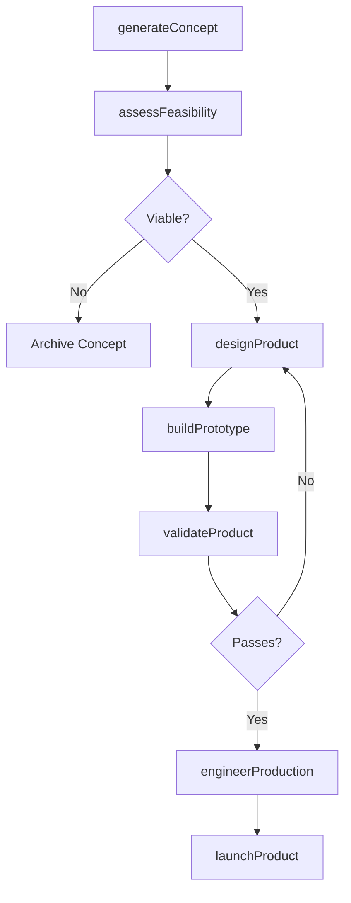
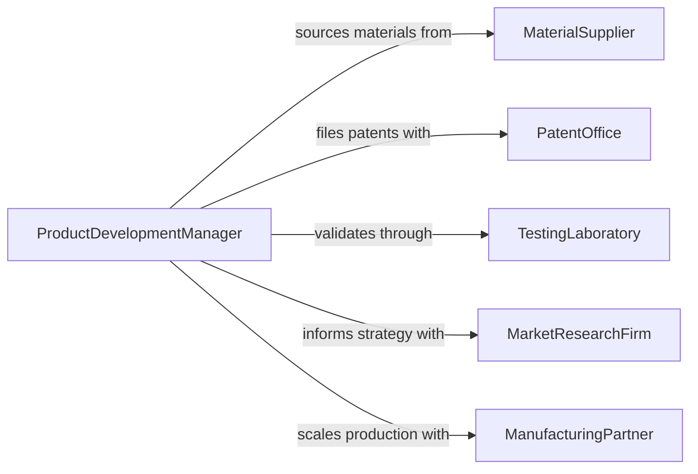

# Develop New Advanced Products Production

> Business-as-Code definition for developing new or advanced products and production methods. Models the innovation pipeline from concept ideation through feasibility analysis, prototyping, production engineering, and market launch.

## Overview

Developing new or advanced products and production methods involves researching emerging technologies, designing innovative product concepts, engineering manufacturing processes, and validating both product performance and production scalability. This activity spans the full innovation lifecycle from ideation through commercialization, incorporating market analysis, material science, process engineering, and quality validation. The goal is to bring differentiated products to market while establishing efficient, repeatable production methods.

## Actors

| Actor | Description |
|-------|-------------|
| MaterialSupplier | Providers of raw materials, compounds, and specialty inputs for new products |
| PatentOffice | Authorities that grant intellectual property protection for innovations |
| TestingLaboratory | Accredited facilities that validate product performance and safety |
| MarketResearchFirm | Agencies that assess market demand and competitive positioning |
| ManufacturingPartner | Contract manufacturers or co-development partners for production scale-up |

## Roles

| Role | Description |
|------|-------------|
| ProductDevelopmentManager | Leads cross-functional teams through the product development lifecycle |
| DesignEngineer | Creates product concepts, CAD models, and engineering specifications |
| ManufacturingEngineer | Designs and optimizes production processes for new products |
| MarketAnalyst | Evaluates market opportunity and informs product positioning |

## Entities

| Entity | Description |
|--------|-------------|
| ProductConcept | An early-stage idea describing a new product's value proposition |
| Prototype | A physical or digital model built to test design assumptions |
| ProductionMethod | A defined manufacturing process for producing a product at scale |
| FeasibilityStudy | An analysis of technical and economic viability for a product concept |
| BillOfMaterials | A comprehensive list of components and materials for a product |
| LaunchPlan | A strategy for introducing a new product to market |

## Actions

| Action | Description |
|--------|-------------|
| generateConcept | Ideate and document a new product concept with value proposition |
| assessFeasibility | Evaluate technical and economic viability of a product concept |
| designProduct | Create engineering specifications, CAD models, and material selections |
| buildPrototype | Construct a functional prototype for testing and validation |
| engineerProduction | Design the manufacturing process and tooling for the product |
| validateProduct | Test the product against performance, safety, and regulatory criteria |
| launchProduct | Execute the go-to-market plan for a validated product |

## Events

| Event | Description |
|-------|-------------|
| conceptGenerated | A new product concept has been documented |
| feasibilityAssessed | Technical and economic viability analysis is complete |
| productDesigned | Engineering specifications have been created |
| prototypeBuilt | A functional prototype has been constructed |
| productionEngineered | Manufacturing processes and tooling have been designed |
| productValidated | Product testing against acceptance criteria is complete |
| productLaunched | A new product has been introduced to market |

## Searches

| Search | Description |
|--------|-------------|
| findConcepts | List product concepts by category, stage, or originator |
| getPrototypes | Retrieve prototypes by product line, version, or test status |
| getProductionMethods | Look up manufacturing processes by product or production line |
| findFeasibilityStudies | Search feasibility analyses by product concept or outcome |

## Workflow



## Actor Relationships



## Usage

### Calling Actions

```typescript
import { developNewAdvancedProductsProduction } from '@headlessly/develop-new-advanced-products-production'

const products = developNewAdvancedProductsProduction()

// Generate a new product concept
const concept = await products.generateConcept({
  name: 'Lightweight Carbon Fiber Bicycle Frame',
  category: 'Sporting Goods',
  valueProposition: 'Race-grade performance at 30% lower weight than aluminum',
  targetMarket: 'Competitive cyclists and enthusiasts'
})

// Assess feasibility
const feasibility = await products.assessFeasibility({
  conceptId: concept.id,
  factors: {
    technicalComplexity: 'medium',
    estimatedCost: { development: 250000, unitProduction: 850 },
    timeToMarket: { months: 18 },
    marketSize: { annual: 500000000, currency: 'USD' }
  }
})

// Build and validate a prototype
const prototype = await products.buildPrototype({
  conceptId: concept.id,
  version: 'v2',
  materials: ['T700 Carbon Fiber', 'Epoxy Resin System', 'Titanium Inserts'],
  targetWeight: { value: 980, unit: 'grams' }
})

const validation = await products.validateProduct({
  prototypeId: prototype.id,
  tests: [
    { name: 'Fatigue Test', standard: 'ISO 4210-6', cycles: 100000 },
    { name: 'Impact Test', standard: 'EN 14764', energy: '50J' }
  ]
})
```

### Event-Driven Automation

```typescript
// Alert leadership when a concept passes feasibility
products.feasibilityAssessed(async ({ conceptId, viable, projectedROI }) => {
  if (viable) {
    await notify({
      to: 'product-leadership',
      message: `Concept ${conceptId} passed feasibility with projected ROI of ${projectedROI}%. Proceeding to design phase.`
    })
  }
})

// Initiate production engineering when product is validated
products.productValidated(async ({ prototypeId, results }) => {
  if (results.every(r => r.passed)) {
    await products.engineerProduction({
      prototypeId,
      targetVolume: 5000,
      productionLine: 'composites-facility-A'
    })
  }
})
```
