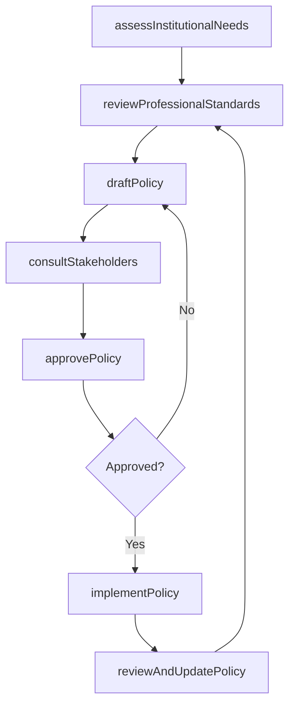
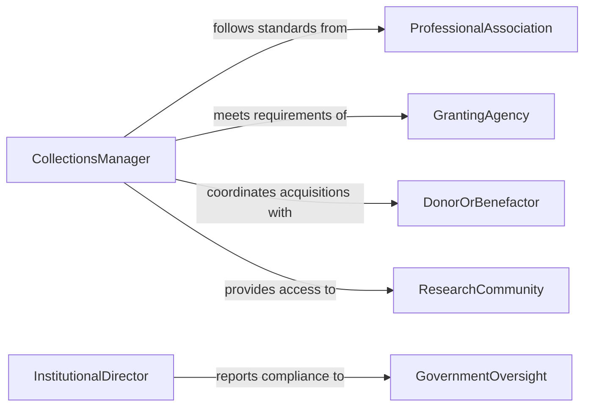

# Develop Policies Procedures Archives Museums

> Business-as-Code definition for developing policies or procedures for archives, museums, or libraries. Models the creation and maintenance of institutional policies governing collections management, access, preservation, and public engagement.

## Overview

Developing policies or procedures for archives, museums, or libraries involves creating formal guidelines that govern the acquisition, cataloging, preservation, storage, access, and deaccessioning of collections. This activity ensures that cultural institutions operate according to professional standards and ethical principles while meeting the needs of researchers, educators, and the public. It encompasses drafting collection development policies, establishing conservation protocols, defining access and lending rules, and implementing digital preservation strategies.

## Actors

| Actor | Description |
|-------|-------------|
| ProfessionalAssociation | Organizations such as ALA, SAA, or AAM that publish professional standards |
| GrantingAgency | Funder providing financial support contingent on institutional policy compliance |
| DonorOrBenefactor | Individual or organization contributing materials or funding to the institution |
| ResearchCommunity | Scholars and educators who access and use institutional collections |
| GovernmentOversight | Regulatory body overseeing publicly funded cultural institutions |

## Roles

| Role | Description |
|------|-------------|
| CollectionsManager | Oversees acquisition, cataloging, and care of institutional holdings |
| Archivist | Develops policies for archival arrangement, description, and access |
| PreservationSpecialist | Establishes conservation standards and environmental control procedures |
| InstitutionalDirector | Approves policies and sets strategic direction for the organization |

## Entities

| Entity | Description |
|--------|-------------|
| CollectionPolicy | A document defining acquisition scope, criteria, and deaccessioning rules |
| PreservationGuideline | Standards for the physical and digital conservation of collection materials |
| AccessPolicy | Rules governing who may access collection materials and under what conditions |
| CatalogingStandard | Specifications for describing and indexing items within the collection |
| LendingAgreement | Terms and procedures for loaning materials to other institutions |
| DigitalPreservationPlan | A strategy for long-term storage and accessibility of digitized materials |

## Actions

| Action | Description |
|--------|-------------|
| assessInstitutionalNeeds | Evaluate current gaps in policies and procedures based on operations and standards |
| draftPolicy | Write the initial text of an institutional policy with scope and procedures |
| reviewProfessionalStandards | Analyze current best practices from professional associations and peer institutions |
| consultStakeholders | Gather input from staff, board members, donors, and the research community |
| approvePolicy | Submit the policy for formal review and adoption by institutional governance |
| implementPolicy | Put the approved policy into practice with staff training and documentation |
| reviewAndUpdatePolicy | Periodically reassess policies to ensure alignment with evolving standards |

## Events

| Event | Description |
|-------|-------------|
| institutionalNeedsAssessed | Gaps in current policies have been identified and documented |
| policyDrafted | An initial version of the institutional policy has been written |
| professionalStandardsReviewed | Best practices from peer institutions and associations have been analyzed |
| stakeholdersConsulted | Feedback from staff, governance, and external parties has been collected |
| policyApproved | The institutional policy has been formally adopted by governance |
| policyImplemented | The approved policy has been put into practice across the institution |
| policyReviewed | A periodic review of the policy has been completed |

## Searches

| Search | Description |
|--------|-------------|
| findPolicies | List institutional policies by type, collection area, or effective date |
| getPreservationGuidelines | Retrieve preservation standards by material type or storage condition |
| getAccessPolicies | Find access rules by collection, user type, or restriction level |
| getLendingAgreements | Search lending agreements by borrowing institution, date, or collection |

## Workflow



## Actor Relationships



## Usage

### Calling Actions

```typescript
import { developPoliciesProceduresArchivesMuseums } from '@headlessly/develop-policies-procedures-archives-museums'

const institutionalPolicies = developPoliciesProceduresArchivesMuseums()

// Assess needs for a digital preservation policy
const needs = await institutionalPolicies.assessInstitutionalNeeds({
  institutionId: 'city-historical-archive',
  areas: ['digital-preservation', 'born-digital-collections'],
  currentPolicies: ['collection-development-2022', 'physical-preservation-2023']
})

// Draft a digital preservation policy
const draft = await institutionalPolicies.draftPolicy({
  title: 'Digital Preservation and Access Policy',
  scope: 'All born-digital and digitized materials in the collection',
  sections: [
    { heading: 'File Format Standards', content: 'Preferred formats: TIFF for images, PDF/A for documents...' },
    { heading: 'Storage and Redundancy', content: 'Minimum three copies across geographically separated locations...' },
    { heading: 'Access and Rights', content: 'Digital materials shall be accessible via the online catalog...' },
    { heading: 'Migration Schedule', content: 'Format migration review every five years...' }
  ]
})

// Consult stakeholders
await institutionalPolicies.consultStakeholders({
  policyDraftId: draft.id,
  consultees: ['archival-staff', 'it-department', 'board-of-trustees', 'research-advisory-committee'],
  deadline: '2026-05-01'
})
```

### Event-Driven Automation

```typescript
// Notify staff when a new policy is implemented
institutionalPolicies.policyImplemented(async ({ policyId, title, affectedDepartments }) => {
  for (const dept of affectedDepartments) {
    await notify({
      to: `${dept}-staff`,
      message: `New policy in effect: ${title}. Please review updated procedures.`
    })
  }
})

// Schedule periodic policy review
institutionalPolicies.policyApproved(async ({ policyId, title, effectiveDate }) => {
  await scheduleTask({
    action: 'reviewAndUpdatePolicy',
    policyId,
    scheduledDate: addYears(effectiveDate, 3),
    assignee: 'collections-manager'
  })
})
```
