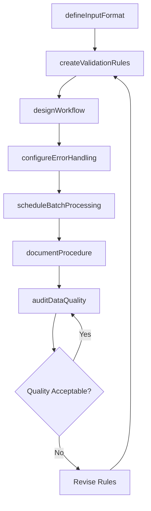
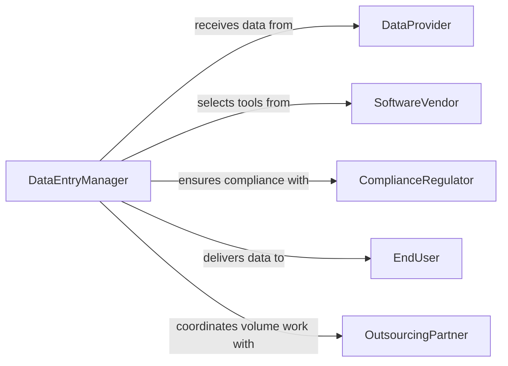

# Develop Procedures Data Entry Processing

> Business-as-Code definition for developing data entry and processing procedures. Models the design of input workflows, validation rules, error handling protocols, and quality assurance checkpoints that govern how data is captured, transformed, and loaded into organizational systems.

## Overview

Developing procedures for data entry or processing involves designing standardized workflows for capturing, validating, transforming, and loading data into business systems. These procedures define input formats, field-level validation rules, error correction protocols, and batch processing schedules to ensure data accuracy and timeliness. The activity covers both manual keying operations and automated ingestion pipelines, with quality checkpoints at each stage of the data flow.

## Actors

| Actor | Description |
|-------|-------------|
| DataProvider | External sources that supply data feeds, documents, or forms for entry |
| SoftwareVendor | Providers of data entry tools, OCR systems, and ETL platforms |
| ComplianceRegulator | Authorities that mandate data accuracy and retention requirements |
| EndUser | Internal staff who consume processed data for business decisions |
| OutsourcingPartner | Third-party firms that handle high-volume data entry operations |

## Roles

| Role | Description |
|------|-------------|
| DataEntryManager | Oversees data entry operations and procedure development |
| DataQualityAnalyst | Designs validation rules and monitors error rates |
| ProcessAutomationLead | Identifies opportunities to automate manual data entry tasks |
| TrainingCoordinator | Develops and delivers training on data entry procedures |

## Entities

| Entity | Description |
|--------|-------------|
| EntryProcedure | A documented workflow for capturing data from a specific source |
| ValidationRule | A check applied to incoming data to ensure correctness |
| ErrorLog | A record of data entry mistakes and their resolution status |
| BatchJob | A scheduled process that ingests and transforms data in bulk |
| InputTemplate | A standardized form or format for data capture |
| QualityCheckpoint | A defined point in the workflow where accuracy is verified |

## Actions

| Action | Description |
|--------|-------------|
| defineInputFormat | Establish the structure and field requirements for data capture |
| createValidationRules | Design checks for data type, range, format, and consistency |
| designWorkflow | Map the end-to-end data entry and processing pipeline |
| configureErrorHandling | Set up protocols for detecting, logging, and correcting errors |
| scheduleBatchProcessing | Define timing and sequencing for automated data ingestion |
| documentProcedure | Write and publish the finalized data entry procedure |
| auditDataQuality | Assess error rates and compliance with entry procedures |

## Events

| Event | Description |
|-------|-------------|
| inputFormatDefined | Data capture structure and field requirements have been set |
| validationRulesCreated | Data quality checks have been designed and configured |
| workflowDesigned | The data entry pipeline has been mapped end to end |
| errorHandlingConfigured | Error detection and correction protocols are in place |
| batchProcessingScheduled | Automated ingestion timing has been defined |
| procedureDocumented | A data entry procedure has been written and published |
| dataQualityAudited | An accuracy assessment of data entry operations is complete |

## Searches

| Search | Description |
|--------|-------------|
| findProcedures | List data entry procedures by source type, system, or owner |
| getErrorLogs | Retrieve error records by procedure, date range, or severity |
| getValidationRules | Look up validation checks by field, data source, or rule type |
| findBatchJobs | Search batch processing jobs by schedule, status, or data source |

## Workflow



## Actor Relationships



## Usage

### Calling Actions

```typescript
import { developProceduresDataEntryProcessing } from '@headlessly/develop-procedures-data-entry-processing'

const dataEntry = developProceduresDataEntryProcessing()

// Define input format for insurance claims
const format = await dataEntry.defineInputFormat({
  name: 'Insurance Claim Intake Form',
  fields: [
    { name: 'claimNumber', type: 'string', pattern: 'CLM-[0-9]{8}', required: true },
    { name: 'claimDate', type: 'date', format: 'YYYY-MM-DD', required: true },
    { name: 'claimAmount', type: 'decimal', min: 0, max: 1000000, required: true },
    { name: 'policyNumber', type: 'string', lookup: 'policies', required: true }
  ]
})

// Create validation rules
await dataEntry.createValidationRules({
  formatId: format.id,
  rules: [
    { field: 'claimDate', check: 'not-future-date' },
    { field: 'policyNumber', check: 'exists-in-system', system: 'policy-database' },
    { field: 'claimAmount', check: 'within-policy-limits', referenceField: 'policyNumber' }
  ]
})

// Schedule batch processing for overnight ingestion
await dataEntry.scheduleBatchProcessing({
  procedureName: 'Nightly Claims Ingestion',
  schedule: '0 2 * * *',
  source: 'sftp://claims-inbox/',
  destination: 'claims-processing-system',
  validationMode: 'strict'
})
```

### Event-Driven Automation

```typescript
// Alert quality team when error rates spike
dataEntry.dataQualityAudited(async ({ procedureId, errorRate, period }) => {
  if (errorRate > 0.05) {
    await notify({
      to: 'data-quality-analysts',
      message: `Error rate for ${procedureId} reached ${(errorRate * 100).toFixed(1)}% in ${period}. Review validation rules.`
    })
  }
})

// Trigger retraining when new procedures are documented
dataEntry.procedureDocumented(async ({ procedureId, name, affectedTeams }) => {
  await scheduleTrain({
    topic: `Updated data entry procedure: ${name}`,
    teams: affectedTeams,
    deadline: addDays(new Date(), 7),
    materials: [procedureId]
  })
})
```
