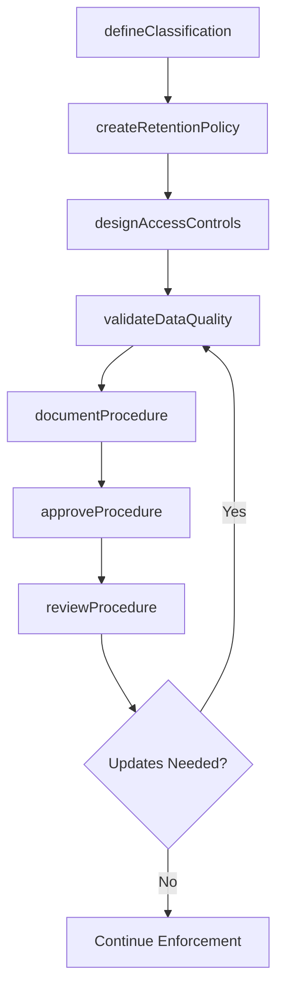
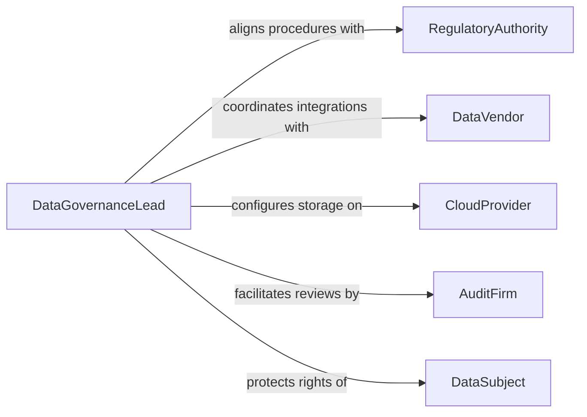

# Develop Procedures Data Management

> Business-as-Code definition for developing data management procedures. Models the lifecycle of creating, governing, and maintaining organizational data handling policies from classification through retention and disposal.

## Overview

Developing data management procedures involves defining how an organization collects, stores, organizes, secures, and disposes of its data assets. These procedures establish data governance frameworks, naming conventions, quality standards, and lifecycle policies that ensure consistency and regulatory compliance. The process spans data classification, access control design, backup scheduling, and retention rule creation across all organizational systems.

## Actors

| Actor | Description |
|-------|-------------|
| RegulatoryAuthority | Government or industry body that mandates data handling requirements |
| DataVendor | External providers of data feeds, integrations, or enrichment services |
| CloudProvider | Infrastructure vendors hosting data storage and processing platforms |
| AuditFirm | External auditors who verify data governance compliance |
| DataSubject | Individuals whose personal data is governed by these procedures |

## Roles

| Role | Description |
|------|-------------|
| DataGovernanceLead | Owns the data management strategy and procedure development |
| DataSteward | Maintains data quality and enforces classification rules |
| DatabaseAdministrator | Implements technical procedures for storage and access |
| PrivacyOfficer | Ensures data procedures comply with privacy regulations |

## Entities

| Entity | Description |
|--------|-------------|
| DataProcedure | A documented process for handling a specific data management task |
| ClassificationPolicy | Rules for categorizing data by sensitivity and business value |
| RetentionSchedule | A defined timeline for how long data must be kept before disposal |
| AccessControlMatrix | A mapping of roles to data access permissions |
| DataQualityRule | A validation criterion applied to incoming or stored data |
| GovernanceFramework | The overarching structure that organizes all data procedures |

## Actions

| Action | Description |
|--------|-------------|
| defineClassification | Establish data sensitivity categories and labeling rules |
| createRetentionPolicy | Set data lifecycle durations and disposal triggers |
| designAccessControls | Map roles and permissions for data access |
| documentProcedure | Write and publish a formal data management procedure |
| validateDataQuality | Define and apply quality checks to data assets |
| reviewProcedure | Assess existing procedures for gaps or regulatory changes |
| approveProcedure | Formally sign off on a new or updated procedure |

## Events

| Event | Description |
|-------|-------------|
| classificationDefined | Data sensitivity categories have been established |
| retentionPolicyCreated | A new retention schedule has been set |
| accessControlsDesigned | Role-based access permissions have been mapped |
| procedureDocumented | A data management procedure has been written |
| dataQualityValidated | Quality rules have been applied and verified |
| procedureReviewed | An existing procedure has been assessed for updates |
| procedureApproved | A procedure has been formally approved for adoption |

## Searches

| Search | Description |
|--------|-------------|
| findProcedures | List data management procedures by domain, status, or owner |
| getRetentionSchedules | Retrieve retention rules by data category or system |
| getAccessMatrix | Look up access permissions by role or data classification |
| findQualityRules | List data quality checks by dataset or validation type |

## Workflow



## Actor Relationships



## Usage

### Calling Actions

```typescript
import { developProceduresDataManagement } from '@headlessly/develop-procedures-data-management'

const dataMgmt = developProceduresDataManagement()

// Define data classification tiers
const classification = await dataMgmt.defineClassification({
  categories: [
    { level: 'Public', description: 'Non-sensitive, publicly available data' },
    { level: 'Internal', description: 'Business data restricted to employees' },
    { level: 'Confidential', description: 'Sensitive data requiring encryption' },
    { level: 'Restricted', description: 'Regulated data with strict access controls' }
  ]
})

// Create retention policy for financial records
await dataMgmt.createRetentionPolicy({
  dataCategory: 'Financial Records',
  retentionPeriod: { years: 7 },
  disposalMethod: 'secure-deletion',
  regulatoryBasis: 'SOX Section 802'
})

// Document and approve a procedure
const procedure = await dataMgmt.documentProcedure({
  name: 'Customer PII Handling Procedure',
  scope: 'All customer-facing systems',
  classificationLevel: 'Confidential',
  steps: ['Collect with consent', 'Encrypt at rest', 'Restrict access by role', 'Purge after retention period']
})
```

### Event-Driven Automation

```typescript
// Notify stakeholders when a new procedure is approved
dataMgmt.procedureApproved(async ({ procedureId, name, scope }) => {
  await notify({
    to: 'data-stewards',
    message: `New data procedure approved: ${name}. Scope: ${scope}. Please implement within 30 days.`
  })
})

// Trigger review cycle when regulations change
dataMgmt.procedureReviewed(async ({ procedureId, findings }) => {
  if (findings.regulatoryGaps.length > 0) {
    await createTask({
      title: `Update procedure for regulatory compliance`,
      assignTo: 'privacy-officer',
      priority: 'high',
      details: findings.regulatoryGaps
    })
  }
})
```
