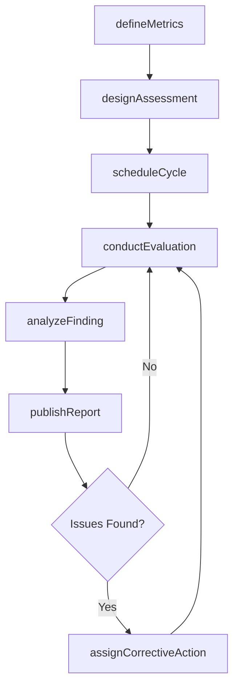
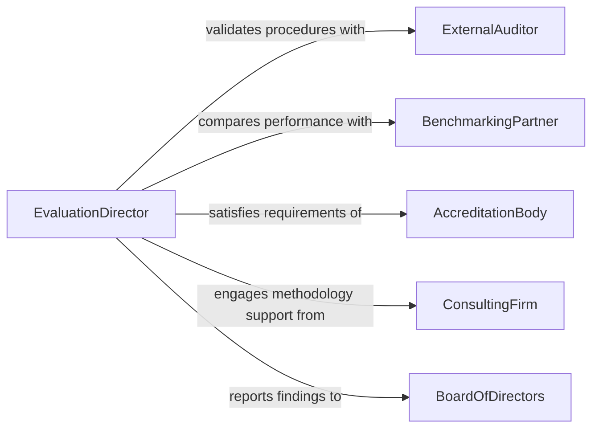

# Develop Procedures Evaluate Organizational Activities

> Business-as-Code definition for developing procedures to evaluate organizational activities. Models the creation of evaluation frameworks, performance metrics, assessment methodologies, and reporting processes that measure how effectively an organization executes its operations.

## Overview

Developing procedures to evaluate organizational activities involves designing systematic methods for measuring, assessing, and reporting on the performance of business functions, programs, and initiatives. This activity establishes evaluation criteria, data collection methods, benchmarking approaches, and reporting cadences that enable leadership to make evidence-based decisions. The resulting evaluation procedures span financial performance, operational efficiency, program effectiveness, and employee productivity.

## Actors

| Actor | Description |
|-------|-------------|
| ExternalAuditor | Independent reviewers who validate evaluation procedures and findings |
| BenchmarkingPartner | Peer organizations that share performance data for comparison |
| AccreditationBody | Agencies that require documented evaluation procedures for certification |
| ConsultingFirm | Advisory firms that assist in designing evaluation methodologies |
| BoardOfDirectors | Governing body that receives evaluation results and directs strategy |

## Roles

| Role | Description |
|------|-------------|
| PerformanceAnalyst | Designs metrics, collects data, and produces evaluation reports |
| EvaluationDirector | Oversees the development and governance of evaluation procedures |
| DepartmentManager | Participates in evaluations and implements improvement actions |
| InternalAuditor | Verifies that evaluation procedures are followed consistently |

## Entities

| Entity | Description |
|--------|-------------|
| EvaluationProcedure | A documented method for assessing a specific organizational activity |
| PerformanceMetric | A quantitative or qualitative measure used to gauge effectiveness |
| AssessmentSchedule | A calendar defining when evaluations are conducted |
| EvaluationReport | A document summarizing findings, scores, and recommendations |
| Benchmark | A reference point for comparing performance against peers or targets |
| CorrectiveAction | A planned improvement triggered by evaluation findings |

## Actions

| Action | Description |
|--------|-------------|
| defineMetrics | Establish the key performance indicators for an activity |
| designAssessment | Create the methodology and tools for conducting an evaluation |
| scheduleCycle | Set the frequency and timeline for recurring evaluations |
| conductEvaluation | Execute an assessment using the defined procedure |
| analyzeFinding | Interpret evaluation data to identify strengths and gaps |
| publishReport | Generate and distribute the evaluation results to stakeholders |
| assignCorrectiveAction | Create improvement tasks based on evaluation outcomes |

## Events

| Event | Description |
|-------|-------------|
| metricsDefined | Performance indicators for an activity have been established |
| assessmentDesigned | An evaluation methodology has been created |
| cycleScheduled | The evaluation cadence has been set |
| evaluationConducted | An assessment has been executed |
| findingsAnalyzed | Evaluation data has been interpreted |
| reportPublished | Evaluation results have been distributed |
| correctiveActionAssigned | An improvement task has been created from findings |

## Searches

| Search | Description |
|--------|-------------|
| findProcedures | List evaluation procedures by activity area, frequency, or owner |
| getEvaluationResults | Retrieve assessment scores and findings by period or department |
| getBenchmarks | Look up benchmark comparisons for a specific metric |
| findCorrectiveActions | Search improvement tasks by status, priority, or department |

## Workflow



## Actor Relationships



## Usage

### Calling Actions

```typescript
import { developProceduresEvaluateOrganizationalActivities } from '@headlessly/develop-procedures-evaluate-organizational-activities'

const evaluation = developProceduresEvaluateOrganizationalActivities()

// Define metrics for customer service evaluation
const metrics = await evaluation.defineMetrics({
  activity: 'Customer Support Operations',
  indicators: [
    { name: 'First Response Time', target: 2, unit: 'hours', direction: 'lower-is-better' },
    { name: 'Resolution Rate', target: 92, unit: 'percent', direction: 'higher-is-better' },
    { name: 'Customer Satisfaction', target: 4.5, unit: 'score-out-of-5', direction: 'higher-is-better' }
  ]
})

// Design the assessment methodology
const assessment = await evaluation.designAssessment({
  metricsId: metrics.id,
  method: 'Balanced Scorecard',
  dataSources: ['CRM', 'Survey Platform', 'Call Center Analytics'],
  sampleSize: 'all-tickets-per-quarter'
})

// Conduct the evaluation
const result = await evaluation.conductEvaluation({
  assessmentId: assessment.id,
  period: { start: '2026-01-01', end: '2026-03-31' },
  evaluator: 'performance-analyst-team'
})
```

### Event-Driven Automation

```typescript
// Distribute reports to leadership when published
evaluation.reportPublished(async ({ reportId, activity, period }) => {
  await distribute({
    document: reportId,
    to: ['executive-team', 'board-of-directors'],
    message: `Q${period.quarter} evaluation report for ${activity} is now available.`
  })
})

// Auto-assign corrective actions for underperforming areas
evaluation.findingsAnalyzed(async ({ activity, metrics }) => {
  const failing = metrics.filter(m => m.score < m.target)
  for (const metric of failing) {
    await evaluation.assignCorrectiveAction({
      activity,
      metric: metric.name,
      gap: metric.target - metric.score,
      assignTo: metric.ownerDepartment,
      deadline: addDays(new Date(), 45)
    })
  }
})
```
