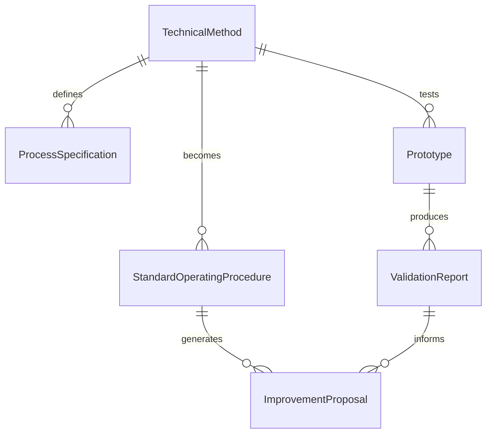
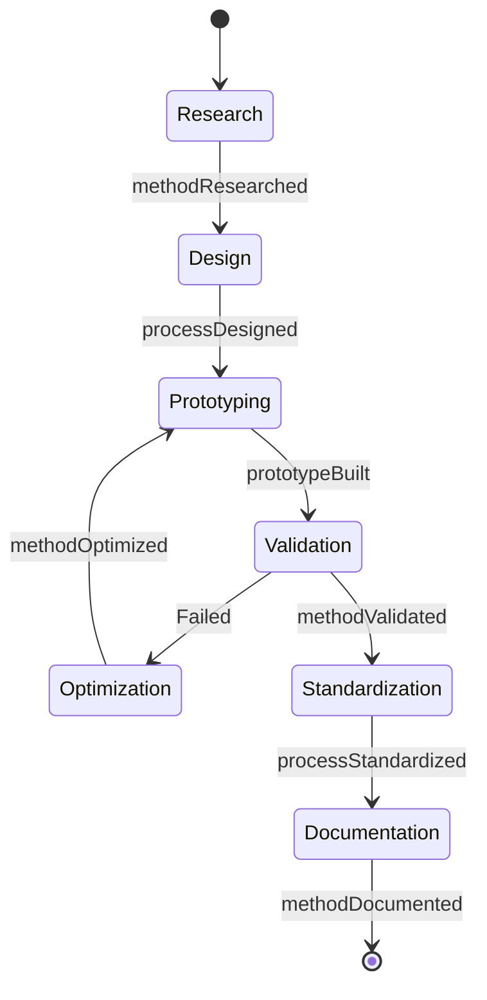
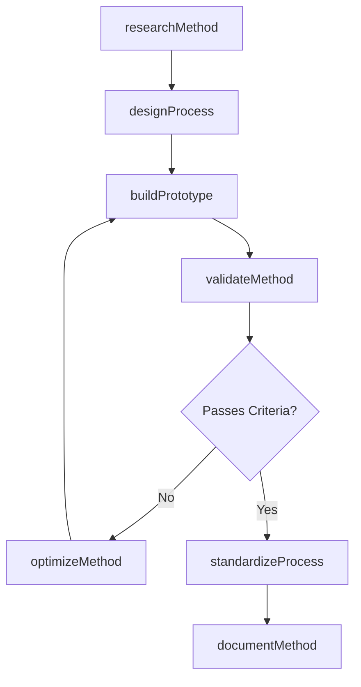
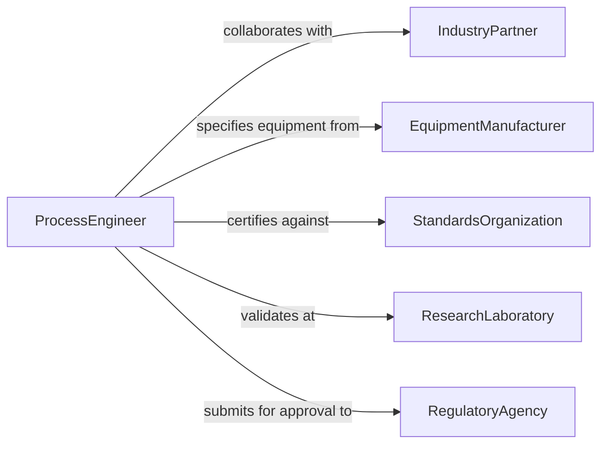

# Develop Technical Methods Processes

> Business-as-Code definition for developing technical methods and processes. Models the end-to-end lifecycle from research and feasibility analysis through prototyping, validation, standardization, and continuous improvement.

## Overview

Developing technical methods or processes involves designing, testing, and formalizing new or improved approaches to manufacturing, engineering, scientific analysis, or operational execution. This activity draws on applied research, experimentation, and domain expertise to produce repeatable, documented methods that meet performance and quality targets. The resulting processes are validated against requirements, standardized for organizational adoption, and monitored for ongoing effectiveness.

## Actors

| Actor | Description |
|-------|-------------|
| IndustryPartner | External collaborators who co-develop or license technical methods |
| EquipmentManufacturer | Vendors who supply tooling and machinery for new processes |
| StandardsOrganization | Bodies such as ISO or ASTM that certify process conformance |
| ResearchLaboratory | Facilities that conduct experiments to validate new methods |
| RegulatoryAgency | Authorities that approve methods for regulated industries |

## Roles

| Role | Description |
|------|-------------|
| ProcessEngineer | Designs and optimizes technical methods and workflows |
| ResearchScientist | Conducts experiments and generates data to inform method design |
| TechnicalDirector | Approves methods for adoption and allocates development resources |
| QualityEngineer | Validates that methods meet performance and compliance criteria |

## Entities

| Entity | Description |
|--------|-------------|
| TechnicalMethod | A documented approach for performing a specific technical task |
| ProcessSpecification | Detailed parameters and tolerances for a method |
| Prototype | An early-stage implementation used to test a method |
| ValidationReport | Results from testing a method against acceptance criteria |
| StandardOperatingProcedure | The finalized, approved version of a method for production use |
| ImprovementProposal | A suggested change to an existing method based on performance data |

## Actions

| Action | Description |
|--------|-------------|
| researchMethod | Investigate approaches and technologies for a new method |
| designProcess | Create the technical specification for a method or process |
| buildPrototype | Construct a test implementation to evaluate feasibility |
| validateMethod | Run tests to confirm the method meets acceptance criteria |
| standardizeProcess | Formalize the method into a standard operating procedure |
| optimizeMethod | Refine parameters to improve yield, speed, or quality |
| documentMethod | Produce comprehensive documentation for training and reference |

## Events

| Event | Description |
|-------|-------------|
| methodResearched | Background research for a new method has been completed |
| processDesigned | A technical specification has been drafted |
| prototypeBuilt | A test implementation has been constructed |
| methodValidated | Testing has confirmed the method meets criteria |
| processStandardized | The method has been formalized as a standard procedure |
| methodOptimized | Process parameters have been refined for better performance |
| methodDocumented | Comprehensive documentation has been produced |

## Searches

| Search | Description |
|--------|-------------|
| findMethods | List technical methods by domain, status, or maturity level |
| getValidationResults | Retrieve test results for a specific method or prototype |
| getImprovementProposals | Find proposed changes to existing methods |
| findSpecifications | Look up process specifications by parameter or tolerance range |

## Entity Relationships



## State Diagram



## Workflow



## Actor Relationships



## Usage

### Calling Actions

```typescript
import { developTechnicalMethodsProcesses } from '@headlessly/develop-technical-methods-processes'

const methods = developTechnicalMethodsProcesses()

// Research a new thermal bonding method
const research = await methods.researchMethod({
  domain: 'Advanced Materials',
  objective: 'Develop low-temperature thermal bonding for composite panels',
  references: ['DOI:10.1016/j.matdes.2025.112345']
})

// Design the process specification
const spec = await methods.designProcess({
  researchId: research.id,
  parameters: {
    temperature: { min: 120, max: 150, unit: 'C' },
    pressure: { min: 2, max: 5, unit: 'MPa' },
    duration: { min: 30, max: 60, unit: 'seconds' }
  }
})

// Validate against acceptance criteria
const validation = await methods.validateMethod({
  prototypeId: 'proto-thermal-001',
  criteria: [
    { metric: 'bondStrength', threshold: 45, unit: 'MPa' },
    { metric: 'cycleTime', threshold: 90, unit: 'seconds' }
  ]
})
```

### Event-Driven Automation

```typescript
// Notify team when a method passes validation
methods.methodValidated(async ({ methodId, results }) => {
  if (results.every(r => r.passed)) {
    await notify({
      to: 'engineering-leads',
      message: `Method ${methodId} passed all validation criteria. Ready for standardization.`
    })
  }
})

// Schedule documentation when a process is standardized
methods.processStandardized(async ({ methodId, name }) => {
  await createTask({
    title: `Document SOP for ${name}`,
    assignTo: 'technical-writing',
    priority: 'high',
    dueDate: addDays(new Date(), 14)
  })
})
```
