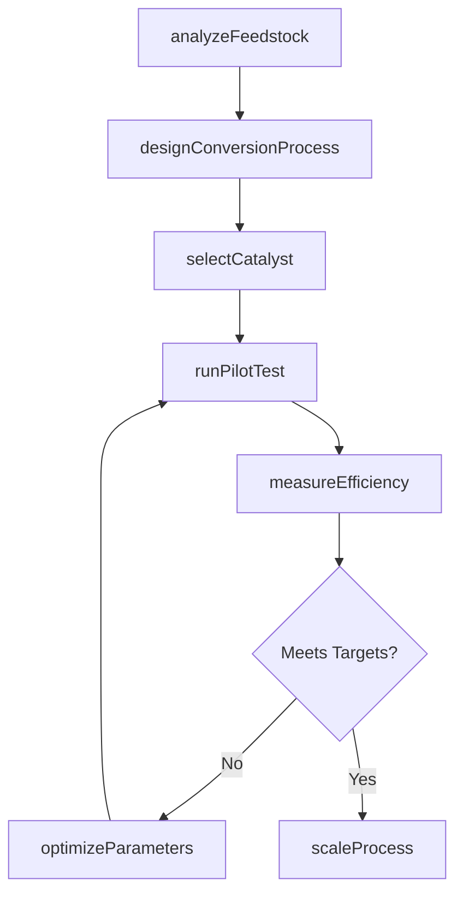
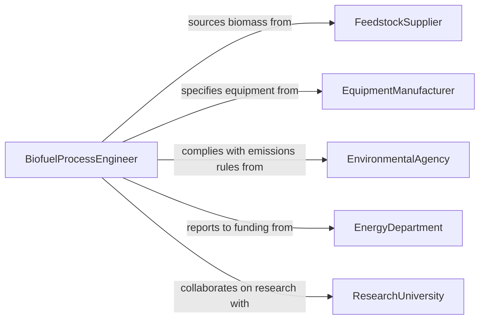

# Develop Technical Processes Improve Efficiency

> Business-as-Code definition for developing technical processes to improve biofuel production efficiency. Models the lifecycle from feedstock analysis and process design through pilot testing, scale-up, and continuous optimization of conversion yields and energy balance.

## Overview

Developing technical processes to improve biofuel production efficiency involves researching, designing, and validating methods that increase conversion yields, reduce energy consumption, and lower production costs for biofuel operations. This activity spans feedstock evaluation, enzyme and catalyst selection, fermentation optimization, and downstream processing improvements. The resulting processes are tested at pilot scale, validated against performance targets, and scaled to commercial production with ongoing monitoring.

## Actors

| Actor | Description |
|-------|-------------|
| FeedstockSupplier | Providers of biomass, agricultural residues, or algae for biofuel production |
| EquipmentManufacturer | Vendors of reactors, fermentation vessels, and distillation systems |
| EnvironmentalAgency | Regulators overseeing emissions and waste from biofuel facilities |
| EnergyDepartment | Government agencies funding or regulating renewable energy programs |
| ResearchUniversity | Academic partners conducting fundamental biofuel research |

## Roles

| Role | Description |
|------|-------------|
| BiofuelProcessEngineer | Designs and optimizes conversion processes for biofuel production |
| FermentationScientist | Develops and monitors biological conversion pathways |
| PlantManager | Oversees scale-up and commercial production operations |
| SustainabilityAnalyst | Evaluates environmental impact and lifecycle energy balance |

## Entities

| Entity | Description |
|--------|-------------|
| ConversionProcess | A defined method for transforming feedstock into biofuel |
| FeedstockProfile | Characteristics of a biomass source including composition and yield potential |
| PilotRun | A controlled test of a process at intermediate scale |
| EfficiencyMetric | A quantitative measure of process performance such as yield or energy ratio |
| CatalystFormulation | A chemical or biological agent used to accelerate conversion |
| ScaleUpPlan | A roadmap for transitioning a process from pilot to commercial scale |

## Actions

| Action | Description |
|--------|-------------|
| analyzeFeedstock | Evaluate biomass composition and conversion potential |
| designConversionProcess | Create the technical specification for a biofuel production method |
| selectCatalyst | Identify and test catalysts or enzymes for optimal conversion |
| runPilotTest | Execute a controlled process run at pilot scale |
| measureEfficiency | Calculate yield, energy balance, and cost metrics for a process |
| scaleProcess | Transition a validated process from pilot to commercial production |
| optimizeParameters | Fine-tune temperature, pressure, or timing to improve yields |

## Events

| Event | Description |
|-------|-------------|
| feedstockAnalyzed | Biomass evaluation has been completed |
| conversionProcessDesigned | A new production method has been specified |
| catalystSelected | An optimal catalyst or enzyme has been identified |
| pilotTestCompleted | A pilot-scale process run has finished |
| efficiencyMeasured | Yield and energy metrics have been calculated |
| processScaled | A process has been transitioned to commercial production |
| parametersOptimized | Process variables have been refined for better performance |

## Searches

| Search | Description |
|--------|-------------|
| findProcesses | List conversion processes by feedstock type, yield, or status |
| getPilotResults | Retrieve test data from pilot runs by process or date range |
| getEfficiencyMetrics | Look up yield and energy balance metrics by process |
| findFeedstockProfiles | Search feedstock evaluations by biomass type or region |

## Workflow



## Actor Relationships



## Usage

### Calling Actions

```typescript
import { developTechnicalProcessesImproveEfficiency } from '@headlessly/develop-technical-processes-improve-efficiency'

const biofuel = developTechnicalProcessesImproveEfficiency()

// Analyze a new feedstock source
const feedstock = await biofuel.analyzeFeedstock({
  type: 'Corn Stover',
  region: 'Midwest US',
  composition: { cellulose: 37.5, hemicellulose: 22.4, lignin: 17.6 },
  moistureContent: 15.2
})

// Design and pilot a conversion process
const process = await biofuel.designConversionProcess({
  feedstockId: feedstock.id,
  method: 'Enzymatic Hydrolysis + Fermentation',
  targetYield: { ethanol: 85, unit: 'gallons-per-dry-ton' }
})

// Run pilot test and measure efficiency
const pilot = await biofuel.runPilotTest({
  processId: process.id,
  batchSize: { value: 500, unit: 'kg' },
  duration: { value: 72, unit: 'hours' }
})

const metrics = await biofuel.measureEfficiency({
  pilotRunId: pilot.id,
  measures: ['ethanolYield', 'energyBalance', 'waterUsage', 'costPerGallon']
})
```

### Event-Driven Automation

```typescript
// Alert team when pilot results exceed targets
biofuel.efficiencyMeasured(async ({ processId, metrics }) => {
  if (metrics.ethanolYield > 80) {
    await notify({
      to: 'plant-managers',
      message: `Process ${processId} achieved ${metrics.ethanolYield} gal/dry-ton. Ready for scale-up review.`
    })
  }
})

// Schedule environmental review before scaling
biofuel.processScaled(async ({ processId, facility }) => {
  await createReview({
    type: 'Environmental Impact Assessment',
    processId,
    facility,
    reviewer: 'sustainability-analyst',
    deadline: addDays(new Date(), 60)
  })
})
```
