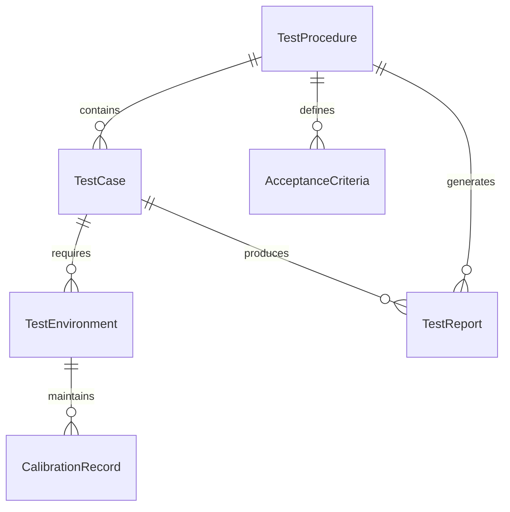
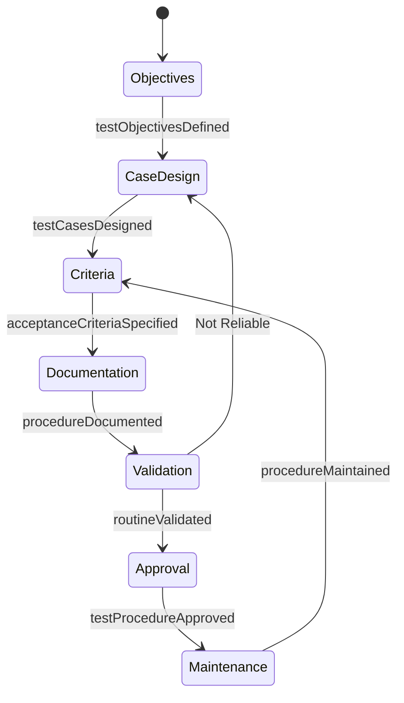
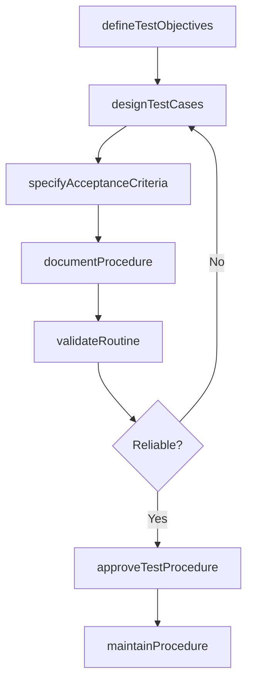
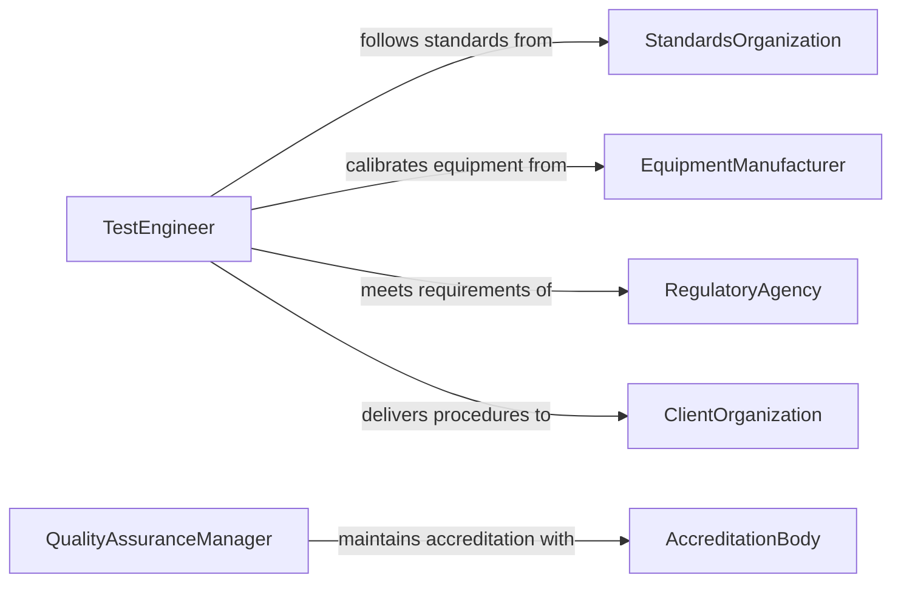

# Develop Testing Routines Procedures

> Business-as-Code definition for developing testing routines or procedures. Models the design, documentation, validation, and maintenance of standardized testing protocols used to evaluate products, systems, or processes.

## Overview

Developing testing routines or procedures involves creating systematic, repeatable methods for evaluating the quality, performance, safety, or compliance of products, systems, software, or materials. This activity includes defining test objectives, specifying acceptance criteria, designing test cases, documenting step-by-step procedures, and validating that the routines produce reliable and consistent results. It spans industries from manufacturing and engineering to software development and laboratory sciences.

## Actors

| Actor | Description |
|-------|-------------|
| StandardsOrganization | Body such as ISO, ASTM, or IEEE that publishes testing standards |
| EquipmentManufacturer | Provider of testing instruments, fixtures, and calibration services |
| RegulatoryAgency | Authority requiring specific testing for product approval or certification |
| ClientOrganization | External party requesting testing of products or systems |
| AccreditationBody | Entity that certifies testing laboratories and procedures |

## Roles

| Role | Description |
|------|-------------|
| TestEngineer | Designs test procedures and defines acceptance criteria |
| QualityAssuranceManager | Oversees testing standards and ensures procedural compliance |
| LaboratoryTechnician | Executes testing procedures and records results |
| ValidationSpecialist | Verifies that testing routines produce accurate and reproducible outcomes |

## Entities

| Entity | Description |
|--------|-------------|
| TestProcedure | A documented, step-by-step method for conducting a specific test |
| TestCase | A defined scenario specifying inputs, execution steps, and expected outcomes |
| AcceptanceCriteria | Quantitative or qualitative thresholds that determine pass or fail |
| TestEnvironment | The controlled conditions and equipment configuration required for testing |
| CalibrationRecord | Documentation of instrument calibration ensuring measurement accuracy |
| TestReport | A formal document recording test execution, results, and conclusions |

## Actions

| Action | Description |
|--------|-------------|
| defineTestObjectives | Establish what the testing routine is intended to evaluate or verify |
| designTestCases | Create specific test scenarios with inputs, steps, and expected outcomes |
| specifyAcceptanceCriteria | Set quantitative thresholds and qualitative standards for pass or fail |
| documentProcedure | Write the formal, step-by-step testing procedure with required conditions |
| validateRoutine | Execute the procedure against known samples to confirm reliability |
| approveTestProcedure | Submit the procedure for quality assurance review and formal approval |
| maintainProcedure | Update the testing routine to reflect changes in standards or equipment |

## Events

| Event | Description |
|-------|-------------|
| testObjectivesDefined | The purpose and scope of the testing routine have been established |
| testCasesDesigned | Specific test scenarios and expected outcomes have been created |
| acceptanceCriteriaSpecified | Pass and fail thresholds have been set for the testing routine |
| procedureDocumented | The formal testing procedure has been written and formatted |
| routineValidated | The procedure has been executed and confirmed as reliable |
| testProcedureApproved | The testing procedure has passed quality review and been approved |
| procedureMaintained | The testing routine has been updated to reflect current standards |

## Searches

| Search | Description |
|--------|-------------|
| findTestProcedures | List testing procedures by product type, standard, or approval status |
| getTestCases | Retrieve test cases by procedure, category, or criticality |
| getCalibrationRecords | Find calibration records by instrument, date, or laboratory |
| getTestReports | Search test reports by procedure, execution date, or result |

## Entity Relationships



## State Diagram



## Workflow



## Actor Relationships



## Usage

### Calling Actions

```typescript
import { developTestingRoutinesProcedures } from '@headlessly/develop-testing-routines-procedures'

const testingProcedures = developTestingRoutinesProcedures()

// Define test objectives for a new product
const objectives = await testingProcedures.defineTestObjectives({
  productId: 'sensor-module-v3',
  objectives: ['Verify temperature accuracy within +/- 0.5C', 'Validate response time under 200ms'],
  applicableStandards: ['ISO-17025', 'IEC-61298']
})

// Design test cases
const testCases = await testingProcedures.designTestCases({
  objectivesId: objectives.id,
  cases: [
    { name: 'Accuracy at ambient temperature', input: '25C reference', expectedOutput: '24.5-25.5C' },
    { name: 'Accuracy at extreme cold', input: '-40C reference', expectedOutput: '-40.5 to -39.5C' },
    { name: 'Response time under load', input: 'rapid-temperature-ramp', expectedOutput: '<200ms' }
  ]
})

// Document the formal procedure
await testingProcedures.documentProcedure({
  title: 'Temperature Sensor Module V3 Validation',
  testCaseIds: testCases.map(tc => tc.id),
  environment: { chamber: 'thermal-chamber-A', calibrationDue: '2026-06-01' },
  steps: [
    'Calibrate reference thermometer per ISO-17025',
    'Place sensor module in thermal chamber',
    'Execute temperature ramp sequence',
    'Record readings at each setpoint',
    'Compare against acceptance criteria'
  ]
})
```

### Event-Driven Automation

```typescript
// Notify quality team when procedure is approved
testingProcedures.testProcedureApproved(async ({ procedureId, title }) => {
  await notify({
    to: 'quality-assurance-team',
    message: `Test procedure approved: ${title}. Ready for laboratory adoption.`
  })
})

// Auto-schedule recalibration when maintenance is due
testingProcedures.procedureMaintained(async ({ procedureId, equipmentIds }) => {
  for (const equipmentId of equipmentIds) {
    await scheduleTask({
      action: 'calibrate',
      equipmentId,
      assignee: 'laboratory-technician',
      deadline: addDays(new Date(), 14)
    })
  }
})
```
