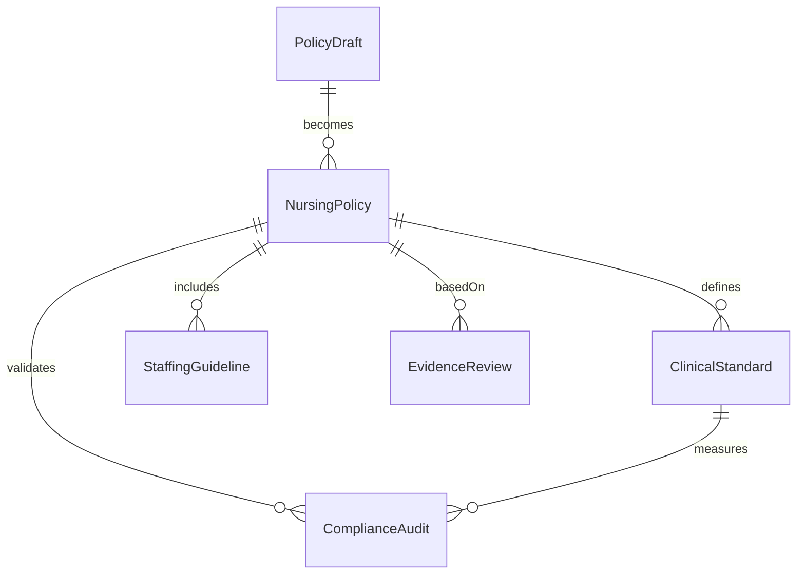
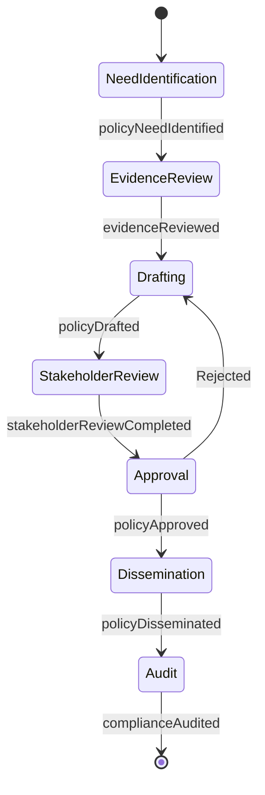
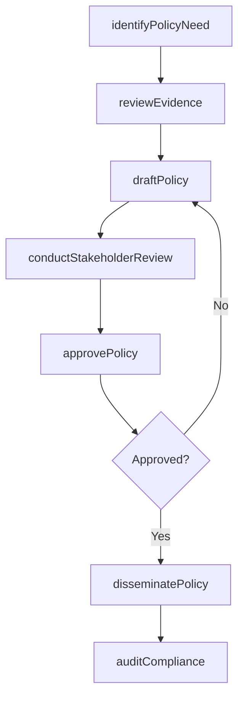
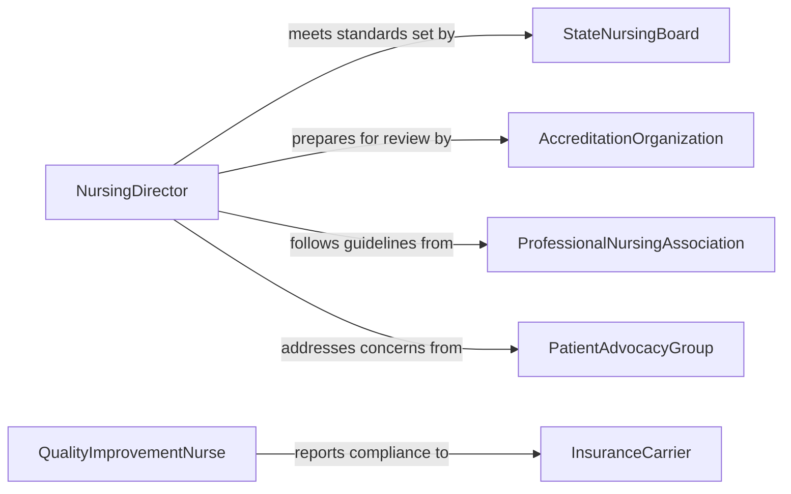

# Establish Nursing Policies Standards

> Business-as-Code definition for establishing nursing policies or standards. Models the development, review, and implementation of clinical nursing policies that govern patient care practices, staffing protocols, and quality benchmarks.

## Overview

Establishing nursing policies or standards involves developing evidence-based guidelines that define nursing care practices, staffing requirements, documentation protocols, and patient safety measures within healthcare organizations. This activity draws on clinical research, regulatory requirements, and professional standards to create policies that ensure consistent, high-quality patient care. It includes stakeholder consultation, policy drafting, clinical review, approval by governance committees, and dissemination to nursing staff.

## Actors

| Actor | Description |
|-------|-------------|
| StateNursingBoard | Regulatory body that sets and enforces nursing licensure and practice standards |
| AccreditationOrganization | Entity such as The Joint Commission that evaluates healthcare quality |
| ProfessionalNursingAssociation | Organization publishing evidence-based nursing practice guidelines |
| PatientAdvocacyGroup | Organization representing patient interests in care quality and safety |
| InsuranceCarrier | Payer requiring adherence to specific care standards for reimbursement |

## Roles

| Role | Description |
|------|-------------|
| NursingDirector | Leads policy development and oversees nursing practice standards |
| ClinicalNurseSpecialist | Provides expert clinical input and evaluates evidence for policy decisions |
| QualityImprovementNurse | Monitors care outcomes and identifies areas requiring policy updates |
| NursingGovernanceCommittee | Reviews, approves, and ratifies nursing policies for the organization |

## Entities

| Entity | Description |
|--------|-------------|
| NursingPolicy | A formal directive governing a specific aspect of nursing practice |
| ClinicalStandard | A benchmark defining the expected level of nursing care quality |
| StaffingGuideline | A policy specifying nurse-to-patient ratios and scheduling requirements |
| EvidenceReview | A systematic analysis of clinical research supporting policy decisions |
| PolicyDraft | A preliminary version of a nursing policy under development |
| ComplianceAudit | An assessment of adherence to established nursing policies and standards |

## Actions

| Action | Description |
|--------|-------------|
| identifyPolicyNeed | Determine the need for a new or revised nursing policy based on incidents or regulations |
| reviewEvidence | Analyze clinical research and best practices to support policy development |
| draftPolicy | Write the initial text of a nursing policy with scope, procedures, and rationale |
| conductStakeholderReview | Gather feedback from nursing staff, physicians, and administrators |
| approvePolicy | Submit the policy for formal approval by the nursing governance committee |
| disseminatePolicy | Distribute the approved policy to nursing units and update training materials |
| auditCompliance | Assess adherence to established nursing policies through chart reviews and observations |

## Events

| Event | Description |
|-------|-------------|
| policyNeedIdentified | A gap or requirement for a new nursing policy has been recognized |
| evidenceReviewed | Clinical evidence supporting the policy has been analyzed |
| policyDrafted | An initial version of the nursing policy has been written |
| stakeholderReviewCompleted | Feedback from clinical and administrative stakeholders has been collected |
| policyApproved | The nursing governance committee has formally approved the policy |
| policyDisseminated | The approved policy has been distributed and staff have been notified |
| complianceAudited | Adherence to the nursing policy has been assessed and documented |

## Searches

| Search | Description |
|--------|-------------|
| findNursingPolicies | List nursing policies by topic, unit, effective date, or status |
| getEvidenceReviews | Retrieve evidence reviews by clinical topic or policy reference |
| getComplianceAudits | Find compliance audit results by policy, unit, or audit period |
| getStaffingGuidelines | Search staffing guidelines by unit type, acuity level, or effective date |

## Entity Relationships



## State Diagram



## Workflow



## Actor Relationships



## Usage

### Calling Actions

```typescript
import { establishNursingPoliciesStandards } from '@headlessly/establish-nursing-policies-standards'

const nursingPolicies = establishNursingPoliciesStandards()

// Identify need for a fall prevention policy update
const need = await nursingPolicies.identifyPolicyNeed({
  trigger: 'incident-trend',
  description: 'Increase in patient falls on medical-surgical units over Q4',
  affectedUnits: ['med-surg-3a', 'med-surg-3b'],
  currentPolicyId: 'np-fall-prevention-2024'
})

// Review clinical evidence
const evidence = await nursingPolicies.reviewEvidence({
  topic: 'fall-prevention-interventions',
  sources: ['pubmed', 'cochrane-library', 'ana-guidelines'],
  dateRange: { start: '2023-01-01', end: '2026-01-31' }
})

// Draft the updated policy
const draft = await nursingPolicies.draftPolicy({
  title: 'Fall Prevention and Management Protocol',
  scope: 'All inpatient nursing units',
  procedures: [
    'Conduct fall risk assessment on admission using Morse Fall Scale',
    'Implement tiered interventions based on risk score',
    'Document fall events within 2 hours of occurrence'
  ],
  evidenceReviewId: evidence.id
})
```

### Event-Driven Automation

```typescript
// Notify nursing units when a policy is disseminated
nursingPolicies.policyDisseminated(async ({ policyId, title, affectedUnits }) => {
  for (const unit of affectedUnits) {
    await notify({
      to: `nurse-manager-${unit}`,
      message: `New policy effective: ${title}. Please review and update unit protocols.`
    })
  }
})

// Schedule compliance audit after policy approval
nursingPolicies.policyApproved(async ({ policyId, effectiveDate }) => {
  await scheduleTask({
    action: 'auditCompliance',
    policyId,
    scheduledDate: addDays(effectiveDate, 90),
    assignee: 'quality-improvement-nurse'
  })
})
```
