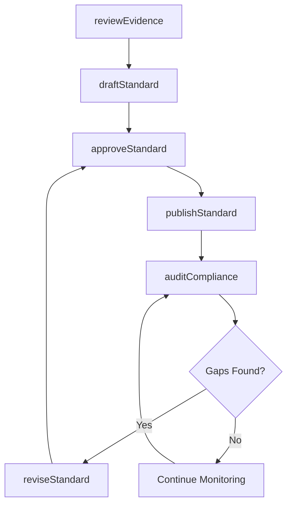
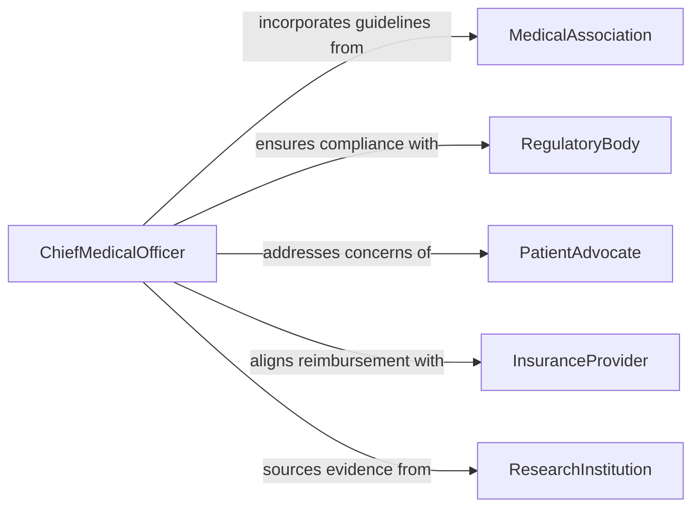

# Establish Standards Medical Care

> Business-as-Code definition for establishing medical care standards. Models the full lifecycle of clinical standard development, from evidence review through adoption, compliance monitoring, and periodic revision.

## Overview

Establishing standards for medical care involves defining clinical protocols, quality benchmarks, and patient safety guidelines that healthcare organizations must follow. This process draws on evidence-based research, regulatory requirements, and expert consensus to create measurable care standards. The resulting standards govern diagnosis, treatment, documentation, and outcome measurement across clinical departments.

## Actors

| Actor | Description |
|-------|-------------|
| RegulatoryBody | Government or accreditation agencies that mandate minimum care standards |
| MedicalAssociation | Professional societies that publish clinical practice guidelines |
| PatientAdvocate | Representatives who ensure standards reflect patient needs and rights |
| InsuranceProvider | Payers who tie reimbursement to adherence with quality standards |
| ResearchInstitution | Academic bodies that supply evidence for clinical best practices |

## Roles

| Role | Description |
|------|-------------|
| ChiefMedicalOfficer | Leads the adoption and enforcement of care standards |
| QualityDirector | Designs measurement criteria and monitors compliance |
| ClinicalCommitteeChair | Facilitates expert panels that draft and review standards |
| ComplianceOfficer | Ensures standards meet regulatory and accreditation requirements |

## Entities

| Entity | Description |
|--------|-------------|
| CareStandard | A formal specification of acceptable clinical practice |
| ClinicalProtocol | Step-by-step procedures for diagnosing or treating a condition |
| QualityMetric | A measurable indicator used to evaluate care delivery |
| ComplianceReport | Documentation of adherence to established standards |
| EvidenceReview | A systematic assessment of research supporting a standard |
| RevisionRecord | A tracked change to an existing care standard |

## Actions

| Action | Description |
|--------|-------------|
| draftStandard | Author a new care standard based on evidence and expert input |
| reviewEvidence | Evaluate clinical research to support or update a standard |
| approveStandard | Formally ratify a care standard for organizational adoption |
| publishStandard | Release the approved standard for clinical implementation |
| auditCompliance | Assess whether clinical departments meet the standard |
| reviseStandard | Update an existing standard based on new evidence or outcomes |
| retireStandard | Withdraw an outdated or superseded care standard |

## Events

| Event | Description |
|-------|-------------|
| standardDrafted | A new care standard has been authored for review |
| evidenceReviewed | Clinical research evaluation has been completed |
| standardApproved | A care standard has been formally ratified |
| standardPublished | An approved standard has been released for adoption |
| complianceAudited | A compliance assessment has been completed |
| standardRevised | An existing care standard has been updated |
| standardRetired | A care standard has been withdrawn from active use |

## Searches

| Search | Description |
|--------|-------------|
| findStandards | List care standards by specialty, status, or effective date |
| getComplianceReports | Retrieve compliance audit results by department or period |
| getQualityMetrics | Look up quality indicators tied to a specific standard |
| findRevisionHistory | Retrieve the change history for a care standard |

## Workflow



## Actor Relationships



## Usage

### Calling Actions

```typescript
import { establishStandardsMedicalCare } from '@headlessly/establish-standards-medical-care'

const standards = establishStandardsMedicalCare()

// Draft a new care standard for sepsis management
const standard = await standards.draftStandard({
  name: 'Sepsis Early Recognition Protocol',
  specialty: 'Emergency Medicine',
  evidenceBasis: ['PMID:34521890', 'PMID:35678234'],
  effectiveDate: '2026-07-01'
})

// Publish the approved standard
await standards.publishStandard({
  standardId: standard.id,
  distributionChannels: ['EMR', 'clinical-portal', 'department-heads']
})

// Audit compliance across departments
const audit = await standards.auditCompliance({
  standardId: standard.id,
  departments: ['Emergency', 'ICU', 'MedSurg'],
  period: { start: '2026-07-01', end: '2026-09-30' }
})
```

### Event-Driven Automation

```typescript
// Notify department heads when a new standard is published
standards.standardPublished(async ({ standardId, name, specialty }) => {
  await notify({
    to: `${specialty}-department-heads`,
    message: `New care standard published: ${name}. Review and implement by effective date.`
  })
})

// Trigger corrective action when compliance gaps are found
standards.complianceAudited(async ({ standardId, department, complianceRate }) => {
  if (complianceRate < 0.85) {
    await createCorrectiveAction({
      standardId,
      department,
      deadline: addDays(new Date(), 30)
    })
  }
})
```
