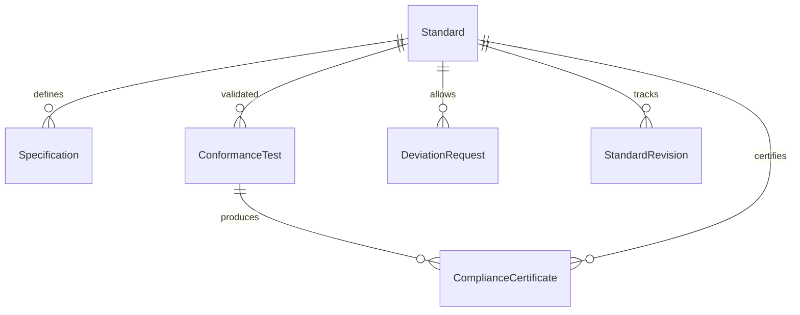
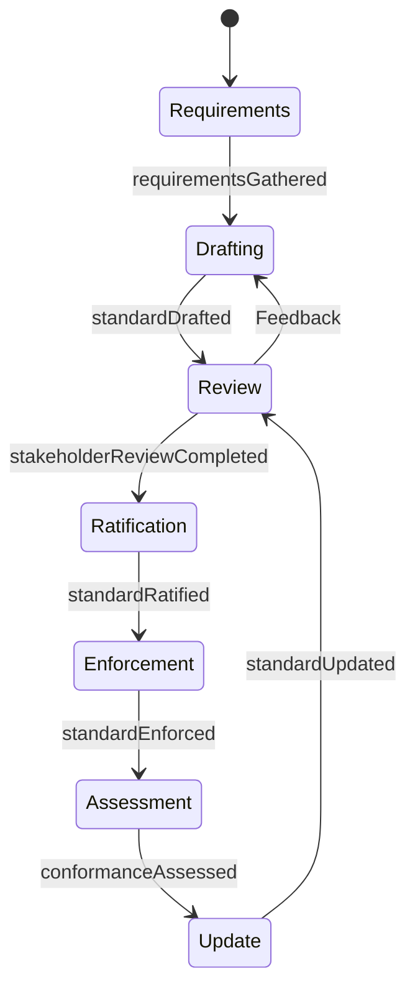
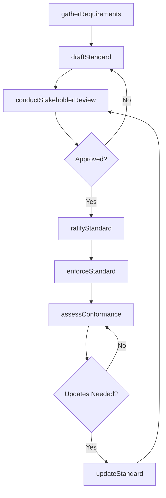
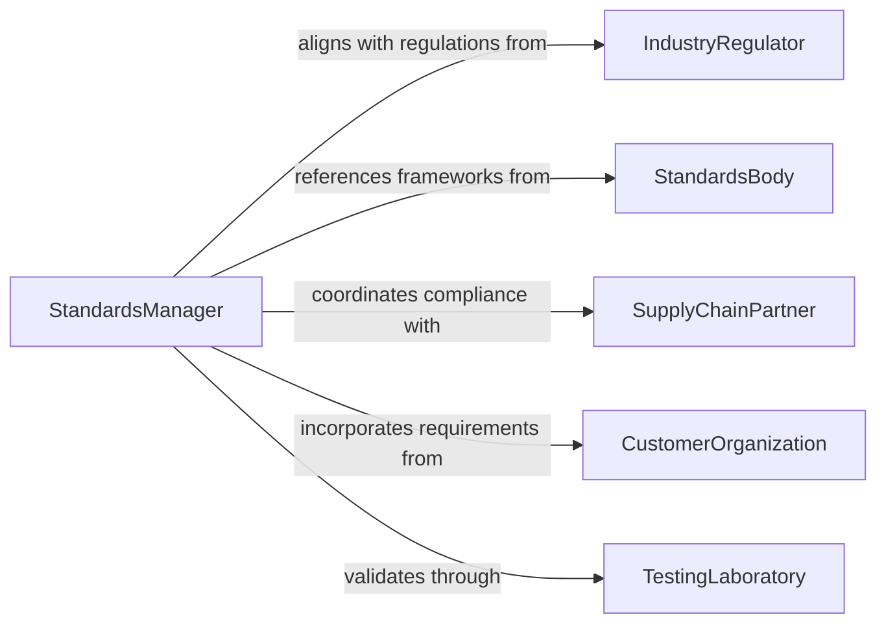

# Establish Standards Products Processes Procedures

> Business-as-Code definition for establishing standards for products, processes, and procedures. Models the complete standards lifecycle from requirements gathering through drafting, stakeholder review, ratification, and enforcement.

## Overview

Establishing standards for products, processes, or procedures involves defining the quality benchmarks, operational specifications, and procedural requirements that an organization must follow. This activity ensures consistency, safety, and regulatory compliance across manufacturing, service delivery, and internal operations. Standards are developed through cross-functional collaboration, industry benchmarking, and iterative review cycles before being formalized and enforced.

## Actors

| Actor | Description |
|-------|-------------|
| IndustryRegulator | Government or certification body that mandates minimum standards |
| StandardsBody | Organizations like ISO, ANSI, or IEEE that publish reference standards |
| SupplyChainPartner | Vendors and distributors who must comply with product standards |
| CustomerOrganization | Clients whose requirements drive product and service standards |
| TestingLaboratory | Accredited facilities that verify product conformance to standards |

## Roles

| Role | Description |
|------|-------------|
| StandardsManager | Leads the development and maintenance of organizational standards |
| QualityAssuranceLead | Validates that standards are measurable and enforceable |
| ProcessOwner | Ensures operational processes align with established standards |
| RegulatoryAffairsSpecialist | Maps standards to external regulatory requirements |

## Entities

| Entity | Description |
|--------|-------------|
| Standard | A formal document defining requirements for a product, process, or procedure |
| Specification | Detailed technical criteria within a standard |
| ConformanceTest | A defined test to verify compliance with a standard |
| DeviationRequest | A formal request to operate outside an established standard |
| StandardRevision | A tracked update to an existing standard document |
| ComplianceCertificate | Proof that a product or process meets the required standard |

## Actions

| Action | Description |
|--------|-------------|
| gatherRequirements | Collect internal and external inputs that inform standard creation |
| draftStandard | Author the initial version of a product, process, or procedure standard |
| conductStakeholderReview | Circulate a draft standard for feedback from affected parties |
| ratifyStandard | Formally approve a standard for organizational adoption |
| enforceStandard | Implement controls to ensure ongoing adherence |
| assessConformance | Test products or processes against the established standard |
| updateStandard | Revise a standard based on new requirements or findings |

## Events

| Event | Description |
|-------|-------------|
| requirementsGathered | Inputs for a new standard have been collected |
| standardDrafted | An initial standard document has been authored |
| stakeholderReviewCompleted | Feedback from stakeholders has been incorporated |
| standardRatified | A standard has been formally approved |
| standardEnforced | Controls for adherence have been put in place |
| conformanceAssessed | A product or process has been tested against the standard |
| standardUpdated | An existing standard has been revised |

## Searches

| Search | Description |
|--------|-------------|
| findStandards | List standards by product line, process area, or status |
| getConformanceResults | Retrieve test results for a product or process against a standard |
| getDeviationRequests | Find active deviation requests by standard or department |
| findRevisions | Look up the revision history of a specific standard |

## Entity Relationships



## State Diagram



## Workflow



## Actor Relationships



## Usage

### Calling Actions

```typescript
import { establishStandardsProductsProcessesProcedures } from '@headlessly/establish-standards-products-processes-procedures'

const standards = establishStandardsProductsProcessesProcedures()

// Gather requirements for a new product quality standard
const requirements = await standards.gatherRequirements({
  scope: 'Electronic Components - Soldering Quality',
  sources: ['IPC-A-610', 'Customer Spec CS-2026-Q1', 'Internal defect data'],
  stakeholders: ['Manufacturing', 'Quality', 'Procurement']
})

// Draft and review the standard
const draft = await standards.draftStandard({
  requirementsId: requirements.id,
  title: 'Soldering Acceptance Criteria for PCB Assemblies',
  specifications: [
    { parameter: 'Solder Joint Fill', minimum: '75%', method: 'Visual inspection' },
    { parameter: 'Cold Solder Defect Rate', maximum: '0.1%', method: 'AOI scan' }
  ]
})

// Assess conformance across production lines
const results = await standards.assessConformance({
  standardId: draft.id,
  targets: ['Line-A', 'Line-B', 'Line-C'],
  testDate: '2026-03-15'
})
```

### Event-Driven Automation

```typescript
// Distribute ratified standards to affected teams
standards.standardRatified(async ({ standardId, title, scope }) => {
  await distribute({
    document: standardId,
    to: ['manufacturing-leads', 'quality-inspectors', 'procurement'],
    message: `New standard ratified: ${title}. Effective immediately for ${scope}.`
  })
})

// Escalate conformance failures
standards.conformanceAssessed(async ({ standardId, target, passRate }) => {
  if (passRate < 0.95) {
    await escalate({
      to: 'quality-assurance-lead',
      issue: `${target} conformance at ${(passRate * 100).toFixed(1)}% against standard ${standardId}`,
      priority: 'critical'
    })
  }
})
```
