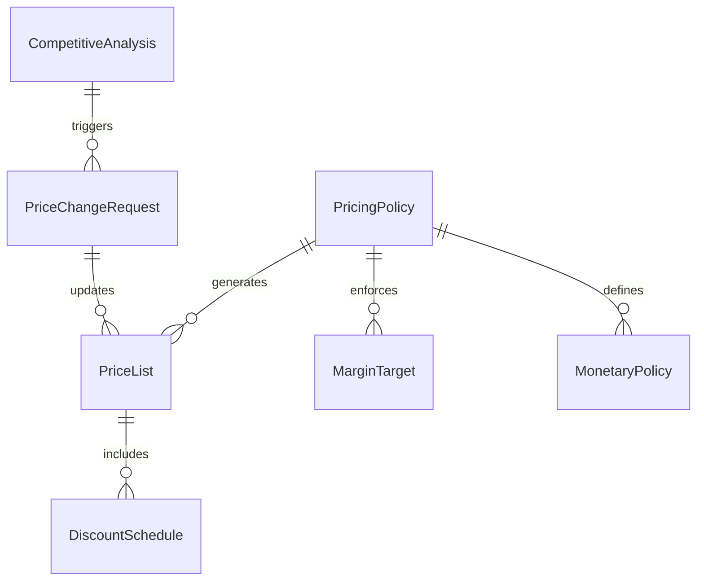
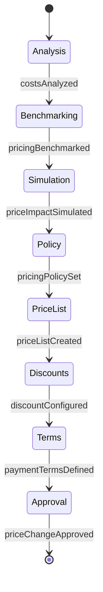
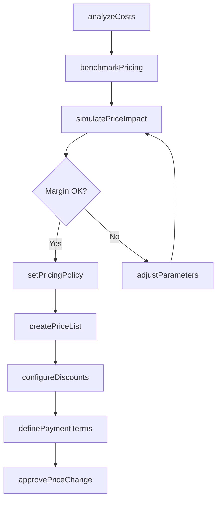
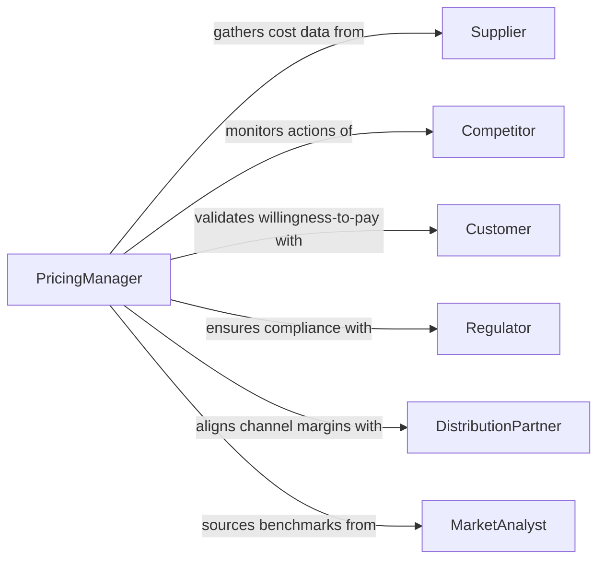

# Determine Pricing Monetary Policies

> Business-as-Code definition for pricing and monetary policy determination. Models the complete process of analyzing market conditions, cost structures, and competitive positioning to establish pricing strategies and monetary policies.

## Overview

Determining pricing and monetary policies involves evaluating cost inputs, market dynamics, competitive landscapes, and organizational financial objectives to set product and service prices, discount structures, payment terms, and currency exchange strategies. This definition provides actions for each stage of the pricing lifecycle, events for automated policy enforcement, and searches for market intelligence retrieval.

## Actors

| Actor | Description |
|-------|-------------|
| Customer | End buyer whose willingness-to-pay influences pricing decisions |
| Competitor | Market rival whose pricing actions inform competitive positioning |
| Supplier | Upstream provider whose costs affect pricing floor calculations |
| Regulator | Government body that enforces price controls or antitrust rules |
| DistributionPartner | Channel partner whose margins factor into end-price calculations |
| MarketAnalyst | External research provider supplying pricing benchmarks |

## Roles

| Role | Description |
|------|-------------|
| PricingManager | Owns the pricing strategy and approves price changes |
| RevenueAnalyst | Analyzes revenue data, elasticity, and margin impacts |
| FinanceDirector | Sets monetary policy parameters and currency guidelines |
| ProductManager | Provides cost-of-goods and value proposition context |
| SalesLeader | Represents field feedback on price competitiveness |

## Entities

| Entity | Description |
|--------|-------------|
| PricingPolicy | A set of rules governing how prices are determined |
| PriceList | Catalog of current prices for products or services |
| DiscountSchedule | Tiered discount rules based on volume or customer segment |
| MonetaryPolicy | Guidelines for payment terms, currency, and exchange rates |
| MarginTarget | Minimum profit margin threshold for a product line |
| CompetitiveAnalysis | Market intelligence on competitor pricing strategies |
| PriceChangeRequest | Formal proposal to adjust an existing price |

## Actions

| Action | Description |
|--------|-------------|
| analyzeCosts | Calculate unit costs including materials, labor, and overhead |
| benchmarkPricing | Compare current prices against competitor and market data |
| setPricingPolicy | Define or update rules for price determination |
| createPriceList | Generate a new price list for a product catalog |
| configureDiscounts | Establish discount tiers, conditions, and approval thresholds |
| definePaymentTerms | Set net payment days, early-pay discounts, and penalties |
| approvePriceChange | Formally approve a proposed price adjustment |
| simulatePriceImpact | Model revenue and margin effects of a proposed price change |

## Events

| Event | Description |
|-------|-------------|
| pricingPolicySet | A new pricing policy has been established or updated |
| priceListCreated | A new price list has been generated and published |
| discountConfigured | Discount schedule has been created or modified |
| priceChangeApproved | A price adjustment has been formally approved |
| marginThresholdBreached | A product's margin has fallen below the target threshold |
| competitorPriceChanged | A significant competitor price shift has been detected |
| paymentTermsDefined | Payment terms have been established for a segment |

## Searches

| Search | Description |
|--------|-------------|
| findPricingPolicies | List pricing policies by product line, region, or status |
| getPriceLists | Retrieve price lists by catalog, effective date, or currency |
| getMarginAnalysis | Fetch margin data by product, channel, or time period |
| findDiscountSchedules | List discount rules by customer segment or volume tier |
| getCompetitorPricing | Retrieve competitive pricing intelligence by market |

## Entity Relationships



## State Diagram



## Workflow



## Actor Relationships



## Usage

### Calling Actions

```typescript
import { determinePricingMonetaryPolicies } from '@headlessly/determine-pricing-monetary-policies'

const pricing = determinePricingMonetaryPolicies()

// Analyze costs for a product line
const costs = await pricing.analyzeCosts({
  productLine: 'Enterprise SaaS',
  includeOverhead: true,
  period: { start: '2026-01-01', end: '2026-12-31' }
})

// Simulate a price increase
const impact = await pricing.simulatePriceImpact({
  productLine: 'Enterprise SaaS',
  proposedChange: { type: 'percentage', value: 8 },
  elasticity: -0.3
})

// Set the pricing policy
await pricing.setPricingPolicy({
  name: 'Enterprise SaaS FY2026',
  basePrice: 12000,
  currency: 'USD',
  discountCeiling: 25,
  marginFloor: 65
})
```

### Event-Driven Automation

```typescript
// Alert when margins drop below target
pricing.marginThresholdBreached(async ({ productLine, currentMargin, target }) => {
  await notify({
    to: 'pricing-team',
    message: `${productLine} margin at ${currentMargin}% (target: ${target}%)`
  })
})

// Re-evaluate pricing when competitor shifts
pricing.competitorPriceChanged(async ({ competitor, product, oldPrice, newPrice }) => {
  await pricing.benchmarkPricing({
    productLine: product,
    competitors: [competitor]
  })
})
```
