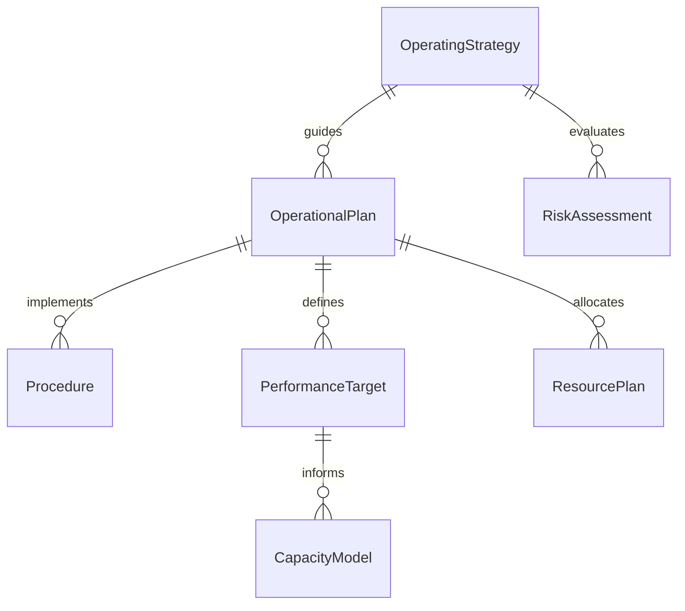
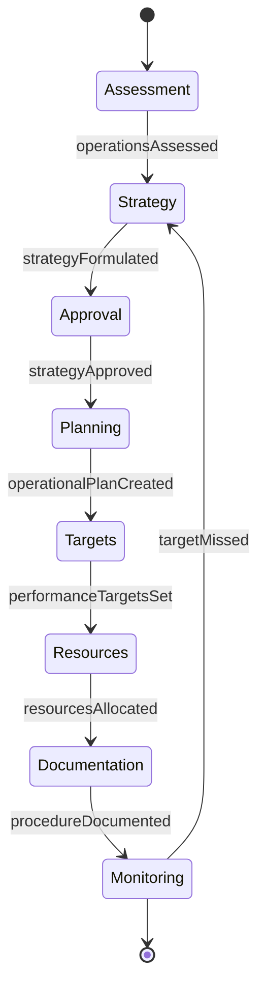
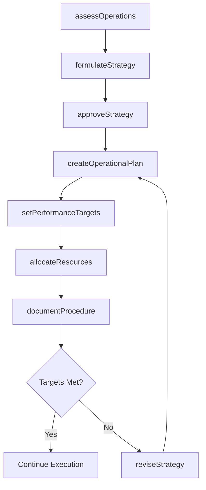
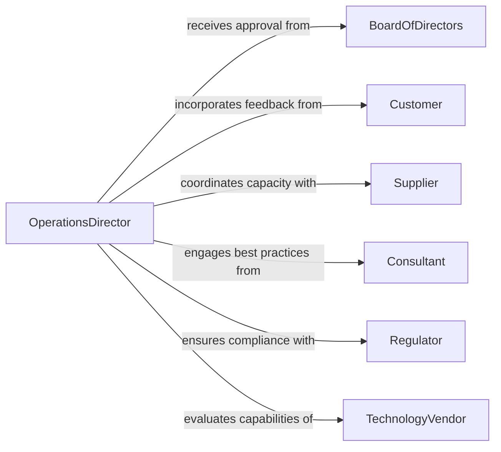

# Develop Operating Strategies Plans Procedures

> Business-as-Code definition for developing operating strategies, plans, and procedures. Models the process of translating organizational objectives into actionable operational blueprints with defined workflows, resource plans, and performance targets.

## Overview

Developing operating strategies, plans, and procedures involves analyzing current operations, identifying improvement opportunities, defining strategic objectives, creating detailed operational plans, and documenting standard operating procedures. This definition provides actions for strategy formulation, plan creation, and procedure documentation, along with events for tracking progress and searches for retrieving operational intelligence.

## Actors

| Actor | Description |
|-------|-------------|
| Customer | End user whose needs and expectations shape operational priorities |
| Supplier | Upstream partner whose capabilities constrain operational planning |
| Consultant | External advisor providing operational best practices and benchmarks |
| Regulator | Governing body whose requirements influence operational procedures |
| BoardOfDirectors | Governance body approving high-level strategic direction |
| TechnologyVendor | Software or infrastructure provider enabling operational capabilities |

## Roles

| Role | Description |
|------|-------------|
| OperationsDirector | Owns the operating strategy and oversees plan execution |
| StrategyAnalyst | Researches market conditions and models operational scenarios |
| ProcessEngineer | Designs and documents standard operating procedures |
| ProjectManager | Coordinates implementation of strategic initiatives |
| DepartmentManager | Translates organizational strategy into departmental plans |

## Entities

| Entity | Description |
|--------|-------------|
| OperatingStrategy | High-level strategic direction for organizational operations |
| OperationalPlan | Detailed plan with timelines, resources, and deliverables |
| Procedure | Step-by-step instructions for executing a business process |
| PerformanceTarget | Measurable objective tied to an operational plan |
| ResourcePlan | Allocation of staff, budget, and equipment for operations |
| RiskAssessment | Identified risks and mitigation strategies for a plan |
| CapacityModel | Analysis of current and projected operational capacity |

## Actions

| Action | Description |
|--------|-------------|
| assessOperations | Evaluate current operational performance and identify gaps |
| formulateStrategy | Define strategic operating objectives and priorities |
| createOperationalPlan | Build a detailed plan with milestones and resource allocations |
| documentProcedure | Write standard operating procedures for business processes |
| setPerformanceTargets | Establish measurable KPIs for operational plans |
| allocateResources | Assign personnel, budget, and equipment to plan activities |
| approveStrategy | Formally approve an operating strategy for execution |
| reviseStrategy | Update an existing strategy based on performance data |

## Events

| Event | Description |
|-------|-------------|
| operationsAssessed | Current operational performance assessment is complete |
| strategyFormulated | A new operating strategy has been defined |
| operationalPlanCreated | A detailed operational plan has been built |
| procedureDocumented | A standard operating procedure has been published |
| performanceTargetsSet | KPIs have been established for an operational plan |
| strategyApproved | An operating strategy has been formally approved |
| targetMissed | An operational KPI has fallen below its threshold |

## Searches

| Search | Description |
|--------|-------------|
| findStrategies | List operating strategies by business unit, status, or period |
| getOperationalPlans | Retrieve plans by department, timeline, or approval status |
| getProcedures | Fetch standard operating procedures by process area or version |
| getPerformanceMetrics | Retrieve KPI actuals against targets by plan or department |
| findResourceAllocations | List resource assignments by plan, department, or type |

## Entity Relationships



## State Diagram



## Workflow



## Actor Relationships



## Usage

### Calling Actions

```typescript
import { developOperatingStrategiesPlansProcedures } from '@headlessly/develop-operating-strategies-plans-procedures'

const operations = developOperatingStrategiesPlansProcedures()

// Assess current operations
const assessment = await operations.assessOperations({
  businessUnit: 'Supply Chain',
  period: { start: '2025-01-01', end: '2025-12-31' },
  metrics: ['throughput', 'defectRate', 'cycleTime']
})

// Formulate a new operating strategy
const strategy = await operations.formulateStrategy({
  name: 'Supply Chain Optimization FY2026',
  objectives: [
    'Reduce cycle time by 20%',
    'Improve on-time delivery to 98%',
    'Lower logistics cost per unit by 12%'
  ],
  horizon: '12-months'
})

// Create a detailed operational plan
await operations.createOperationalPlan({
  strategyId: strategy.id,
  milestones: [
    { name: 'Vendor consolidation', date: '2026-03-31' },
    { name: 'Warehouse automation', date: '2026-06-30' },
    { name: 'Route optimization', date: '2026-09-30' }
  ]
})
```

### Event-Driven Automation

```typescript
// Alert leadership when a KPI target is missed
operations.targetMissed(async ({ planId, metric, actual, target }) => {
  await notify({
    to: 'operations-leadership',
    message: `${metric} at ${actual} vs target ${target} for plan ${planId}`
  })
})

// Trigger procedure update when strategy is revised
operations.strategyApproved(async ({ strategyId, name }) => {
  await operations.documentProcedure({
    strategyId,
    processArea: 'Operations',
    title: `Updated procedures for ${name}`
  })
})
```
