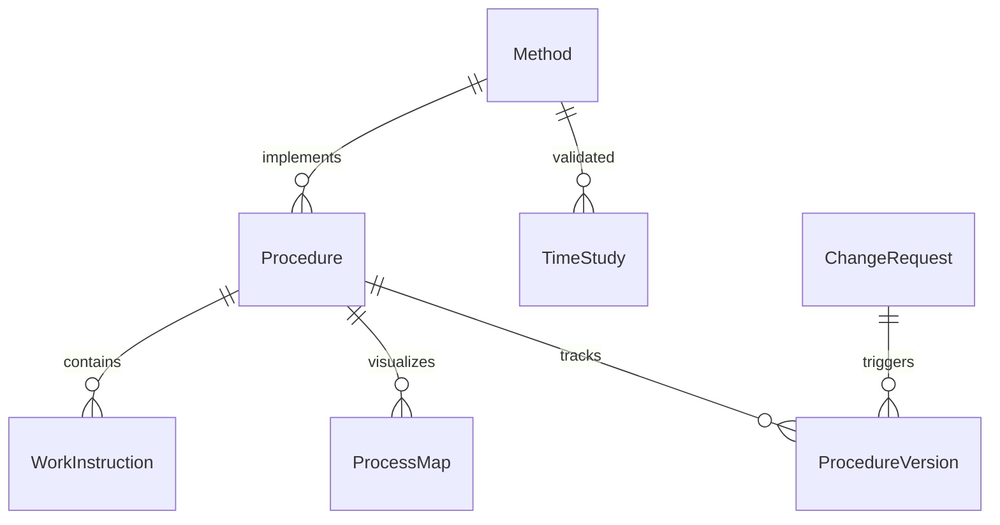
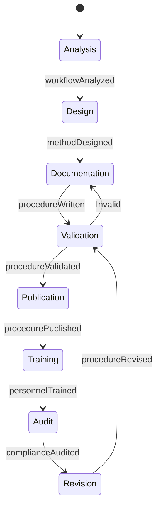
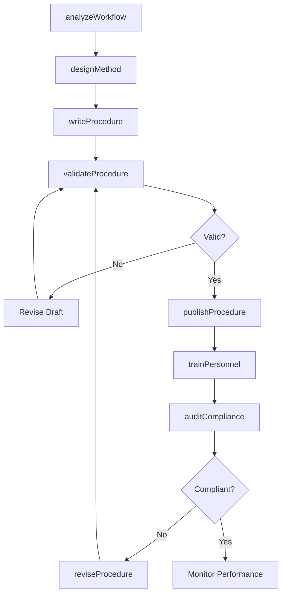
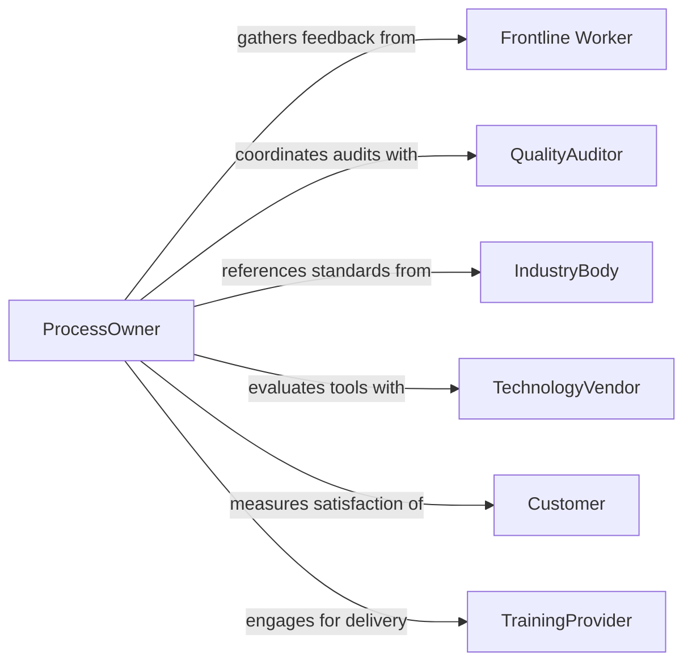

# Develop Organizational Methods Procedures

> Business-as-Code definition for developing organizational methods and procedures. Models the design, documentation, validation, and deployment of standardized work methods and step-by-step procedures across business functions.

## Overview

Developing organizational methods and procedures involves analyzing existing workflows, identifying inefficiencies, designing improved work methods, documenting step-by-step procedures, piloting changes, and rolling out standardized processes. This definition exposes actions for method design and procedure documentation, events for change tracking, and searches for retrieving procedure libraries and compliance data.

## Actors

| Actor | Description |
|-------|-------------|
| Frontline Worker | Employee who executes procedures and provides practical feedback |
| QualityAuditor | External assessor who evaluates procedure compliance and effectiveness |
| IndustryBody | Standards organization providing method frameworks and certifications |
| TechnologyVendor | Provider of tools and systems that enable or constrain procedures |
| Customer | End user whose experience is affected by procedural quality |
| TrainingProvider | External organization delivering procedure training programs |

## Roles

| Role | Description |
|------|-------------|
| ProcessOwner | Accountable for the design and performance of a business process |
| MethodsEngineer | Designs work methods using time studies and workflow analysis |
| ProcedureWriter | Documents step-by-step instructions in standard format |
| QualityManager | Ensures procedures meet quality standards and certifications |
| ChangeManager | Coordinates the rollout and adoption of new procedures |

## Entities

| Entity | Description |
|--------|-------------|
| Method | A defined approach for performing a category of work |
| Procedure | A step-by-step document for executing a specific task |
| ProcessMap | A visual representation of workflow steps and decision points |
| WorkInstruction | Detailed instructions for a single operation within a procedure |
| TimeStudy | Analysis of time required to complete procedural steps |
| ChangeRequest | A formal proposal to modify an existing method or procedure |
| ProcedureVersion | A specific revision of a published procedure document |

## Actions

| Action | Description |
|--------|-------------|
| analyzeWorkflow | Map and measure an existing process to identify improvement areas |
| designMethod | Create a new or improved work method based on analysis findings |
| writeProcedure | Document a step-by-step procedure in standard organizational format |
| validateProcedure | Test a procedure through pilot execution and gather feedback |
| publishProcedure | Release a validated procedure to the procedure library |
| trainPersonnel | Deliver training on new or updated methods and procedures |
| auditCompliance | Verify that published procedures are being followed correctly |
| reviseProcedure | Update a procedure based on audit findings or change requests |

## Events

| Event | Description |
|-------|-------------|
| workflowAnalyzed | A workflow analysis has been completed with findings |
| methodDesigned | A new work method has been created |
| procedureWritten | A step-by-step procedure document has been drafted |
| procedureValidated | A procedure has been tested and feedback incorporated |
| procedurePublished | A procedure has been released to the organization |
| personnelTrained | Training on a new procedure has been completed |
| complianceAudited | A procedure compliance audit has been finished |
| procedureRevised | An existing procedure has been updated |

## Searches

| Search | Description |
|--------|-------------|
| findProcedures | List procedures by process area, version, or status |
| getMethods | Retrieve work methods by department or function |
| getProcessMaps | Fetch visual process maps by workflow or business unit |
| findChangeRequests | List pending procedure change requests by priority or submitter |
| getAuditResults | Retrieve compliance audit results by procedure or department |

## Entity Relationships



## State Diagram



## Workflow



## Actor Relationships



## Usage

### Calling Actions

```typescript
import { developOrganizationalMethodsProcedures } from '@headlessly/develop-organizational-methods-procedures'

const methods = developOrganizationalMethodsProcedures()

// Analyze an existing workflow
const analysis = await methods.analyzeWorkflow({
  processArea: 'Order Fulfillment',
  scope: ['order-receipt', 'picking', 'packing', 'shipping'],
  includeTimeStudy: true
})

// Design an improved method
const method = await methods.designMethod({
  name: 'Batch Picking Method',
  processArea: 'Order Fulfillment',
  improvements: [
    { step: 'picking', change: 'Batch orders by zone', expectedGain: '30% faster' }
  ]
})

// Write and publish the procedure
const procedure = await methods.writeProcedure({
  methodId: method.id,
  title: 'Batch Picking Standard Operating Procedure',
  steps: [
    'Group orders by warehouse zone',
    'Generate consolidated pick list',
    'Pick items in zone sequence',
    'Sort items by individual order at packing station'
  ]
})
```

### Event-Driven Automation

```typescript
// Schedule training when a procedure is published
methods.procedurePublished(async ({ procedureId, title, processArea }) => {
  await methods.trainPersonnel({
    procedureId,
    audience: processArea,
    format: 'hands-on',
    deadline: new Date(Date.now() + 30 * 24 * 60 * 60 * 1000)
  })
})

// Trigger revision when audit finds non-compliance
methods.complianceAudited(async ({ procedureId, complianceRate, findings }) => {
  if (complianceRate < 0.85) {
    await methods.reviseProcedure({
      procedureId,
      reason: 'Low compliance rate',
      findings
    })
  }
})
```
