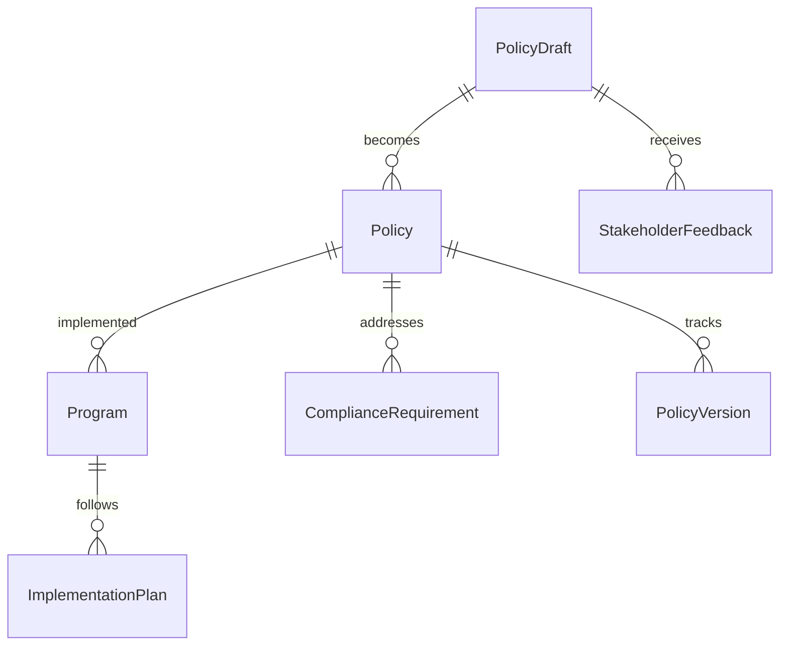
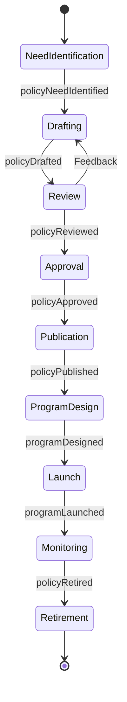
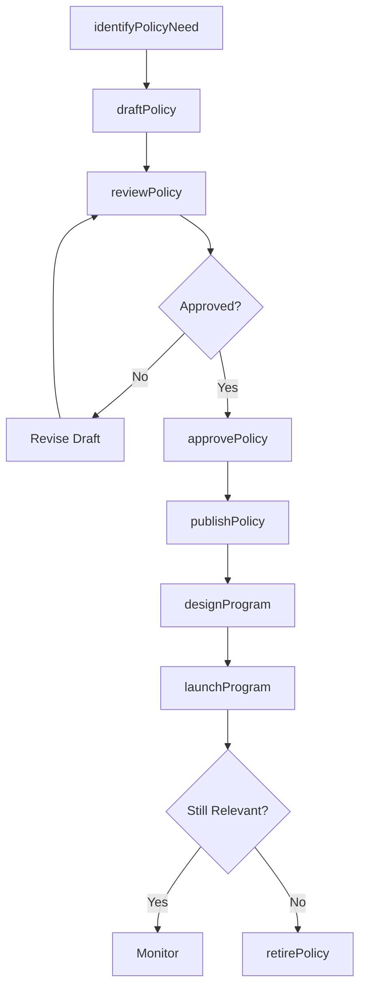
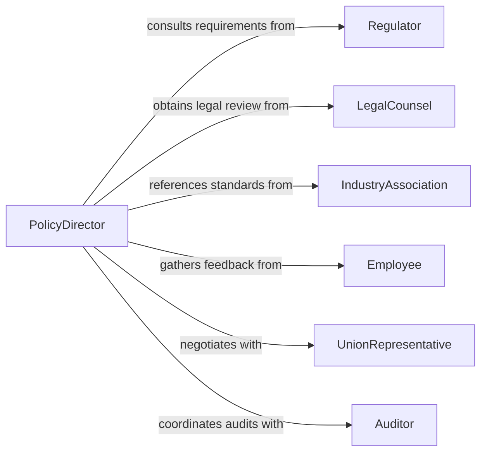

# Develop Organizational Policies Programs

> Business-as-Code definition for developing organizational policies and programs. Models the lifecycle of drafting, reviewing, approving, and implementing enterprise-wide policies and structured programs.

## Overview

Developing organizational policies and programs involves identifying governance needs, researching best practices and regulatory requirements, drafting policy documents, obtaining stakeholder input, securing executive approval, and rolling out programs across the organization. This definition exposes actions for each stage, events for change management automation, and searches for policy retrieval and compliance tracking.

## Actors

| Actor | Description |
|-------|-------------|
| Regulator | Government or industry body whose mandates shape policy requirements |
| LegalCounsel | External legal advisors who review policy language for compliance |
| IndustryAssociation | Professional body providing standards and best-practice frameworks |
| Employee | Workforce member subject to and affected by organizational policies |
| UnionRepresentative | Labor organization representative consulted on workforce policies |
| Auditor | External party validating policy adherence during audits |

## Roles

| Role | Description |
|------|-------------|
| PolicyDirector | Oversees the policy development lifecycle and prioritization |
| PolicyAnalyst | Researches requirements and drafts policy content |
| ProgramManager | Designs and manages structured organizational programs |
| ComplianceOfficer | Ensures policies meet legal and regulatory standards |
| ExecutiveSponsor | Senior leader who approves and champions policy adoption |

## Entities

| Entity | Description |
|--------|-------------|
| Policy | A formal document defining organizational rules and expectations |
| Program | A structured initiative implementing one or more policies |
| PolicyDraft | A working version of a policy under review |
| ComplianceRequirement | A regulatory or legal obligation a policy must address |
| StakeholderFeedback | Input collected from affected parties during review |
| PolicyVersion | A specific revision of a published policy document |
| ImplementationPlan | A rollout schedule and communication plan for a new policy |

## Actions

| Action | Description |
|--------|-------------|
| identifyPolicyNeed | Recognize a gap or change requiring a new or updated policy |
| draftPolicy | Create initial policy language and scope definition |
| reviewPolicy | Circulate draft for stakeholder and legal review |
| approvePolicy | Formally approve a policy for organizational adoption |
| publishPolicy | Release the approved policy to the organization |
| designProgram | Structure a program with objectives, milestones, and metrics |
| launchProgram | Activate a program and begin implementation activities |
| retirePolicy | Deprecate and archive an outdated policy |

## Events

| Event | Description |
|-------|-------------|
| policyNeedIdentified | A governance gap or regulatory change has been flagged |
| policyDrafted | An initial policy draft has been completed |
| policyReviewed | Stakeholder review of a policy draft is complete |
| policyApproved | A policy has been formally approved by leadership |
| policyPublished | An approved policy has been released organization-wide |
| programLaunched | A structured organizational program has been activated |
| policyRetired | An outdated policy has been deprecated and archived |

## Searches

| Search | Description |
|--------|-------------|
| findPolicies | List policies by department, status, or effective date |
| getPrograms | Retrieve programs by type, sponsor, or implementation stage |
| getPolicyVersions | Fetch revision history for a specific policy document |
| findComplianceGaps | Identify policies missing required regulatory coverage |
| getStakeholderFeedback | Retrieve review comments for a policy draft |

## Entity Relationships



## State Diagram



## Workflow



## Actor Relationships



## Usage

### Calling Actions

```typescript
import { developOrganizationalPoliciesPrograms } from '@headlessly/develop-organizational-policies-programs'

const policies = developOrganizationalPoliciesPrograms()

// Draft a new remote work policy
const draft = await policies.draftPolicy({
  title: 'Remote Work Policy',
  scope: 'All full-time employees',
  department: 'Human Resources',
  effectiveDate: '2026-04-01',
  complianceRequirements: ['FLSA', 'State Labor Laws']
})

// Submit for stakeholder review
await policies.reviewPolicy({
  policyId: draft.id,
  reviewers: ['legal', 'hr-leadership', 'union-rep'],
  deadline: '2026-03-01'
})

// Design an implementation program
await policies.designProgram({
  name: 'Remote Work Enablement',
  policyId: draft.id,
  milestones: [
    { name: 'Manager Training', date: '2026-03-15' },
    { name: 'Employee Communication', date: '2026-03-25' },
    { name: 'Go-Live', date: '2026-04-01' }
  ]
})
```

### Event-Driven Automation

```typescript
// Notify compliance team when a policy is published
policies.policyPublished(async ({ policyId, title, effectiveDate }) => {
  await notify({
    to: 'compliance-team',
    message: `Policy "${title}" is now effective as of ${effectiveDate}`
  })
})

// Trigger review when a regulatory change is detected
policies.policyNeedIdentified(async ({ reason, regulatoryBody }) => {
  await policies.draftPolicy({
    title: `Policy Update: ${reason}`,
    scope: 'Organization-wide',
    complianceRequirements: [regulatoryBody]
  })
})
```
