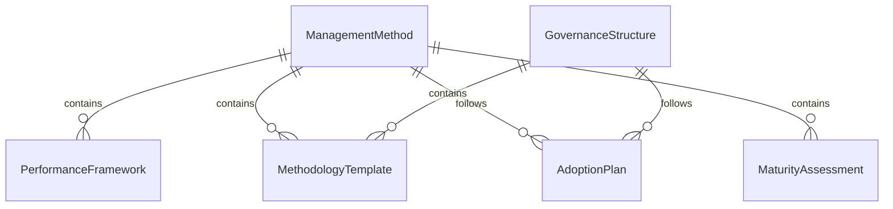
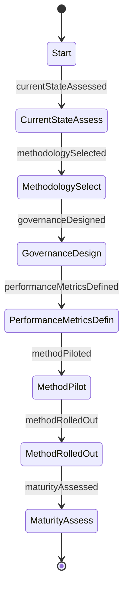
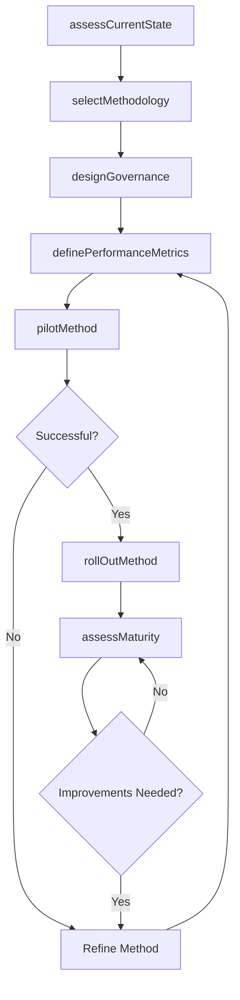
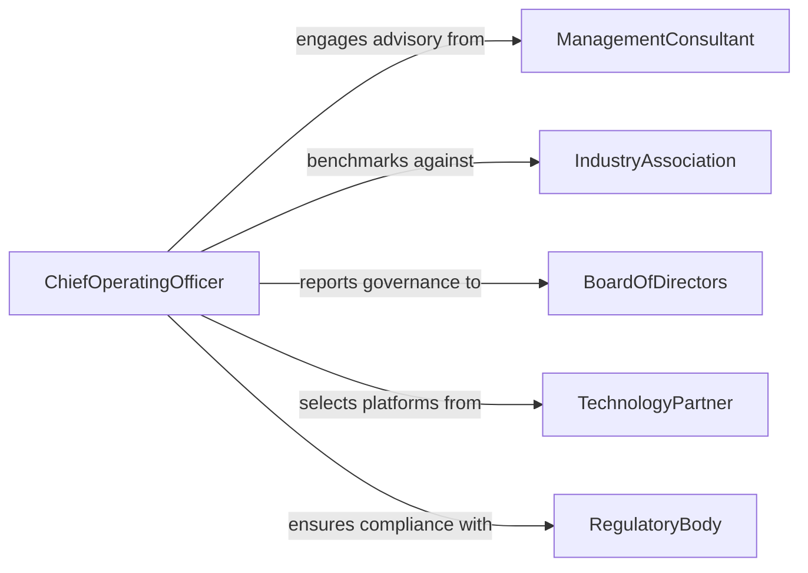

# Establish Business Management Methods

> Business-as-Code definition for establishing business management methods. Models the design, validation, and adoption of management frameworks, operational methodologies, and governance structures that drive organizational performance.

## Overview

Establishing business management methods involves selecting, designing, and implementing the operational frameworks and governance structures that guide how an organization plans, executes, and measures its activities. This activity covers methodology adoption (such as Lean, Six Sigma, OKR, or Agile), management system design, decision-making frameworks, and performance governance structures. The goal is to create repeatable, scalable management practices that align operational execution with strategic objectives.

## Actors

| Actor | Description |
|-------|-------------|
| ManagementConsultant | External advisors who recommend and help implement management methodologies |
| IndustryAssociation | Professional bodies that publish management best practices and benchmarks |
| BoardOfDirectors | Governing body that approves management frameworks and reviews performance |
| TechnologyPartner | Vendors providing management software, dashboards, and analytics platforms |
| RegulatoryBody | Authorities requiring specific governance and reporting structures |

## Roles

| Role | Description |
|------|-------------|
| ChiefOperatingOfficer | Champions management method adoption and drives operational excellence |
| StrategyDirector | Aligns management methods with long-term organizational strategy |
| ProcessExcellenceLead | Designs and continuously improves management frameworks |
| OrganizationalDevelopmentManager | Ensures management methods are adopted through training and change management |

## Entities

| Entity | Description |
|--------|-------------|
| ManagementMethod | A documented framework or methodology for managing business operations |
| GovernanceStructure | A defined hierarchy of decision-making authority and accountability |
| PerformanceFramework | A system of metrics and review cadences for measuring execution |
| MethodologyTemplate | A reusable blueprint for applying a management method to a business unit |
| AdoptionPlan | A strategy for rolling out a management method across the organization |
| MaturityAssessment | An evaluation of how effectively a management method is being applied |

## Actions

| Action | Description |
|--------|-------------|
| assessCurrentState | Evaluate existing management practices and identify gaps |
| selectMethodology | Choose a management framework aligned with organizational strategy |
| designGovernance | Define decision-making structures, roles, and accountability chains |
| definePerformanceMetrics | Establish KPIs and review cadences for the management method |
| pilotMethod | Test the management method in a business unit before broad adoption |
| rollOutMethod | Deploy the management method across the organization |
| assessMaturity | Evaluate how effectively the method is being applied and delivering results |

## Events

| Event | Description |
|-------|-------------|
| currentStateAssessed | Existing management practices have been evaluated |
| methodologySelected | A management framework has been chosen |
| governanceDesigned | Decision-making structures have been defined |
| performanceMetricsDefined | KPIs and review cadences have been established |
| methodPiloted | A management method has been tested in a business unit |
| methodRolledOut | A management method has been deployed organization-wide |
| maturityAssessed | Adoption effectiveness has been evaluated |

## Searches

| Search | Description |
|--------|-------------|
| findMethods | List management methods by type, business unit, or maturity level |
| getPerformanceMetrics | Retrieve KPIs and scores by method, period, or department |
| getMaturityScores | Look up maturity assessment results by business unit |
| findGovernanceStructures | Search governance definitions by organizational level or method |

## Entity Relationships



## State Diagram



## Workflow



## Actor Relationships



## Usage

### Calling Actions

```typescript
import { establishBusinessManagementMethods } from '@headlessly/establish-business-management-methods'

const management = establishBusinessManagementMethods()

// Assess current management practices
const assessment = await management.assessCurrentState({
  scope: ['Operations', 'Product Development', 'Customer Success'],
  dimensions: ['Planning', 'Execution', 'Measurement', 'Governance'],
  method: 'interviews-plus-document-review'
})

// Select and configure a management methodology
const methodology = await management.selectMethodology({
  framework: 'OKR + Lean Operations',
  strategicAlignment: 'Growth and operational efficiency',
  assessmentId: assessment.id,
  rationale: 'Combines goal clarity with waste reduction for scaling organization'
})

// Pilot in a single business unit
const pilot = await management.pilotMethod({
  methodologyId: methodology.id,
  businessUnit: 'Product Development',
  duration: { months: 3 },
  successCriteria: [
    { metric: 'Goal Achievement Rate', target: 70, unit: 'percent' },
    { metric: 'Cycle Time Reduction', target: 15, unit: 'percent' },
    { metric: 'Team Satisfaction', target: 4.0, unit: 'score-out-of-5' }
  ]
})
```

### Event-Driven Automation

```typescript
// Notify leadership when a methodology pilot succeeds
management.methodPiloted(async ({ methodologyId, businessUnit, results }) => {
  const allPassed = results.every(r => r.actual >= r.target)
  if (allPassed) {
    await notify({
      to: 'executive-leadership',
      message: `Management method pilot in ${businessUnit} met all success criteria. Recommending organization-wide rollout.`
    })
  }
})

// Schedule maturity reassessment after rollout
management.methodRolledOut(async ({ methodologyId, completionDate }) => {
  await scheduleAssessment({
    type: 'Maturity Assessment',
    methodologyId,
    scheduledDate: addMonths(new Date(completionDate), 6),
    assessor: 'process-excellence-lead'
  })
})
```
