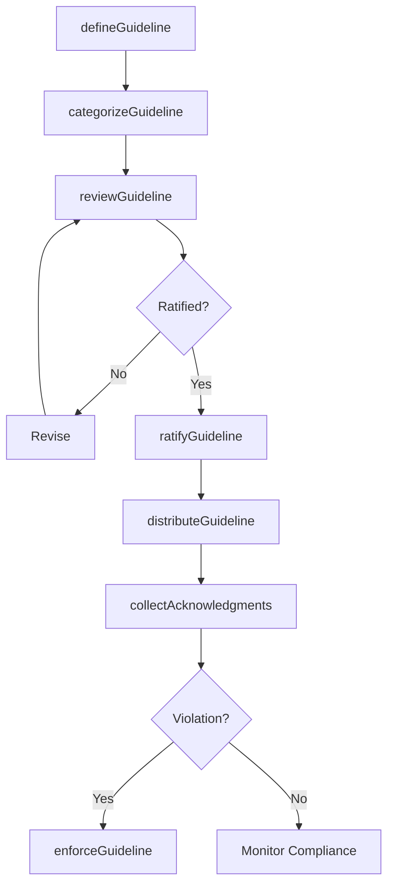
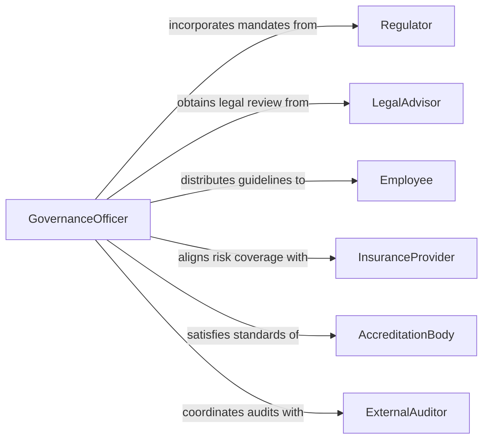

# Establish Organizational Guidelines Policies

> Business-as-Code definition for establishing organizational guidelines and policies. Models the process of codifying behavioral expectations, compliance standards, and governance frameworks into enforceable organizational directives.

## Overview

Establishing organizational guidelines and policies involves defining the rules, standards, and behavioral expectations that govern how an organization operates. Unlike developing policies from scratch, this activity focuses on formalizing, codifying, and institutionalizing guidelines so they become enforceable organizational standards. This definition provides actions for guideline creation, approval workflows, distribution mechanisms, and compliance tracking.

## Actors

| Actor | Description |
|-------|-------------|
| Regulator | Government or industry authority mandating compliance standards |
| LegalAdvisor | External counsel reviewing guidelines for legal sufficiency |
| Employee | Workforce member who must adhere to established guidelines |
| InsuranceProvider | Carrier whose risk assessments influence safety and conduct policies |
| AccreditationBody | Organization that certifies compliance with industry standards |
| ExternalAuditor | Third party validating guideline adherence during audits |

## Roles

| Role | Description |
|------|-------------|
| GovernanceOfficer | Leads the establishment and maintenance of organizational guidelines |
| ComplianceManager | Ensures guidelines meet regulatory and legal requirements |
| HRDirector | Oversees workforce-related guidelines and code of conduct |
| RiskManager | Assesses organizational risk to inform guideline priorities |
| ExecutiveCommittee | Senior leadership body that ratifies organizational guidelines |

## Entities

| Entity | Description |
|--------|-------------|
| Guideline | A documented standard defining expected behavior or process |
| PolicyFramework | An overarching structure organizing related guidelines |
| CodeOfConduct | Organization-wide behavioral expectations for all personnel |
| ComplianceChecklist | A verification tool for guideline adherence |
| Acknowledgment | A record that an individual has reviewed and accepted a guideline |
| EnforcementAction | A corrective measure taken when a guideline is violated |
| GuidelineException | A documented deviation approved under specific circumstances |

## Actions

| Action | Description |
|--------|-------------|
| defineGuideline | Create a new organizational guideline with scope and requirements |
| categorizeGuideline | Assign a guideline to a policy framework or domain |
| reviewGuideline | Submit a guideline for stakeholder and legal review |
| ratifyGuideline | Obtain executive approval to make a guideline enforceable |
| distributeGuideline | Publish and communicate a guideline to affected personnel |
| collectAcknowledgments | Track employee review and acceptance of guidelines |
| enforceGuideline | Apply corrective actions for guideline violations |
| grantException | Approve a documented deviation from a guideline |

## Events

| Event | Description |
|-------|-------------|
| guidelineDefined | A new organizational guideline has been created |
| guidelineReviewed | Stakeholder review of a guideline is complete |
| guidelineRatified | A guideline has been approved by executive leadership |
| guidelineDistributed | A guideline has been published to the organization |
| acknowledgmentReceived | An employee has confirmed review of a guideline |
| violationDetected | A guideline violation has been identified |
| exceptionGranted | A formal deviation from a guideline has been approved |

## Searches

| Search | Description |
|--------|-------------|
| findGuidelines | List guidelines by domain, status, or effective date |
| getAcknowledgmentStatus | Retrieve acknowledgment completion rates by department |
| findViolations | List guideline violations by severity, department, or period |
| getExceptions | Retrieve approved exceptions by guideline or business unit |
| getPolicyFrameworks | Fetch policy frameworks and their associated guidelines |

## Workflow



## Actor Relationships



## Usage

### Calling Actions

```typescript
import { establishOrganizationalGuidelinesPolicies } from '@headlessly/establish-organizational-guidelines-policies'

const guidelines = establishOrganizationalGuidelinesPolicies()

// Define a new data privacy guideline
const guideline = await guidelines.defineGuideline({
  title: 'Employee Data Privacy Standards',
  scope: 'All departments handling personal data',
  domain: 'Information Security',
  requirements: [
    'Encrypt personal data at rest and in transit',
    'Limit access to need-to-know personnel',
    'Conduct annual privacy training'
  ],
  effectiveDate: '2026-07-01'
})

// Submit for review and ratification
await guidelines.reviewGuideline({
  guidelineId: guideline.id,
  reviewers: ['legal', 'compliance', 'it-security'],
  deadline: '2026-05-15'
})

// Distribute to the organization
await guidelines.distributeGuideline({
  guidelineId: guideline.id,
  channels: ['email', 'intranet', 'employee-portal'],
  requireAcknowledgment: true
})
```

### Event-Driven Automation

```typescript
// Escalate when acknowledgment rates are low
guidelines.guidelineDistributed(async ({ guidelineId, title }) => {
  setTimeout(async () => {
    const status = await guidelines.getAcknowledgmentStatus({ guidelineId })
    if (status.completionRate < 0.80) {
      await notify({
        to: 'hr-leadership',
        message: `Only ${status.completionRate * 100}% acknowledged "${title}"`
      })
    }
  }, 14 * 24 * 60 * 60 * 1000) // 14 days
})

// Log enforcement actions on violations
guidelines.violationDetected(async ({ guidelineId, employeeId, severity }) => {
  await guidelines.enforceGuideline({
    guidelineId,
    employeeId,
    action: severity === 'critical' ? 'suspension' : 'written-warning'
  })
})
```
