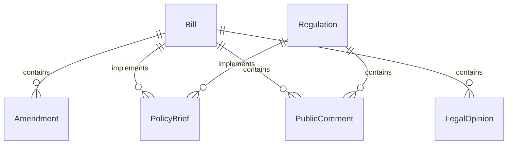
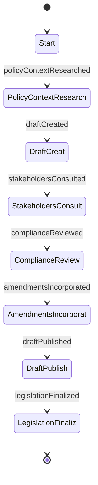
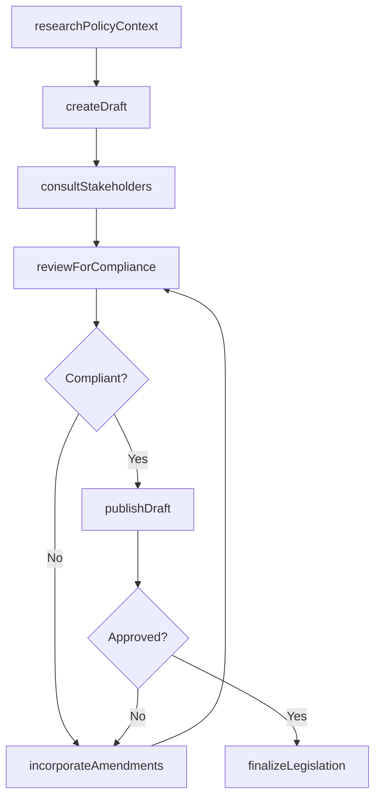
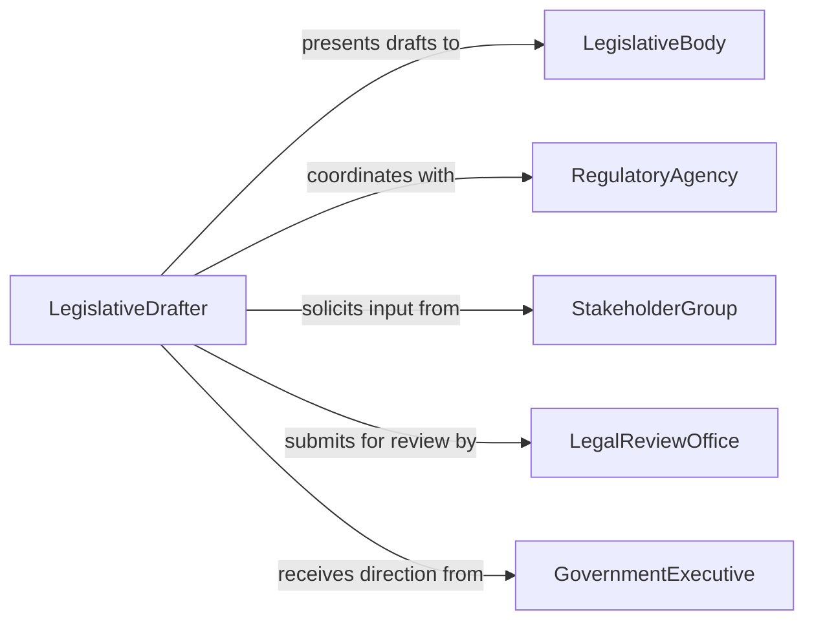

# Draft Legislation Regulations

> Business-as-Code definition for drafting legislation or regulations. Models the complete legislative drafting process from policy research through stakeholder consultation, legal review, and formal publication.

## Overview

Drafting legislation or regulations involves translating policy objectives into formal legal language that can be enacted by legislative bodies or regulatory agencies. This activity requires analyzing existing legal frameworks, consulting with stakeholders and subject matter experts, writing statutory or regulatory text with precise language, and iterating through review and amendment cycles. The resulting instruments establish enforceable rules that govern conduct within specific jurisdictions or industries.

## Actors

| Actor | Description |
|-------|-------------|
| LegislativeBody | Elected assembly or council that considers and enacts legislation |
| RegulatoryAgency | Government body with authority to issue and enforce regulations |
| StakeholderGroup | Affected parties including industry representatives, advocacy groups, and the public |
| LegalReviewOffice | Office that reviews drafts for constitutional and legal consistency |
| GovernmentExecutive | Elected or appointed official who initiates or signs legislation into law |

## Roles

| Role | Description |
|------|-------------|
| LegislativeDrafter | Writes and structures the legal text of bills and regulations |
| PolicyAnalyst | Researches policy context and evaluates the impact of proposed provisions |
| LegalCounsel | Reviews drafts for legal soundness, constitutional compliance, and consistency |
| CommitteeChair | Oversees the committee process for reviewing and amending legislation |

## Entities

| Entity | Description |
|--------|-------------|
| Bill | A proposed law presented to a legislative body for consideration |
| Regulation | A rule issued by a regulatory agency to implement or enforce a law |
| Amendment | A proposed change to an existing bill or regulation |
| PolicyBrief | A summary document outlining the objectives and rationale for proposed legislation |
| PublicComment | Feedback submitted by stakeholders during the regulatory process |
| LegalOpinion | A formal assessment of the legality or constitutionality of proposed text |

## Actions

| Action | Description |
|--------|-------------|
| researchPolicyContext | Analyze existing laws, precedents, and policy objectives informing the draft |
| createDraft | Write the initial text of a bill or regulation with proper legal structure |
| consultStakeholders | Gather input from affected parties through hearings, meetings, or comment periods |
| reviewForCompliance | Evaluate the draft for legal consistency and constitutional validity |
| incorporateAmendments | Revise the draft to reflect approved changes from committee or agency review |
| publishDraft | Release the draft for formal consideration, public comment, or legislative vote |
| finalizeLegislation | Prepare the final version of enacted legislation for official publication |

## Events

| Event | Description |
|-------|-------------|
| policyContextResearched | Background research and existing legal analysis has been completed |
| draftCreated | An initial version of the legislation or regulation has been written |
| stakeholdersConsulted | Input from affected parties has been gathered and documented |
| complianceReviewed | Legal and constitutional review of the draft has been completed |
| amendmentsIncorporated | Approved changes have been integrated into the draft |
| draftPublished | The draft has been released for formal review or public comment |
| legislationFinalized | The enacted legislation has been prepared for official publication |

## Searches

| Search | Description |
|--------|-------------|
| findLegislation | Search enacted or proposed legislation by topic, jurisdiction, or status |
| getPublicComments | Retrieve stakeholder comments by draft, topic, or submission date |
| getAmendments | List proposed or adopted amendments by bill, sponsor, or subject |
| getLegalOpinions | Find legal opinions by draft, issue, or reviewing authority |

## Entity Relationships



## State Diagram



## Workflow



## Actor Relationships



## Usage

### Calling Actions

```typescript
import { draftLegislationRegulations } from '@headlessly/draft-legislation-regulations'

const legislation = draftLegislationRegulations()

// Research policy context for a new regulation
const context = await legislation.researchPolicyContext({
  topic: 'autonomous-vehicle-safety-standards',
  jurisdictions: ['US-Federal', 'US-CA'],
  existingLaws: ['motor-vehicle-safety-act', 'ca-av-testing-regulations']
})

// Create initial draft
const draft = await legislation.createDraft({
  title: 'Autonomous Vehicle Safety Certification Act',
  type: 'bill',
  jurisdiction: 'US-Federal',
  sections: [
    { heading: 'Definitions', content: 'For purposes of this Act...' },
    { heading: 'Safety Certification Requirements', content: 'No autonomous vehicle shall...' },
    { heading: 'Enforcement and Penalties', content: 'The Secretary shall...' }
  ]
})

// Consult stakeholders
await legislation.consultStakeholders({
  draftId: draft.id,
  method: 'public-comment-period',
  duration: 60,
  stakeholderGroups: ['automotive-manufacturers', 'safety-advocacy', 'insurance-industry']
})
```

### Event-Driven Automation

```typescript
// Notify legal review when a new draft is created
legislation.draftCreated(async ({ draftId, title, type }) => {
  await createTask({
    assignee: 'legal-review-office',
    title: `Review ${type}: ${title}`,
    draftId,
    priority: 'high'
  })
})

// Compile and distribute public comments when consultation closes
legislation.stakeholdersConsulted(async ({ draftId, commentCount }) => {
  const comments = await legislation.getPublicComments({ draftId })
  await distribute({
    to: 'legislative-committee',
    subject: `Stakeholder feedback: ${commentCount} comments received`,
    attachments: [comments.summary]
  })
})
```
