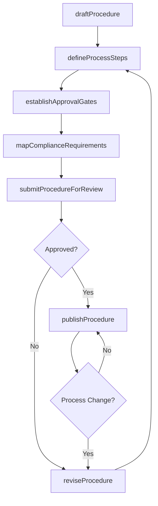
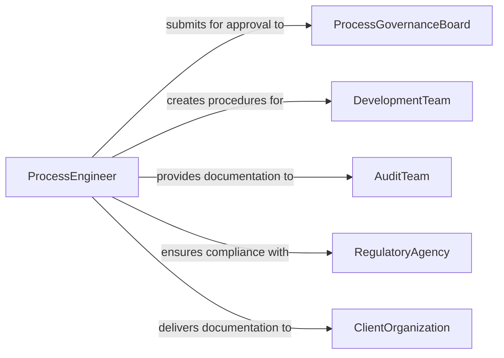

# Document Design Development Procedures

> Business-as-Code definition for documenting design and development procedures that govern how products, systems, and solutions are created.

## Overview

Documenting design or development procedures involves capturing the standardized processes, methodologies, and workflows that teams follow when creating products, software, or engineered systems. This definition exposes actions for procedure documentation and governance, events for process compliance automation, and searches for retrieving procedural documentation across organizational repositories.

## Actors

| Actor | Description |
|-------|-------------|
| ProcessGovernanceBoard | Approves and maintains organizational procedure standards |
| DevelopmentTeam | Follows documented procedures during project execution |
| AuditTeam | Reviews adherence to documented design and development procedures |
| RegulatoryAgency | Mandates procedural documentation for compliance |
| ClientOrganization | Requires procedural documentation for contractual assurance |

## Roles

| Role | Description |
|------|-------------|
| ProcessEngineer | Authors and maintains design and development procedures |
| QualityManager | Ensures procedures meet quality management standards |
| ProcedureReviewer | Validates procedure accuracy, completeness, and applicability |
| ComplianceAnalyst | Verifies procedures align with regulatory requirements |

## Entities

| Entity | Description |
|--------|-------------|
| ProcedureDocument | Formalized record of a design or development process |
| ProcessStep | Individual action or decision point within a procedure |
| ApprovalGate | Checkpoint requiring authorization before proceeding |
| ProcedureTemplate | Standardized format for creating procedure documents |
| ComplianceMapping | Link between a procedure and applicable regulatory requirements |
| ProcedureRevision | Version-controlled update to an existing procedure |

## Actions

| Action | Description |
|--------|-------------|
| draftProcedure | Create initial documentation of a design or development process |
| defineProcessSteps | Detail individual actions, inputs, and outputs for each step |
| establishApprovalGates | Set authorization checkpoints within the procedure |
| mapComplianceRequirements | Link procedure steps to applicable regulations and standards |
| submitProcedureForReview | Send procedure documentation through the approval workflow |
| publishProcedure | Release approved procedure for organizational use |
| reviseProcedure | Update procedure based on lessons learned or process changes |

## Events

| Event | Description |
|-------|-------------|
| procedureDrafted | Initial procedure documentation has been created |
| processStepsDefined | Individual actions and decision points have been detailed |
| approvalGatesEstablished | Authorization checkpoints have been set |
| complianceRequirementsMapped | Regulatory links have been established |
| procedureSubmittedForReview | Procedure has entered the approval workflow |
| procedurePublished | Approved procedure has been released for use |
| procedureRevised | Procedure has been updated with changes |

## Searches

| Search | Description |
|--------|-------------|
| findProcedures | Retrieve procedures by domain, project type, or status |
| findProceduresByRegulation | List procedures linked to a specific regulatory requirement |
| getProcedureRevisions | Retrieve version history for a procedure document |
| findPendingApproval | List procedures awaiting governance board review |

## Workflow



## Actor Relationships



## Usage

### Calling Actions

```typescript
import { documentDesignDevelopmentProcedures } from '@headlessly/document-design-development-procedures'

const procedures = documentDesignDevelopmentProcedures()

// Draft a new procedure
const proc = await procedures.draftProcedure({
  title: 'Software Release Management Procedure',
  domain: 'software-engineering',
  applicableTo: ['web-applications', 'mobile-applications'],
  template: 'sdlc-procedure-v2'
})

// Define process steps
await procedures.defineProcessSteps({
  procedureId: proc.id,
  steps: [
    { order: 1, name: 'Code Freeze', inputs: ['feature-branches'], outputs: ['release-branch'] },
    { order: 2, name: 'Integration Testing', inputs: ['release-branch'], outputs: ['test-report'] },
    { order: 3, name: 'Staging Deployment', inputs: ['release-branch'], outputs: ['staging-environment'] },
    { order: 4, name: 'Production Release', inputs: ['approved-release'], outputs: ['production-deployment'] }
  ]
})

// Map compliance requirements
await procedures.mapComplianceRequirements({
  procedureId: proc.id,
  mappings: [
    { step: 'Integration Testing', regulation: 'SOC-2-CC7.1' },
    { step: 'Production Release', regulation: 'SOC-2-CC8.1' }
  ]
})
```

### Event-Driven Automation

```typescript
// Notify governance board when procedure is submitted
procedures.procedureSubmittedForReview(async ({ procedureId, title }) => {
  await notify({
    to: 'process-governance-board',
    message: `Procedure "${title}" is ready for review`
  })
})

// Auto-notify teams when procedure is published
procedures.procedurePublished(async ({ procedureId, applicableTo }) => {
  for (const team of applicableTo) {
    await notify({
      to: `${team}-team`,
      message: `Updated procedure published - please review and acknowledge`
    })
  }
})
```
