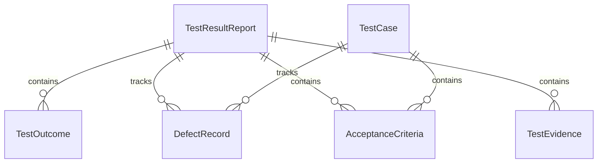
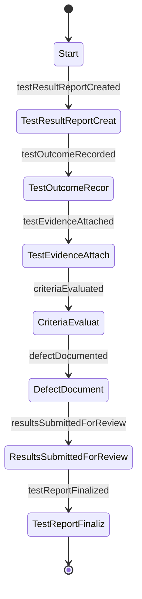
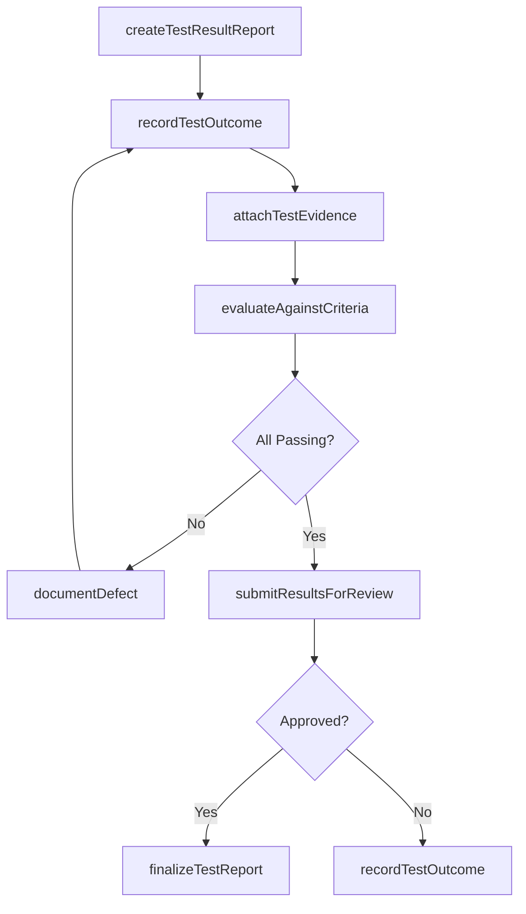
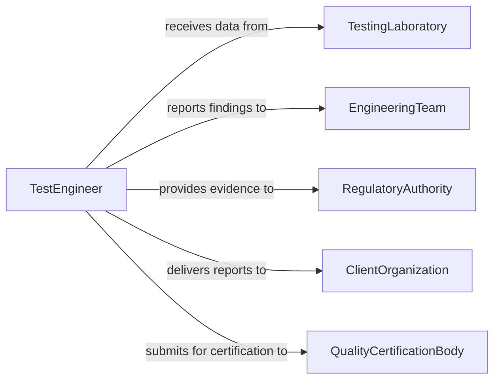

# Document Design Operational Test Results

> Business-as-Code definition for documenting design and operational test results to validate system performance, reliability, and compliance.

## Overview

Documenting design or operational test results involves recording the outcomes of verification and validation testing performed on products, systems, or components during design and operational phases. This definition exposes actions for test result documentation workflows, events for quality gate automation, and searches for retrieving test evidence across testing campaigns.

## Actors

| Actor | Description |
|-------|-------------|
| TestingLaboratory | Conducts tests and produces raw result data |
| EngineeringTeam | Interprets test results and determines design adjustments |
| RegulatoryAuthority | Reviews test documentation for compliance certification |
| ClientOrganization | Receives test result reports as proof of quality |
| QualityCertificationBody | Evaluates test results for standards conformance |

## Roles

| Role | Description |
|------|-------------|
| TestEngineer | Executes tests and documents raw results |
| TestDocumentationSpecialist | Formats and organizes test results into formal reports |
| QualityEngineer | Analyzes test outcomes against acceptance criteria |
| TestManager | Oversees test campaigns and approves result documentation |

## Entities

| Entity | Description |
|--------|-------------|
| TestResultReport | Formal document recording outcomes of a test campaign |
| TestCase | Specific scenario executed during testing |
| TestOutcome | Pass, fail, or conditional result for a test case |
| DefectRecord | Documented anomaly or failure identified during testing |
| AcceptanceCriteria | Measurable threshold against which results are evaluated |
| TestEvidence | Supporting data, logs, or artifacts from test execution |

## Actions

| Action | Description |
|--------|-------------|
| createTestResultReport | Initialize a new report for a test campaign |
| recordTestOutcome | Document the result of an individual test case |
| attachTestEvidence | Link supporting data and artifacts to test results |
| evaluateAgainstCriteria | Compare test outcomes to defined acceptance thresholds |
| documentDefect | Record an anomaly or failure found during testing |
| submitResultsForReview | Send test result documentation through approval workflow |
| finalizeTestReport | Lock and archive the completed test result report |

## Events

| Event | Description |
|-------|-------------|
| testResultReportCreated | A new test result report has been initialized |
| testOutcomeRecorded | An individual test case result has been documented |
| testEvidenceAttached | Supporting data has been linked to test results |
| criteriaEvaluated | Test outcomes have been compared to acceptance thresholds |
| defectDocumented | An anomaly or failure has been recorded |
| resultsSubmittedForReview | Test results have entered the approval workflow |
| testReportFinalized | Completed test report has been locked and archived |

## Searches

| Search | Description |
|--------|-------------|
| findTestReports | Retrieve test result reports by project, phase, or status |
| findFailedTests | List test cases with failing outcomes for a report |
| getDefectsByReport | Retrieve defect records associated with a test campaign |
| findPendingReview | List test result reports awaiting approval |

## Entity Relationships



## State Diagram



## Workflow



## Actor Relationships



## Usage

### Calling Actions

```typescript
import { documentDesignOperationalTestResults } from '@headlessly/document-design-operational-test-results'

const testResults = documentDesignOperationalTestResults()

// Create a test result report
const report = await testResults.createTestResultReport({
  projectId: 'PROJ-2026-0315',
  testCampaign: 'Structural Load Testing - Phase 2',
  systemUnderTest: 'Bridge Support Column Assembly',
  testDate: '2026-02-01'
})

// Record test outcomes
await testResults.recordTestOutcome({
  reportId: report.id,
  testCaseId: 'TC-SLT-014',
  testName: 'Maximum Static Load - 150% Design Load',
  outcome: 'pass',
  measuredValue: 148.7,
  unit: 'kN',
  threshold: 145.0
})

// Document a defect
await testResults.documentDefect({
  reportId: report.id,
  testCaseId: 'TC-SLT-018',
  severity: 'minor',
  description: 'Hairline crack observed at weld joint under cyclic loading',
  recommendation: 'Increase weld penetration depth by 2mm'
})
```

### Event-Driven Automation

```typescript
// Alert engineering on defect documentation
testResults.defectDocumented(async ({ reportId, testCaseId, severity }) => {
  if (severity === 'critical') {
    await notify({
      to: 'engineering-lead',
      message: `Critical defect found in test ${testCaseId} - immediate review required`
    })
  }
})

// Auto-finalize when all tests pass review
testResults.resultsSubmittedForReview(async ({ reportId }) => {
  await notify({
    to: 'quality-manager',
    message: `Test report ${reportId} is ready for final review and approval`
  })
})
```
