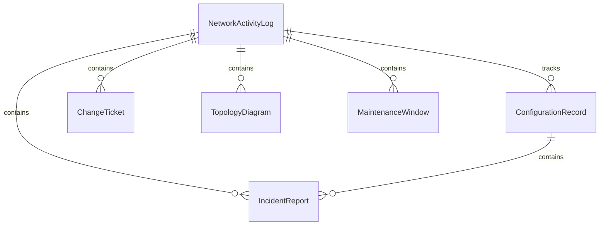
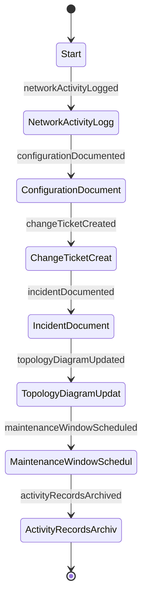
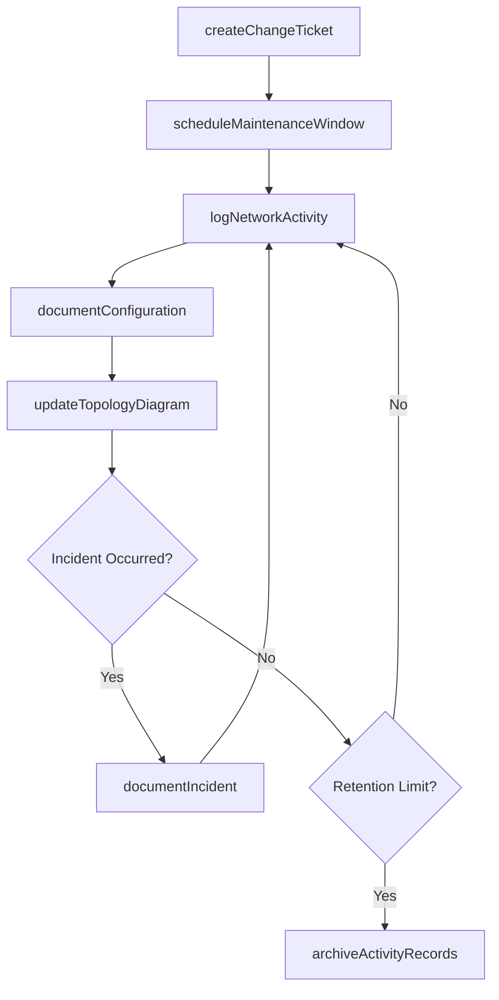
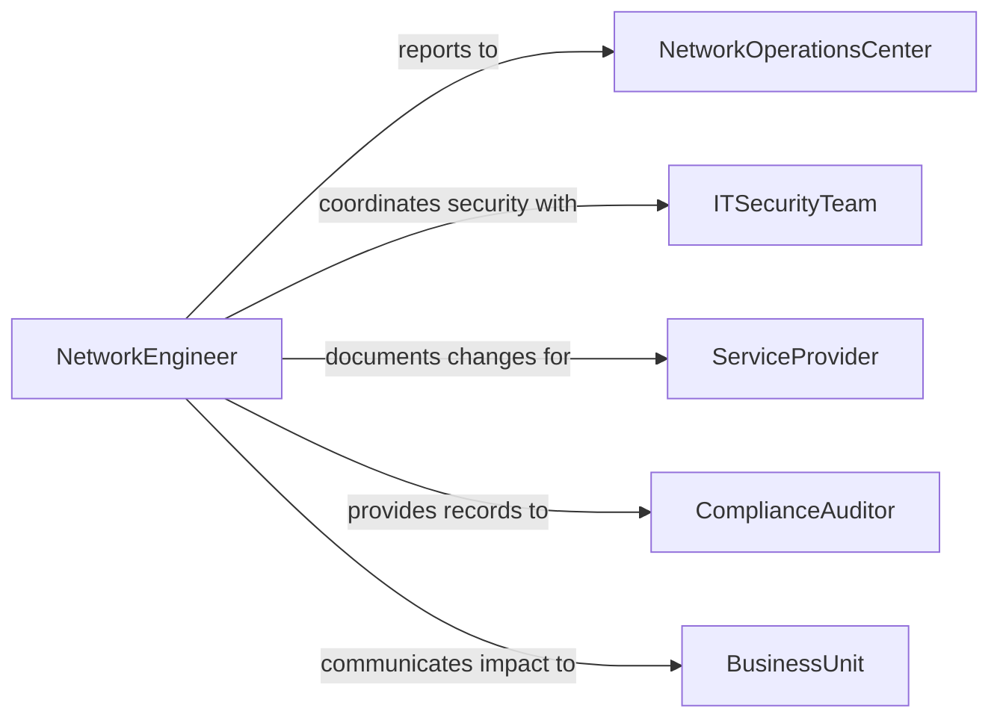

# Document Network-related Activities Tasks

> Business-as-Code definition for documenting network-related activities and tasks including configurations, changes, incidents, and maintenance operations.

## Overview

Documenting network-related activities or tasks involves recording configurations, topology changes, incident responses, maintenance operations, and performance monitoring activities across network infrastructure. This definition exposes actions for network documentation workflows, events for change management automation, and searches for retrieving network activity records across IT operations.

## Actors

| Actor | Description |
|-------|-------------|
| NetworkOperationsCenter | Monitors network health and coordinates activity documentation |
| ITSecurityTeam | Reviews network activity documentation for security compliance |
| ServiceProvider | External network carrier or ISP providing connectivity services |
| ComplianceAuditor | Examines network documentation for regulatory adherence |
| BusinessUnit | Consumes network services and reports connectivity issues |

## Roles

| Role | Description |
|------|-------------|
| NetworkEngineer | Performs and documents network configuration and maintenance tasks |
| NetworkAdministrator | Manages day-to-day network operations documentation |
| ChangeManager | Reviews and approves network change documentation |
| NetworkArchitect | Documents high-level network design and topology decisions |

## Entities

| Entity | Description |
|--------|-------------|
| NetworkActivityLog | Chronological record of actions performed on network infrastructure |
| ConfigurationRecord | Documented state of a network device or service configuration |
| ChangeTicket | Formal record of a planned or executed network modification |
| IncidentReport | Documentation of a network disruption and its resolution |
| TopologyDiagram | Visual representation of network architecture and connectivity |
| MaintenanceWindow | Scheduled period for network maintenance activities |

## Actions

| Action | Description |
|--------|-------------|
| logNetworkActivity | Record a completed network operation or task |
| documentConfiguration | Capture current configuration state of a network device |
| createChangeTicket | Initiate formal documentation for a planned network change |
| documentIncident | Record a network disruption event and response actions |
| updateTopologyDiagram | Revise network architecture documentation after changes |
| scheduleMaintenanceWindow | Document planned maintenance period and affected systems |
| archiveActivityRecords | Move historical network records to long-term storage |

## Events

| Event | Description |
|-------|-------------|
| networkActivityLogged | A network operation has been recorded |
| configurationDocumented | Device or service configuration state has been captured |
| changeTicketCreated | A planned network change has been formally documented |
| incidentDocumented | A network disruption and resolution have been recorded |
| topologyDiagramUpdated | Network architecture documentation has been revised |
| maintenanceWindowScheduled | A planned maintenance period has been documented |
| activityRecordsArchived | Historical records have been moved to long-term storage |

## Searches

| Search | Description |
|--------|-------------|
| findNetworkActivities | Retrieve activity logs by device, date range, or engineer |
| findConfigurationHistory | List configuration snapshots for a specific device |
| findChangeTickets | Retrieve change records by status, priority, or date |
| findIncidentReports | List network incidents by severity, device, or resolution status |

## Entity Relationships



## State Diagram



## Workflow



## Actor Relationships



## Usage

### Calling Actions

```typescript
import { documentNetworkRelatedActivitiesTasks } from '@headlessly/document-network-related-activities-tasks'

const networkDocs = documentNetworkRelatedActivitiesTasks()

// Create a change ticket
const ticket = await networkDocs.createChangeTicket({
  title: 'Core Switch Firmware Upgrade',
  deviceIds: ['SW-CORE-01', 'SW-CORE-02'],
  changeType: 'firmware-upgrade',
  riskLevel: 'medium',
  rollbackPlan: 'Restore previous firmware from backup image'
})

// Log the network activity
await networkDocs.logNetworkActivity({
  changeTicketId: ticket.id,
  activity: 'Firmware upgraded from v12.4 to v12.6',
  deviceId: 'SW-CORE-01',
  engineer: 'NET-CHEN',
  duration: 45,
  outcome: 'success'
})

// Document updated configuration
await networkDocs.documentConfiguration({
  deviceId: 'SW-CORE-01',
  configSnapshot: 'running-config-20260205',
  firmwareVersion: 'v12.6',
  changeTicketId: ticket.id
})
```

### Event-Driven Automation

```typescript
// Update topology when configuration changes
networkDocs.configurationDocumented(async ({ deviceId, changeTicketId }) => {
  await networkDocs.updateTopologyDiagram({
    affectedDevices: [deviceId],
    changeTicketId
  })
})

// Alert security team on incident documentation
networkDocs.incidentDocumented(async ({ incidentId, severity, deviceId }) => {
  if (severity === 'critical') {
    await notify({
      to: 'it-security-team',
      message: `Critical network incident on ${deviceId} - review required`
    })
  }
})
```
