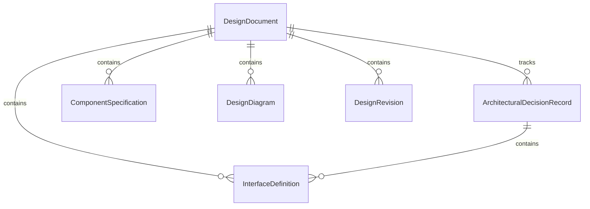
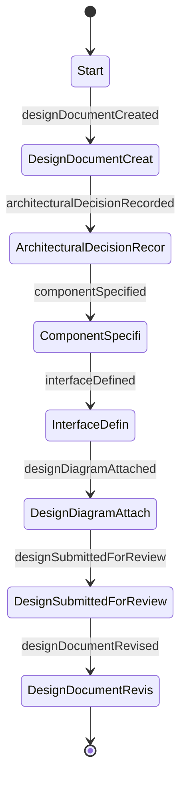
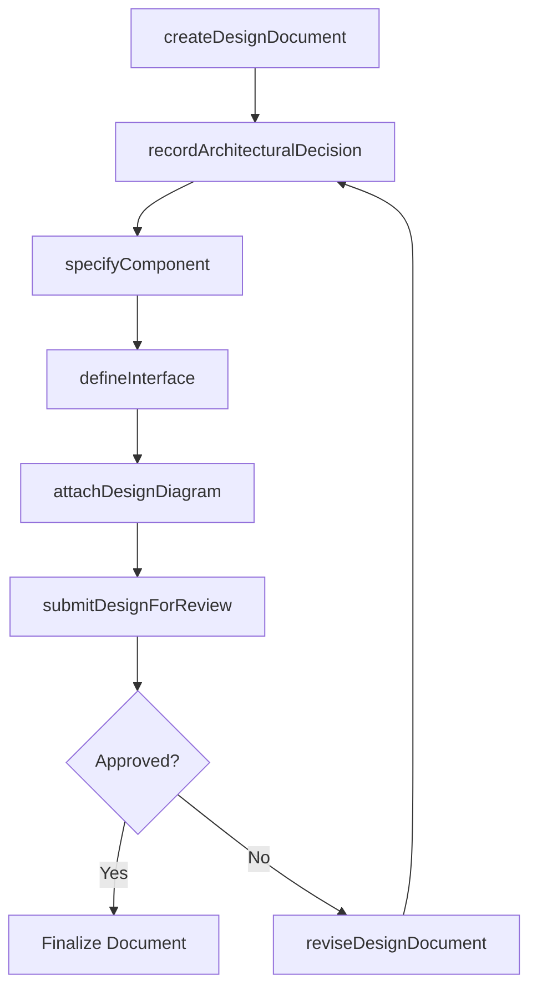
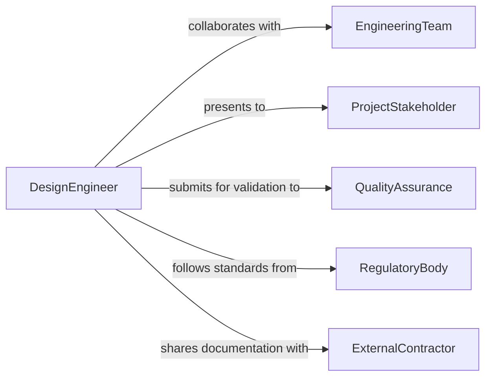

# Document Technical Design Details

> Business-as-Code definition for documenting technical design details including architectural decisions, component specifications, and design rationale.

## Overview

Documenting technical design details involves recording architectural decisions, component specifications, interface definitions, and design rationale for engineering projects. This definition exposes actions for design documentation workflows, events for design review automation, and searches for retrieving design artifacts across project repositories.

## Actors

| Actor | Description |
|-------|-------------|
| EngineeringTeam | Produces and consumes technical design documentation |
| ProjectStakeholder | Reviews design details for alignment with project requirements |
| QualityAssurance | Validates design documentation for completeness and accuracy |
| RegulatoryBody | Mandates design documentation standards for compliance |
| ExternalContractor | Consumes design documentation for implementation work |

## Roles

| Role | Description |
|------|-------------|
| DesignEngineer | Authors technical design documentation and specifications |
| TechnicalArchitect | Defines high-level design patterns and reviews documentation |
| DocumentationSpecialist | Ensures design documents meet formatting and quality standards |
| DesignReviewer | Evaluates technical accuracy and completeness of designs |

## Entities

| Entity | Description |
|--------|-------------|
| DesignDocument | Comprehensive record of technical design decisions and details |
| ArchitecturalDecisionRecord | Documented rationale for a specific design choice |
| ComponentSpecification | Detailed description of a system or product component |
| InterfaceDefinition | Specification of how components interact with each other |
| DesignDiagram | Visual representation of system architecture or component layout |
| DesignRevision | Tracked version of a design document reflecting changes |

## Actions

| Action | Description |
|--------|-------------|
| createDesignDocument | Initialize a new technical design document |
| recordArchitecturalDecision | Document a design choice with context and rationale |
| specifyComponent | Detail the behavior, constraints, and interfaces of a component |
| defineInterface | Document how components communicate and exchange data |
| attachDesignDiagram | Add visual diagrams to support design documentation |
| submitDesignForReview | Send design documentation through the review process |
| reviseDesignDocument | Update design details based on review feedback or changes |

## Events

| Event | Description |
|-------|-------------|
| designDocumentCreated | A new technical design document has been initialized |
| architecturalDecisionRecorded | A design choice and its rationale have been documented |
| componentSpecified | Component details have been documented |
| interfaceDefined | Component interaction specifications have been recorded |
| designDiagramAttached | Visual diagram has been added to design documentation |
| designSubmittedForReview | Design documentation has entered the review process |
| designDocumentRevised | Design details have been updated |

## Searches

| Search | Description |
|--------|-------------|
| findDesignDocuments | Retrieve design documents by project, component, or status |
| getArchitecturalDecisions | List decision records for a project or component |
| findComponentSpecs | Retrieve component specifications by system or type |
| findDesignRevisions | List revision history for a specific design document |

## Entity Relationships



## State Diagram



## Workflow



## Actor Relationships



## Usage

### Calling Actions

```typescript
import { documentTechnicalDesignDetails } from '@headlessly/document-technical-design-details'

const design = documentTechnicalDesignDetails()

// Create a new design document
const doc = await design.createDesignDocument({
  projectId: 'PROJ-2026-0142',
  title: 'Payment Processing Service Architecture',
  scope: 'Microservice design for payment gateway integration',
  version: '1.0.0'
})

// Record an architectural decision
await design.recordArchitecturalDecision({
  documentId: doc.id,
  decision: 'Event-driven architecture for payment state transitions',
  context: 'Need to handle asynchronous payment provider callbacks',
  alternatives: ['polling-based', 'synchronous-rpc'],
  rationale: 'Better fault tolerance and decoupled processing'
})

// Specify a component
await design.specifyComponent({
  documentId: doc.id,
  name: 'PaymentEventProcessor',
  responsibility: 'Consume payment provider webhooks and update order state',
  constraints: ['Must process events within 500ms', 'At-least-once delivery']
})
```

### Event-Driven Automation

```typescript
// Notify reviewers when design is submitted
design.designSubmittedForReview(async ({ documentId, projectId }) => {
  await notify({
    to: 'architecture-review-board',
    message: `Design document for ${projectId} is ready for review`
  })
})

// Track completeness when components are specified
design.componentSpecified(async ({ documentId, componentName }) => {
  const doc = await design.findDesignDocuments({ documentId })
  if (doc.components.length >= doc.expectedComponentCount) {
    await design.submitDesignForReview({ documentId })
  }
})
```
